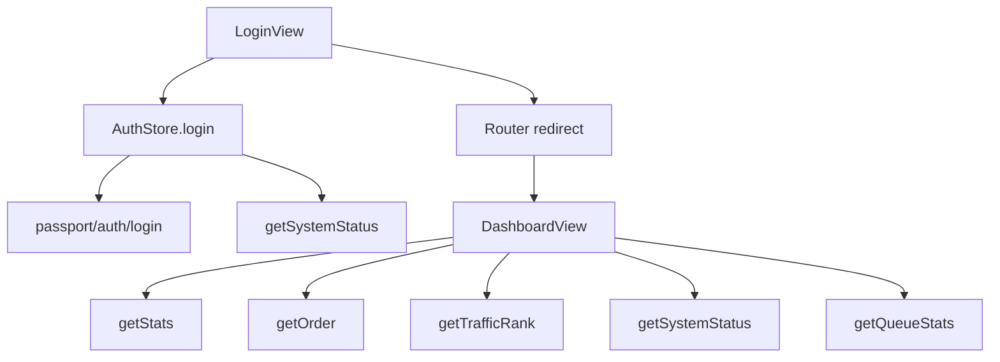

# 变更提案: admin-frontend-composio-dashboard

## 元信息
```yaml
类型: 新功能 + 重构
方案类型: implementation
优先级: P1
状态: 已完成
创建: 2026-04-21
```

---

## 1. 需求

### 背景
当前 `admin-frontend` 已完成基础登录、认证存储、路由守卫和一个占位版 `DashboardView`，但登录成功后的跳转仅固定到 `/dashboard`，无法保留原始访问意图；仪表盘也尚未接入管理端真实统计接口，无法承载后台运营视图。用户已明确要求继续沿 `.claude/plan/admin-frontend-login.md` 推进，并将视觉方向切换为深色 Composio 风格，同时保持参考图中的核心功能结构。

### 目标
- 在不改后端 API 的前提下，实现登录成功后的可靠跳转，支持受保护路由回跳。
- 基于现有管理端接口实现真实数据仪表盘，包括核心统计卡片、收入趋势、节点/用户流量排行、队列与系统状态。
- 将后台主视觉统一到深色 Composio 风格，形成可继续扩展的管理端首页基线。

### 约束条件
```yaml
时间约束: 本轮在现有 admin-frontend 基础上增量完成，不扩展到更多后台业务页面
性能约束: 仪表盘首版避免引入重型图表依赖，尽量复用现有 Vue3 + Element Plus 栈
兼容性约束: 保持 Hash 路由、window.settings.secure_path 运行时配置、现有登录鉴权方式
业务约束: 仅复用后端现有接口，不新增 Laravel Controller/Route，不改变 secure_path 自举逻辑
```

### 验收标准
- [ ] 未登录访问受保护页面时可带 `redirect` 回到目标页，登录成功后正确跳转。
- [ ] 仪表盘成功调用 `stat/getStats`、`stat/getOrder`、`stat/getTrafficRank`、`system/getSystemStatus`、`system/getQueueStats` 并显示真实数据。
- [ ] 首页包含深色 Composio 风格的统计卡片、收入趋势、节点排行、用户排行、队列/系统状态区块，并支持桌面与移动端。
- [ ] `admin-frontend` 可以通过 `npm run build`。

---

## 2. 方案

### 技术方案
在 `admin-frontend` 内完成三层增量改造：

1. 数据层  
   扩展 `src/types/api.d.ts` 和 `src/api/admin.ts`，为管理端仪表盘建立明确的统计、趋势、排行、系统状态类型与请求封装。

2. 认证与导航层  
   调整 `src/router/guards.ts` 和 `src/views/login/LoginView.vue`，在未登录时把目标路由写入 `redirect` 查询参数；登录成功后优先跳转目标路由，否则进入 `/dashboard`。

3. 视图与视觉层  
   重构 `src/layouts/AdminLayout.vue`、`src/views/dashboard/DashboardView.vue` 与全局样式，采用深色 Composio 风格：
   - 近黑背景 + 低对比边框
   - `JetBrains Mono` 数字与技术标签
   - 冷蓝/青色信号强调
   - 以“夜间指挥中心”方式组织统计信息

趋势图首版采用自绘 SVG 折线图，避免为单页仪表盘引入新的重型图表库。

### 影响范围
```yaml
涉及模块:
  - admin-frontend/src/api: 新增后台仪表盘数据请求封装
  - admin-frontend/src/types: 补充管理端统计响应类型
  - admin-frontend/src/router: 调整登录回跳逻辑
  - admin-frontend/src/views/login: 登录成功跳转逻辑增强
  - admin-frontend/src/views/dashboard: 从占位页升级为真实运营仪表盘
  - admin-frontend/src/layouts: 主布局视觉升级
  - admin-frontend/src/styles: 统一深色视觉变量与全局基线
预计变更文件: 8-10
```

### 风险评估
| 风险 | 等级 | 应对 |
|------|------|------|
| 后端接口字段与前端预期存在轻微偏差 | 中 | 直接以仓库内 Controller 返回结构为准建模，类型保持可扩展 |
| 管理端趋势图无现成图表库 | 低 | 使用自绘 SVG，减少依赖和构建风险 |
| 深色重构影响现有登录页与布局一致性 | 中 | 同步更新全局样式变量，确保登录页与后台主框架共享同一视觉系统 |
| 移动端侧边栏与大屏布局冲突 | 中 | 采用断点折叠、卡片栈式布局和横向滚动安全兜底 |

---

## 3. 技术设计（可选）

> 涉及架构变更、API设计、数据模型变更时填写

### 架构设计


### API设计
#### GET /api/v2/{secure_path}/stat/getStats
- **请求**: 无
- **响应**: `todayIncome/currentMonthIncome/traffic/users/onlineNodes` 等仪表盘总览数据

#### GET /api/v2/{secure_path}/stat/getOrder
- **请求**: `start_date`, `end_date`, `type?`
- **响应**: `list[] + summary`，用于收入趋势图与摘要

#### GET /api/v2/{secure_path}/stat/getTrafficRank
- **请求**: `type=node|user`, `start_time`, `end_time`
- **响应**: Top 10 排行及环比变化

#### GET /api/v2/{secure_path}/system/getSystemStatus
- **请求**: 无
- **响应**: `schedule`, `horizon`, `schedule_last_runtime`

#### GET /api/v2/{secure_path}/system/getQueueStats
- **请求**: 无
- **响应**: `failedJobs`, `jobsPerMinute`, `recentJobs`, `processes`, `wait`, `status`

### 数据模型
| 字段 | 类型 | 说明 |
|------|------|------|
| DashboardStats | object | 仪表盘总览统计 |
| OrderTrendPoint | object | 收入趋势日维度数据点 |
| TrafficRankItem | object | 节点或用户排行项 |
| QueueStats | object | Horizon/队列运行状态 |

---

## 4. 核心场景

> 执行完成后同步到对应模块文档

### 场景: 登录后回跳
**模块**: auth / router / login
**条件**: 用户未登录访问受保护路由
**行为**: 路由守卫记录目标地址，登录成功后优先跳转原目标
**结果**: 用户不会被强制打回固定首页

### 场景: 仪表盘总览
**模块**: dashboard
**条件**: 管理员登录成功并进入首页
**行为**: 页面并行拉取总览、趋势、排行和系统状态数据
**结果**: 用户看到真实的收入、用户、流量和队列运行信息

### 场景: 运营态分析
**模块**: dashboard
**条件**: 用户切换时间范围或排行类型
**行为**: 页面重新请求对应接口并刷新局部区块
**结果**: 后台可快速识别收入波动、流量头部节点与活跃用户

---

## 5. 技术决策

> 本方案涉及的技术决策，归档后成为决策的唯一完整记录

### admin-frontend-composio-dashboard#D001: 仪表盘视觉采用深色 Composio 风格而非参考图浅色风格
**日期**: 2026-04-21
**状态**: ✅采纳
**背景**: 用户明确选择“以 DESIGN.md 为准，做深色 Composio 风格仪表盘，但功能结构对齐参考图”。
**选项分析**:
| 选项 | 优点 | 缺点 |
|------|------|------|
| A: 浅色还原参考图 | 更接近截图 | 与仓库既定 DESIGN.md 和现有深色登录页割裂 |
| B: 深色 Composio 风格 | 与既定设计系统一致，辨识度更高 | 需要重做布局与视觉细节 |
**决策**: 选择方案 B
**理由**: 用户已明确选定深色方向，且当前登录页已具备深色基础，继续向“夜间控制台”统一更稳妥。
**影响**: `AdminLayout`、`DashboardView`、`LoginView`、全局样式变量

### admin-frontend-composio-dashboard#D002: 趋势图采用自绘 SVG 而非新增图表依赖
**日期**: 2026-04-21
**状态**: ✅采纳
**背景**: 当前项目仅需单个折线趋势图，引入 ECharts 等库会增加体积和维护成本。
**选项分析**:
| 选项 | 优点 | 缺点 |
|------|------|------|
| A: 引入图表库 | 功能全、配置丰富 | 增加依赖与样式整合成本 |
| B: 自绘 SVG 折线图 | 体积轻、可完全匹配设计语言 | 需手工处理坐标和交互 |
**决策**: 选择方案 B
**理由**: 本轮诉求聚焦仪表盘首页，SVG 已足够覆盖折线图、悬浮提示和时间序列展示。
**影响**: `DashboardView` 内部图表实现方式，不改构建依赖

---

## 6. 成果设计

> 含视觉产出的任务由 DESIGN Phase2 填充。非视觉任务整节标注"N/A"。

### 设计方向
- **美学基调**: Nocturnal Command Center。像深夜运行的运维控制台，近黑背景中浮出冷蓝信号、低对比边框和技术排版，强调“被数据照亮”的感觉。
- **记忆点**: 大面积近黑留白里嵌入发光式统计卡片与自绘蓝青折线图，数字像终端仪表一样被点亮。
- **参考**: 仓库 [DESIGN.md](/E:/code/php/Xboard-new/DESIGN.md) 的 Composio 风格规范 + 用户提供的后台参考图功能结构

### 视觉要素
- **配色**: 背景 `#0f0f0f` / 卡片内层 `#000000` / 线框 `rgba(255,255,255,0.08~0.12)` / 强调蓝 `#0007cd` / 信号青 `#00ffff`
- **字体**: `IBM Plex Sans` 作为界面正文，`JetBrains Mono` 作为数字、标签和技术指标；中文回退到 `PingFang SC`、`Microsoft YaHei`
- **布局**: 顶部密集统计卡片 + 中段趋势图双栏摘要 + 下段双排行 + 底部系统状态；桌面端强调控制台网格感，移动端改为单列堆叠
- **动效**: 卡片和图表采用分层淡入、边框亮起与轻微上浮；筛选切换使用短时透明度过渡
- **氛围**: 低对比边框、局部蓝青径向辉光、硬朗分割线和轻量噪点质感，避免普通 SaaS 白卡片质感

### 技术约束
- **可访问性**: 保证关键指标和文字在深色背景上的对比度；图表与状态块提供文本值而非只靠颜色
- **响应式**: `>=1280px` 四列指标卡，`768-1279px` 两列，`<768px` 单列；排行和图表区域允许安全降级为纵向布局
