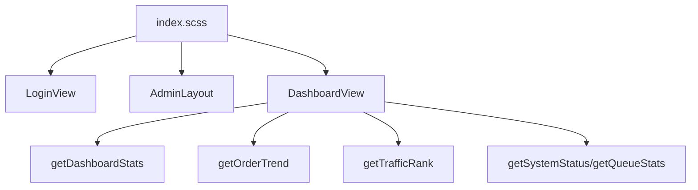

# 变更提案: admin-frontend-apple-performance-refresh

## 元信息
```yaml
类型: 重构 + 优化
方案类型: implementation
优先级: P1
状态: 已完成
创建: 2026-04-21
```

---

## 1. 需求

### 背景
上一轮管理端首页已完成深色 Composio 风格仪表盘，但用户反馈“页面非常卡顿”。结合当前实现可见，卡顿风险主要来自全局远程字体加载、固定噪点层、多个径向渐变与模糊装饰、较重阴影以及偏复杂的深色视觉特效。用户本轮明确要求改为 `apple/DESIGN.md` 设计体系，并将登录页、主布局和仪表盘统一重做。

### 目标
- 将登录页、主布局、仪表盘首页整体切换为 Apple 风格视觉体系。
- 明确降低页面运行时开销，优先删除高成本视觉装饰和非必要动画。
- 保留现有数据接入、登录回跳和后台业务信息结构，不回退功能。

### 约束条件
```yaml
时间约束: 本轮仅重做 admin-frontend 的登录页、主布局、仪表盘首页
性能约束: 去除远程字体依赖、固定背景噪点层、强滤镜和高频装饰性重绘
兼容性约束: 保持现有 Vue3 + Vite + Element Plus 栈，不新增重型 UI 或图表依赖
业务约束: 登录逻辑、secure_path、自定义 API 请求和统计接口保持不变
```

### 验收标准
- [ ] 登录页、主布局、仪表盘首页统一符合 Apple 设计系统，视觉更克制、轻量、清晰。
- [ ] 移除当前页面中的高成本装饰层，首屏样式明显降载。
- [ ] 仪表盘的数据接口、排行、趋势、系统状态功能保持可用。
- [ ] `admin-frontend` 重新构建通过。

---

## 2. 方案

### 技术方案
本轮采用“保留逻辑，重写视图皮层”的方式：

1. 全局样式降载  
   在 `src/styles/index.scss` 中移除 Google Fonts、固定噪点遮罩、全局径向辉光与过重背景层，改为 Apple 风格的系统字体栈、纯色背景与轻量层次。

2. 登录页重构  
   将当前双辉光深色登录页重构为 Apple 式大标题 + 清爽表单卡布局，保留登录回跳逻辑，只替换视觉和结构。

3. 主布局重构  
   把当前“夜间控制台”侧栏和头部压缩为更克制的 Apple 导航语言，减少边框、渐变、信号灯和装饰芯片。

4. 仪表盘重构  
   保留真实数据接口与 SVG 趋势图，但改成 Apple 风格的黑/浅灰分区、简洁卡片、单一蓝色交互重点和更轻的图表样式。

### 影响范围
```yaml
涉及模块:
  - admin-frontend/src/styles: 全局视觉与性能基线
  - admin-frontend/src/views/login: 登录页 Apple 风格重构
  - admin-frontend/src/layouts: 主布局和导航样式重构
  - admin-frontend/src/views/dashboard: 仪表盘内容重排与轻量样式替换
预计变更文件: 4-6
```

### 风险评估
| 风险 | 等级 | 应对 |
|------|------|------|
| 视觉重构影响当前布局层级 | 中 | 保持数据结构和主要 DOM 分区稳定，只重写样式与局部布局 |
| Apple 风格若过度追求极简导致信息密度下降 | 中 | 保留统计卡片、趋势图、排行和状态分区，只减少装饰噪音 |
| 去除装饰层后页面可能显得“过空” | 低 | 用黑/浅灰区块切换、系统字体、轻阴影和单一蓝色 CTA 建立节奏 |

---

## 3. 技术设计（可选）

> 涉及架构变更、API设计、数据模型变更时填写

### 架构设计


### API设计
#### GET /api/v2/{secure_path}/stat/getStats
- **请求**: 无
- **响应**: 仪表盘总览统计

#### GET /api/v2/{secure_path}/stat/getOrder
- **请求**: `start_date`, `end_date`
- **响应**: 收入趋势与汇总

#### GET /api/v2/{secure_path}/stat/getTrafficRank
- **请求**: `type`, `start_time`, `end_time`
- **响应**: 节点/用户排行

### 数据模型
| 字段 | 类型 | 说明 |
|------|------|------|
| DashboardStats | object | 统计卡片数据 |
| OrderTrendData | object | 收入趋势图数据 |
| TrafficRankResponse | object | 排行区数据 |
| QueueStats/SystemStatus | object | 作业详情与系统状态数据 |

---

## 4. 核心场景

> 执行完成后同步到对应模块文档

### 场景: 登录进入后台
**模块**: LoginView / router
**条件**: 用户访问登录页或被守卫重定向到登录页
**行为**: 用户输入管理员账号密码并提交
**结果**: 登录成功后按原有 redirect 规则返回目标页

### 场景: 查看首页经营数据
**模块**: DashboardView
**条件**: 管理员进入仪表盘
**行为**: 页面加载总览、趋势、排行和系统状态
**结果**: 页面用更轻量的 Apple 风格区块展示相同业务信息

---

## 5. 技术决策

> 本方案涉及的技术决策，归档后成为决策的唯一完整记录

### admin-frontend-apple-performance-refresh#D001: 采用 Apple 设计系统并优先做性能减法
**日期**: 2026-04-21
**状态**: ✅采纳
**背景**: 用户已明确指出当前页面“非常卡顿”，并要求按 `apple/DESIGN.md` 重做。
**选项分析**:
| 选项 | 优点 | 缺点 |
|------|------|------|
| A: 保留 Composio 风格，仅做性能微调 | 改动小 | 无法满足用户指定的 Apple 方向 |
| B: Apple 风格 + 性能减法重构 | 同时解决风格偏差和卡顿 | 需要重写多个页面的样式结构 |
**决策**: 选择方案 B
**理由**: 这次诉求的核心不是补功能，而是重新定义页面体验和运行成本。
**影响**: 登录页、主布局、仪表盘、全局样式

### admin-frontend-apple-performance-refresh#D002: 维持现有数据逻辑，仅替换视图皮层
**日期**: 2026-04-21
**状态**: ✅采纳
**背景**: 当前 API 封装和跳转逻辑已完成，不需要在本轮视觉重构中回退或重写。
**选项分析**:
| 选项 | 优点 | 缺点 |
|------|------|------|
| A: 连逻辑层一起重做 | 可重新整理代码 | 超出本轮目标，风险更高 |
| B: 保留逻辑层，重构页面与样式 | 风险可控，收益集中 | 需要在旧结构中做设计转换 |
**决策**: 选择方案 B
**理由**: 用户反馈集中在“前端效果卡顿”，而不是数据和接口错误。
**影响**: `api/*` 与 `router/*` 只做最小配合，改动集中于视图和样式

---

## 6. 成果设计

> 含视觉产出的任务由 DESIGN Phase2 填充。非视觉任务整节标注"N/A"。

### 设计方向
- **美学基调**: Apple Product Editorial。像 Apple 产品页与系统面板的混合体，控制住装饰噪音，让内容像展品一样陈列。
- **记忆点**: 黑色英雄区和浅灰信息区交替展开，单一 Apple Blue 成为全页唯一强调色。
- **参考**: [apple/DESIGN.md](/E:/code/php/Xboard-new/apple/DESIGN.md)

### 视觉要素
- **配色**: 黑色 `#000000`、浅灰 `#f5f5f7`、正文深灰 `#1d1d1f`、交互蓝 `#0071e3`
- **字体**: 采用系统栈模拟 SF Pro 体验，优先 `-apple-system`, `BlinkMacSystemFont`, `SF Pro Display`, `SF Pro Text`, `Helvetica Neue`, Arial, sans-serif`
- **布局**: 英雄区大标题 + 轻卡片信息区 + 简洁双列内容；信息通过区块切换而不是发光边框表达层级
- **动效**: 仅保留轻量 hover 和淡入，不保留大面积 blur、辉光、滤镜动画
- **氛围**: 纯色背景、轻阴影、玻璃感顶栏；不使用噪点、网格、径向发光和复杂纹理

### 技术约束
- **可访问性**: 文字与背景维持高对比；交互色仅使用 Apple Blue
- **响应式**: 登录页双栏在窄屏下改为单列；仪表盘卡片和内容区在平板/手机下自动折叠为单列
