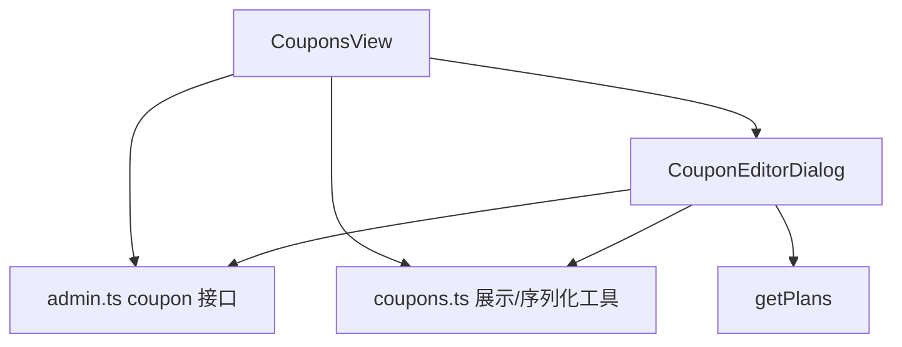

# 变更提案: admin-frontend-coupon-management

## 元信息
```yaml
类型: 新功能
方案类型: implementation
优先级: P1
状态: 执行中
创建: 2026-04-24
```

---

## 1. 需求

### 背景
当前 `admin-frontend` 已完成仪表盘、用户管理、节点管理、套餐管理与系统配置，但“订阅管理”分组下的“优惠券管理”仍是禁用占位。用户本轮明确要求参考 `apple/DESIGN.md`、项目级 `.helloagents/DESIGN.md` 与提供的两张参考图，继续补完真正可用的优惠券管理页面，包括列表工作台与新增/编辑弹窗。

### 目标
- 开放侧边栏中的“优惠券管理”入口，并接入真实页面与路由。
- 基于现有 Laravel `coupon/*` 接口，完成优惠券列表、搜索、类型筛选、启停、删除、新增与编辑。
- 页面视觉延续当前 Apple 化后台，尽量还原参考图中的黑白结构、紧凑表格与表单弹窗。

### 约束条件
```yaml
技术约束: 继续使用 Vue3 + TypeScript + Element Plus + Vite，不引入额外状态管理或重型日期/富文本依赖
业务约束: 后端接口仅使用现有 `/coupon/fetch` `/coupon/generate` `/coupon/update` `/coupon/drop`，不改 Laravel API
数据约束: 套餐限制项沿用现有 `/plan/fetch` 返回结果，优惠券周期限制遵循后端 legacy period 键值
视觉约束: 遵循 `apple/DESIGN.md` 与 `.helloagents/DESIGN.md`，保持与仪表盘/套餐管理同一视觉家族
```

### 验收标准
- [ ] 左侧“订阅管理”分组中的“优惠券管理”由禁用态切换为真实可点击入口，并进入独立页面。
- [ ] 优惠券管理页支持真实数据读取、关键字搜索、类型筛选、本地分页、启用开关、编辑和删除。
- [ ] “添加优惠券 / 编辑优惠券”弹窗支持名称、批量生成数量、自定义优惠码、类型和值、有效期、总使用次数、每人使用次数、指定周期与指定订阅。
- [ ] 页面中的类型标签、剩余次数、每人限制、有效期与过期提示可正确展示，并与后端字段含义一致。
- [ ] `admin-frontend` 构建通过，且知识库同步反映“优惠券管理”已从占位入口升级为真实页面。

---

## 2. 方案

### 技术方案
1. 扩展 `src/types/api.d.ts` 与 `src/api/admin.ts`，新增优惠券列表项、保存载荷、分页查询与计划选项的类型、请求封装。
2. 新增 `src/utils/coupons.ts`，集中处理优惠券类型标签、legacy period 选项、时间范围换算、表单默认值、列表本地过滤与过期文案。
3. 新增 `src/views/subscriptions/CouponsView.vue` 与 `CouponEditorDialog.vue`：
   - `CouponsView` 负责黑色首屏、工具条、表格、分页、行内开关与操作按钮。
   - `CouponEditorDialog` 负责新增/编辑表单、指定周期/订阅、时间范围和数值字段校验。
4. 在 `AdminLayout.vue` 与 `router/index.ts` 中启用“优惠券管理”菜单与 `/subscriptions/coupons` 路由，同时保持“订单管理 / 礼品卡管理”为未完成状态。

### 影响范围
```yaml
涉及模块:
  - admin-frontend/src/layouts: 开放优惠券菜单入口
  - admin-frontend/src/router: 新增优惠券管理路由
  - admin-frontend/src/api: 新增 coupon 接口封装
  - admin-frontend/src/types: 新增优惠券类型定义
  - admin-frontend/src/utils: 新增优惠券数据转换与展示逻辑
  - admin-frontend/src/views/subscriptions: 新增优惠券页面、弹窗与样式
预计变更文件: 7-9
```

### 风险评估
| 风险 | 等级 | 应对 |
|------|------|------|
| `/coupon/fetch` 的服务端筛选能力有限，关键字无法同时覆盖名称与券码 | 中 | 前端优先一次拉取合理数量后做本地搜索与分页，避免错误的 AND 过滤 |
| 编辑接口复用 `/coupon/generate`，字段与新增表单共用，空值和 legacy period 容易提交错误 | 中 | 在 `utils/coupons.ts` 中统一序列化，空数组转 `undefined`，时间统一转 Unix 秒 |
| 参考图包含较丰富的表格状态与表单布局，若实现不克制容易脱离既有后台风格 | 中 | 复用现有 Apple Admin token、表格与弹窗风格，不额外引入第二套后台皮肤 |

---

## 3. 技术设计（可选）

### 架构设计


### API设计
#### GET /coupon/fetch
- **请求**: `{ current, pageSize }`
- **响应**: `{ total, current_page, per_page, last_page, data[] }`

#### POST /coupon/generate
- **请求**: `{ id?, generate_count?, name, code?, type, value, started_at, ended_at, limit_use?, limit_use_with_user?, limit_plan_ids?, limit_period? }`
- **响应**: `{ status, data }`

#### POST /coupon/update
- **请求**: `{ id, show }`
- **响应**: `{ status, data }`

### 数据模型
| 字段 | 类型 | 说明 |
|------|------|------|
| id | number | 优惠券 ID |
| show | boolean | 是否启用 |
| name | string | 优惠券名称 |
| type | 1 \| 2 | 1=按金额优惠，2=按比例优惠 |
| value | number | 金额分/折扣整数 |
| code | string | 券码 |
| limit_use | number \| null | 总可用次数 |
| limit_use_with_user | number \| null | 每人可用次数 |
| limit_plan_ids | string[] \| null | 限制套餐 |
| limit_period | string[] \| null | legacy 周期键 |
| started_at / ended_at | number | 生效时间范围（Unix 秒） |

---

## 4. 核心场景

### 场景: 运营创建单张优惠券
**模块**: admin-frontend/subscriptions
**条件**: 管理员已登录，进入 `#/subscriptions/coupons`
**行为**: 点击“添加优惠券”，填写名称、类型、金额、有效期并提交
**结果**: 新优惠券保存成功，列表刷新并展示新记录

### 场景: 运营批量生成优惠码
**模块**: admin-frontend/subscriptions
**条件**: 管理员在新增弹窗中填写 `generate_count`
**行为**: 提交批量生成请求
**结果**: 后端批量创建优惠券，前端提示成功并刷新列表

### 场景: 运营筛选并停用过期优惠券
**模块**: admin-frontend/subscriptions
**条件**: 列表中存在多种类型与已过期记录
**行为**: 使用关键字或类型筛选找到目标记录，关闭启用开关
**结果**: 对应优惠券 `show=false`，列表状态即时更新

---

## 5. 技术决策

### admin-frontend-coupon-management#D001: 优惠券列表采用真实接口 + 本地搜索/筛选/分页
**日期**: 2026-04-24
**状态**: ✅采纳
**背景**: 后端 `/coupon/fetch` 支持分页，但关键字筛选以 `where like` 串联多个字段时不适合做“名称或券码”搜索。
**选项分析**:
| 选项 | 优点 | 缺点 |
|------|------|------|
| A: 完全依赖后端筛选 | 数据量更轻 | 关键字搜索能力受限，名称/券码无法自然并行匹配 |
| B: 拉取合理数量后本地搜索/筛选/分页 | 交互更贴近参考图，搜索更灵活 | 极大数据量下效率不如纯服务端 |
**决策**: 选择方案 B
**理由**: 当前后台优惠券数量通常不大，本地处理可更稳定满足截图中的使用方式。
**影响**: `CouponsView.vue`、`admin.ts`、`coupons.ts`

### admin-frontend-coupon-management#D002: 新增与编辑共用同一弹窗，并统一序列化到 `/coupon/generate`
**日期**: 2026-04-24
**状态**: ✅采纳
**背景**: 后端没有独立的 coupon save/update 表单接口，新增与编辑都通过 `generate` 处理。
**选项分析**:
| 选项 | 优点 | 缺点 |
|------|------|------|
| A: 新增/编辑拆两套表单 | 心智更直观 | 代码重复，字段校验需要维护两份 |
| B: 共用一个表单模型与序列化逻辑 | 结构更稳定，便于维护 | 需要额外处理编辑态初始值 |
**决策**: 选择方案 B
**理由**: 与当前套餐编辑抽屉模式一致，能减少重复逻辑并提高一致性。
**影响**: `CouponEditorDialog.vue`、`utils/coupons.ts`

### admin-frontend-coupon-management#D003: 编辑态继续采用居中弹窗而非侧边抽屉
**日期**: 2026-04-24
**状态**: ✅采纳
**背景**: 参考图中优惠券编辑器为居中对话框，且字段密度更适合聚焦式表单。
**选项分析**:
| 选项 | 优点 | 缺点 |
|------|------|------|
| A: 复用抽屉模式 | 与套餐管理统一 | 与参考图差异更大，纵向表单视觉焦点分散 |
| B: 改为居中弹窗 | 更贴近参考图，聚焦更强 | 需要单独编写对话框布局样式 |
**决策**: 选择方案 B
**理由**: 这页的主要新增价值就在参考图里的“表格 + 弹窗”组合，值得贴近还原。
**影响**: `CouponEditorDialog.vue` 及其样式

---

## 6. 成果设计

### 设计方向
- **美学基调**: Apple Admin Promotions。像 Apple 后台里的运营配置页，黑色首屏负责建立业务主题，正文工作台回到白底高密度表格，让折扣配置看起来更像精密运营台而不是营销页面。
- **记忆点**: 大标题“优惠券管理”与白色表格之间形成明显的黑白切面；弹窗内部用整齐的双列字段和轻描边区块还原截图的“精密表单感”。
- **参考**: `apple/DESIGN.md`、`.helloagents/DESIGN.md`、用户上传的优惠券列表与添加弹窗截图

### 视觉要素
- **配色**: 首屏 `#000000`，工作区 `#ffffff`，页面背景 `#f5f5f7`，强调色 `#0071e3`，过期提示用浅红底 `rgba(201, 52, 40, 0.08)`
- **字体**: 延续项目现有系统字体栈，标题走大字号紧行高，表格与辅助信息维持更轻的运营化层级
- **布局**: 首屏 Hero + 工具条 + 表格工作台；编辑器采用居中弹窗，字段按双列网格排布，底部操作区固定在弹窗底部
- **动效**: 保留开关切换、弹窗开合、按钮 hover 与筛选状态切换的轻量动效，不引入额外炫技动画
- **氛围**: 工作台继续使用克制阴影、圆角白底与 Apple 式留白，避免多余卡片堆叠

### 技术约束
- **可访问性**: 交互控件保留可见焦点，状态信息不只依赖颜色，危险操作保留明确文案
- **响应式**: 桌面优先；窄屏下 Hero、工具条和弹窗网格折叠为单列，确保表单仍可完整操作
