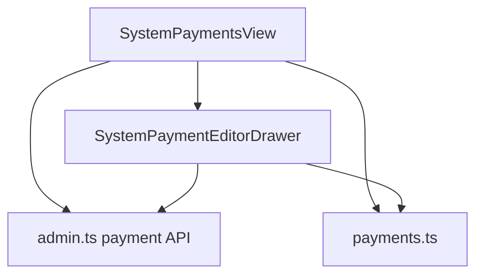

# 变更提案: admin-frontend-payment-management

## 元信息
```yaml
类型: 功能开发
方案类型: implementation
优先级: P1
状态: 进行中
创建: 2026-04-24
```

---

## 1. 需求

### 背景
当前 `admin-frontend` 的“支付配置”仍是占位页，但 Laravel 后端已经提供 `payment/fetch`、`payment/getPaymentMethods`、`payment/getPaymentForm`、`payment/save`、`payment/show`、`payment/drop`、`payment/sort` 等完整管理接口。用户本轮明确选择“完整真实 CRUD”方案，并提供了支付列表、编辑抽屉与支付接口下拉截图，要求继续完成支付配置模块。

### 目标
- 将 `#/system/payments` 从占位页升级为真实可用的支付配置页面。
- 提供支付方式列表、关键词搜索、启停、新增/编辑、删除与排序能力。
- 抽屉表单按所选支付接口动态拉取配置字段，保持与后端支付插件表单契约一致。
- 视觉上延续 `apple/DESIGN.md` 与 `.helloagents/DESIGN.md` 的 Apple 风格后台体系。

### 约束条件
```yaml
范围约束: 仅实现支付配置工作台，不扩展插件/主题/知识库等其他系统模块
技术约束: 继续使用 Vue3 + TypeScript + Element Plus，不新增第三方表单或拖拽依赖
业务约束: 后端真实契约以 PaymentController / PaymentService / 插件 form() 返回字段为准，不在前端猜测额外支付字段
数据约束: 排序继续调用 `/payment/sort`；启停继续调用 `/payment/show` 的“切换”语义接口
视觉约束: 延续黑色 hero + 白色工作台 + 克制蓝色交互，保持与现有系统配置/套餐管理同一视觉家族
```

### 验收标准
- [ ] `#/system/payments` 可真实拉取支付方式列表，并显示 ID、启用状态、显示名称、支付接口、通知地址与操作列。
- [ ] 页面支持关键词搜索，筛选后结果与分页计数同步更新。
- [ ] 支持新增与编辑支付方式，字段覆盖显示名称、图标 URL、通知域名、百分比手续费、固定手续费、支付接口与动态支付配置字段。
- [ ] 支持启停、删除与排序，并给出明确成功/失败反馈。
- [ ] `admin-frontend` 执行 `npm run build` 通过。

---

## 2. 方案

### 页面结构
1. 延续系统管理页面的 Apple 化后台结构，顶部使用黑色 hero 展示支付概览统计。
2. 主工作区使用白色表格容器，提供“添加支付方式”“搜索支付方式”“编辑排序”三类核心操作。
3. 支付方式编辑采用右侧抽屉，顶层字段集中展示显示名称、图标、通知域名、手续费与支付接口。
4. 抽屉下半区按支付接口动态加载真实配置字段，保持与后端插件 `form()` 返回结果一致。
5. 排序使用独立对话框，通过上移/下移维护本地顺序，再提交到 `/payment/sort`。

### 前端实现策略
1. 在 `src/types/api.d.ts` 与 `src/api/admin.ts` 中补齐支付方式列表、动态配置字段与保存载荷类型 / API 封装。
2. 新增 `src/utils/payments.ts`，集中处理支付方式归一化、关键词过滤、排序移动、手续费展示与动态配置序列化。
3. 新增：
   - `src/views/system/SystemPaymentsView.vue`
   - `src/views/system/SystemPaymentsView.scss`
   - `src/views/system/SystemPaymentEditorDrawer.vue`
   - `src/views/system/SystemPaymentEditorDrawer.scss`
4. 将 `/system/payments` 路由切换为真实页面，其余系统管理入口保持现状不动。

### 影响范围
```yaml
涉及模块:
  - admin-frontend/src/types: 补齐支付配置相关类型定义
  - admin-frontend/src/api: 新增 payment 管理接口封装
  - admin-frontend/src/utils: 新增支付数据转换、过滤、保存辅助逻辑
  - admin-frontend/src/views/system: 新增支付列表页与编辑抽屉
  - admin-frontend/src/router: 将支付配置路由切换到真实页面
预计变更文件: 8-9
```

### 风险评估
| 风险 | 等级 | 应对 |
| 后端 `/payment/show` 是切换型接口，不接受显式目标状态 | 中 | 前端只在用户主动切换时调用一次，并在成功后按目标值更新本地状态 |
| 动态支付配置字段完全由插件 form() 返回，前端若自行假设字段会导致保存错位 | 高 | 抽屉内所有支付配置字段均通过 `/payment/getPaymentForm` 实时拉取，不写死配置项 |
| 构建会刷新 `public/assets/admin` 子模块产物 | 中 | 仅执行 `admin-frontend` 构建验证，不自动代做子模块发布 |

---

## 3. 技术设计（可选）

### 架构设计


### API设计
#### GET /payment/fetch
- **请求**: 无
- **响应**: `AdminPaymentListItem[]`

#### GET /payment/getPaymentMethods
- **请求**: 无
- **响应**: `string[]`

#### POST /payment/getPaymentForm
- **请求**: `{ payment, id? }`
- **响应**: `Record<string, AdminPaymentConfigField>`

#### POST /payment/save
- **请求**: `{ id?, name, icon?, payment, config, notify_domain?, handling_fee_fixed?, handling_fee_percent? }`
- **响应**: `{ status, data }`

### 数据模型
| 字段 | 类型 | 说明 |
|------|------|------|
| id | number | 支付方式 ID |
| payment | string | 支付接口代码，如 EPay / TokenPay |
| name | string | 后台显示名称 |
| icon | string \| null | 图标 URL |
| notify_domain | string \| null | 自定义通知域名 |
| notify_url | string \| null | 后端拼接后的完整通知地址 |
| handling_fee_fixed | number \| null | 固定手续费 |
| handling_fee_percent | number \| null | 百分比手续费 |
| enable | boolean | 是否启用 |
| config | Record<string, unknown> | 支付插件配置对象 |

---

## 4. 核心场景

### 场景: 运营新增支付方式
**模块**: admin-frontend/system
**条件**: 管理员已登录，进入 `#/system/payments`
**行为**: 点击“添加支付方式”，选择支付接口并填写网关参数后提交
**结果**: 新支付方式保存成功，列表刷新并展示新记录

### 场景: 运营切换支付启用状态
**模块**: admin-frontend/system
**条件**: 列表中存在可用支付方式
**行为**: 在列表中切换启用开关
**结果**: 对应支付方式状态被切换，并在当前列表中即时更新

### 场景: 运营维护支付排序
**模块**: admin-frontend/system
**条件**: 系统中存在多个支付方式
**行为**: 打开“编辑排序”，调整上下顺序并保存
**结果**: 后端 `/payment/sort` 接收新的排序序列，列表刷新为最新顺序

---

## 5. 技术决策

### admin-frontend-payment-management#D001: 支付配置采用“真实列表页 + 动态配置抽屉 + 独立排序对话框”
**日期**: 2026-04-24
**状态**: ✅采纳
**背景**: 用户截图已经明确表达“列表 + 右侧编辑抽屉 + 编辑排序”的后台工作流结构。
**选项分析**:
| 选项 | 优点 | 缺点 |
| A: 继续使用占位页 | 改动最小 | 无法完成真实支付配置任务 |
| B: 列表页 + 动态配置抽屉 + 排序对话框 | 最贴近截图，也与套餐管理模式一致 | 需要新增更多前端结构与状态管理 |
**决策**: 选择方案 B
**理由**: 能同时覆盖用户截图中的真实使用方式与当前 Apple 风格后台架构。
**影响**: `SystemPaymentsView.vue`、`SystemPaymentEditorDrawer.vue`

### admin-frontend-payment-management#D002: 支付配置字段完全以后端 `/payment/getPaymentForm` 为唯一真相源
**日期**: 2026-04-24
**状态**: ✅采纳
**背景**: 各支付插件的配置字段由插件 `form()` 动态生成，字段集并不固定。
**选项分析**:
| 选项 | 优点 | 缺点 |
|------|------|------|
| A: 前端写死常见支付字段 | 实现快 | 无法覆盖不同插件，容易与后端表单脱节 |
| B: 每次根据接口动态拉取字段 | 契约最稳定 | 需要额外处理加载与切换状态 |
**决策**: 选择方案 B
**理由**: 可同时兼容 EPay、TokenPay、AlipayF2F、Coinbase 等不同插件，不会因为字段假设错误而破坏保存链路。
**影响**: `admin.ts`、`payments.ts`、`SystemPaymentEditorDrawer.vue`

### admin-frontend-payment-management#D003: 支付启停继续沿用现有“切换型接口”，前端做同值短路保护
**日期**: 2026-04-24
**状态**: ✅采纳
**背景**: `/payment/show` 后端实现是直接反转状态，不接收目标状态。
**选项分析**:
| 选项 | 优点 | 缺点 |
|------|------|------|
| A: 前端假设为“设置型接口”并传目标值 | 交互直觉更强 | 与后端真实行为不一致，容易在重复事件下错位 |
| B: 前端只做主动点击触发 + 成功后同步本地状态 | 与现有接口完全对齐 | 需要额外防止无效 change 事件 |
**决策**: 选择方案 B
**理由**: 能最小代价对齐后端现状，并避免初始化或重复事件导致的误切换。
**影响**: `SystemPaymentsView.vue`

---

## 6. 成果设计

### 设计方向
- **美学基调**: Apple Admin Payments。黑色首屏强调“系统级支付运营台”的沉稳感，正文回到白底高密度工作台，重点突出支付方式与通知链路，而不是营销化装饰。
- **记忆点**: 支付配置列表里的“图标 + 名称 + 手续费摘要”组合，与右侧动态配置抽屉形成明显的黑白双层结构。
- **参考**: `apple/DESIGN.md`、`.helloagents/DESIGN.md`、用户提供的支付列表 / 编辑抽屉 / 支付接口下拉截图

### 视觉要素
- **配色**: 首屏 `#000000`，页面背景 `#f5f5f7`，工作区 `#ffffff`，强调色 `#0071e3`，危险动作保持 `var(--xboard-danger)`
- **字体**: 延续项目现有系统字体栈，首屏标题保持大字号紧行高，列表和抽屉字段走轻量运营层级
- **布局**: Hero + 工具条 + 表格工作台；编辑器采用右侧抽屉，表单上半部为顶层字段，下半部为动态支付配置
- **动效**: 仅保留抽屉开合、按钮 hover、排序对话框切换与开关状态变化的轻量动效
- **氛围**: 使用克制阴影、圆角白底、胶囊型通知地址与简洁图标预览，不堆叠过多卡片或装饰性标签

### 技术约束
- **可访问性**: 开关、按钮、抽屉表单需保留可见焦点；错误和危险操作不能只靠颜色表达
- **响应式**: 桌面优先；窄屏下 hero、工具条、排序对话框和抽屉字段网格需折叠为单列
