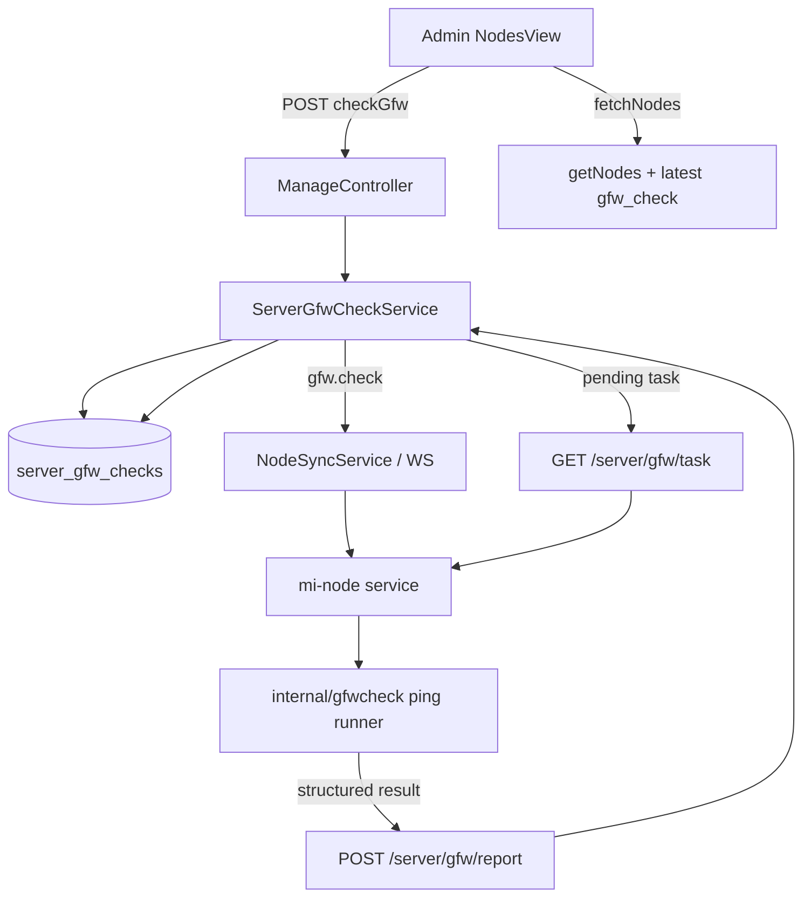

# 变更提案: node-gfw-check

## 元信息
```yaml
类型: 新功能
方案类型: implementation
优先级: P1
状态: 已选方案
创建: 2026-04-27
```

---

## 1. 需求

### 背景
节点管理页目前无法判断节点公网 IP 是否疑似被中国防火墙拦截。用户确认墙是双向影响，但当前暂时没有墙内探测 IP，因此第一阶段只让节点服务器主动 ping 国内三网目标，参考 `E:\code\shell\shell-script\network-tools\test_delay.sh` 的检测思路，不复用其中 Telegram 通知与自动安装依赖逻辑。

### 目标
- 在 Xboard 管理端支持对父节点发起墙状态检测，并在节点列表中显示检测结果。
- 子节点默认不单独检测，展示与筛选继承父节点最新墙状态，并标记为随父节点。
- 节点端 `E:\code\go\mi-node` 支持接收检测任务、执行国内三网 ping、结构化上报结果。
- 搜索与筛选支持区分被墙、正常、异常、未检测、随父节点。

### 约束条件
```yaml
时间约束: 本轮落地基础闭环，不等待后续墙内检测 IP。
性能约束: 检测任务低频触发，节点端并发 ping 要设置超时与并发上限，避免阻塞主服务循环。
兼容性约束: 现有节点同步、用户同步、设备同步、REST fallback 不可回归；旧节点端未支持 gfw.check 时管理端应保留 pending/failed 可见状态。
业务约束: 只对父节点创建实际检测任务；子节点继承父节点结果，不作为独立检测目标。
安全约束: 不引入 Telegram token/chat_id；不在生产节点自动安装系统依赖；不执行破坏性命令。
```

### 验收标准
- [ ] 管理端节点列表可以发起单个/批量墙状态检测，子节点不会被独立下发检测。
- [ ] `getNodes` 返回 `gfw_check` 字段；子节点返回父节点结果并带 `inherited=true` 与 `source_node_id`。
- [ ] mi-node 收到 `gfw.check` WS 事件后执行检测并上报；WS 不可用时可通过 REST 任务接口兜底。
- [ ] 前端节点旁显示墙状态标签，筛选和搜索可过滤被墙/正常/异常/未检测/随父节点。
- [ ] PHP 语法检查、前端 build、mi-node Go 测试通过或明确记录无法执行原因。

---

## 2. 方案

### 技术方案
采用已确认的方案 A：`WS 触发 + REST 兜底 + 子节点继承父节点状态`。

- 后端新增 `server_gfw_checks` 表与 `ServerGfwCheck` 模型，记录每次父节点检测任务、状态、摘要、原始结果和错误。
- 后端新增 `ServerGfwCheckService`，负责发起检测、过滤子节点、推送 `gfw.check`、提供 REST 兜底任务读取、接收节点端报告、计算最终状态。
- 管理端新增 `POST /server/manage/checkGfw`，支持单个/批量节点 ID。输入中子节点不下发任务，按父节点继承规则返回 skipped/inherited。
- 节点端新增 `GET /server/gfw/task` 与 `POST /server/gfw/report`，由 `ServerV2` 鉴权保护。
- mi-node 新增 `internal/gfwcheck` 包，内置三网目标，使用系统 `ping` 并发检测。Docker runtime 安装 `iputils`。
- 前端新增墙状态类型、筛选器、标签和动作入口。关键词搜索覆盖中文状态词。

### 影响范围
```yaml
涉及模块:
  - Xboard 后端: 新表、新模型、新服务、管理端接口、节点端接口、节点列表返回字段、WS 推送事件。
  - admin-frontend: 节点页筛选、搜索、状态标签、单行/批量检测动作、API 类型。
  - mi-node: WS 事件解析、控制面事件转发、服务层检测执行、REST 兜底轮询与上报、Docker 运行依赖。
预计变更文件: 20 个左右，覆盖 PHP、Vue/TypeScript、Go、Dockerfile 与方案包。
```

### 风险评估
| 风险 | 等级 | 应对 |
|------|------|------|
| 部分节点环境没有 `ping` 或缺 ICMP 权限 | 中 | 节点端检测失败时上报 `failed` 与错误；Docker 镜像补 `iputils`，不自动安装依赖 |
| 国内目标临时不可达导致误判 | 中 | 按运营商分组统计，区分 `blocked` 与 `partial`，保存 raw_result 供人工核对 |
| 旧 mi-node 不支持新事件 | 中 | 后端保留 REST task 与 checking/pending 状态，前端清楚显示未完成/失败 |
| 子节点继承状态造成误解 | 低 | `gfw_check.inherited=true`，前端显示“随父节点”并在 tooltip 中说明来源 |
| 检测任务阻塞主服务循环 | 中 | mi-node 在 goroutine 中执行，服务层避免同一 check 并发重复执行 |

### 方案取舍
```yaml
唯一方案理由: WS 触发能让在线节点立即执行检测，REST 兜底能覆盖 WS 不可用或旧链路；只检测父节点符合当前子节点中转落地到父节点的业务模型。
放弃的替代路径:
  - 只用管理端远程 ping 节点: 无法判断节点主动访问国内目标是否被墙，且与用户确认的双向墙逻辑不匹配。
  - 立即引入墙内探测节点: 当前没有墙内检测 IP，无法落地；后续可在同一数据模型中扩展为双向检测。
  - 子节点逐个检测: 子节点一般是中转入口，实际落地到父节点；逐个检测会制造噪音并增加不必要任务。
回滚边界: 可回滚新增接口、服务、前端入口和 mi-node 事件处理；数据库新增表独立，不改动 v2_server 结构。
```

---

## 3. 技术设计

### 架构设计


### API 设计
#### POST `/api/v2/{secure_path}/server/manage/checkGfw`
- **请求**: `{ "ids": [1, 2, 3] }`
- **响应**: `{ "started": [...], "skipped": [...], "total": 3 }`

#### GET `/api/v2/server/gfw/task`
- **请求**: `token/node_id` 鉴权参数
- **响应**: `{ "data": { "check_id": 123, "targets": {...}, "ping_count": 2, "timeout_seconds": 2, "parallel": 12 } }` 或 `null`

#### POST `/api/v2/server/gfw/report`
- **请求**: `{ "check_id": 123, "status": "normal|blocked|partial|failed", "summary": {...}, "raw_result": {...}, "error_message": null }`
- **响应**: `{ "data": true }`

### 数据模型
| 字段 | 类型 | 说明 |
|------|------|------|
| id | big integer | 检测记录 ID |
| server_id | big integer | 父节点 ID |
| status | string | pending/checking/normal/blocked/partial/failed/skipped |
| triggered_by | unsigned big integer nullable | 发起检测的管理员 ID |
| summary | json nullable | 后端/前端摘要 |
| operator_summary | json nullable | 三网聚合结果 |
| raw_result | json nullable | 节点端原始结构化结果 |
| error_message | text nullable | 失败原因 |
| checked_at | unsigned integer nullable | 完成检测时间戳 |
| timestamps | timestamps | 创建/更新时间 |

---

## 4. 核心场景

### 场景: 管理员检测父节点
**模块**: Xboard 后端 + admin-frontend  
**条件**: 管理员在节点列表选择父节点，点击检测墙状态。  
**行为**: 后端创建 checking 记录并推送 `gfw.check`，前端刷新显示“检测中”。  
**结果**: mi-node 上报后节点旁显示正常/疑似被墙/部分异常/检测失败。

### 场景: 管理员选择子节点
**模块**: Xboard 后端 + admin-frontend  
**条件**: 管理员选择子节点发起检测。  
**行为**: 后端不对该子节点创建独立任务，返回 skipped/inherited。  
**结果**: 前端提示子节点随父节点，列表显示父节点检测结果来源。

### 场景: WS 不可用
**模块**: Xboard 后端 + mi-node  
**条件**: 节点端没有收到 `gfw.check` WS 事件。  
**行为**: mi-node 定期查询 `/server/gfw/task` 获取未完成任务。  
**结果**: 任务仍可被执行并上报。

---

## 5. 技术决策

### node-gfw-check#D001: 使用 WS 触发 + REST 兜底
**日期**: 2026-04-27  
**状态**: ✅采纳  
**背景**: 管理端需要尽快触发在线节点检测，但不能依赖 WS 一定可用。  
**选项分析**:
| 选项 | 优点 | 缺点 |
|------|------|------|
| A: WS 触发 + REST 兜底 | 在线响应快，离线/断连可兜底，符合现有节点同步架构 | 需要同时改两条链路 |
| B: 仅 REST 轮询 | 实现较少，行为稳定 | 检测响应慢，用户点击后等待不确定 |
| C: 仅 WS | 响应最快 | WS 不可用时任务丢失 |
**决策**: 选择方案 A。  
**理由**: 与现有 `NodeSyncService`、`NodeWorker`、mi-node 控制面抽象兼容，兼顾及时性与可靠性。  
**影响**: 后端新增任务接口与推送事件；mi-node 新增 WS 事件和 REST 轮询。

### node-gfw-check#D002: 子节点继承父节点墙状态
**日期**: 2026-04-27  
**状态**: ✅采纳  
**背景**: 用户明确说明子节点通常作为中转，实际落地到父节点。  
**选项分析**:
| 选项 | 优点 | 缺点 |
|------|------|------|
| A: 子节点继承父节点 | 符合业务模型，减少噪音 | 需要 UI 明确说明来源 |
| B: 子节点也独立检测 | 看似更完整 | 结果不代表真实落地路径，任务成本高 |
**决策**: 选择方案 A。  
**理由**: 检测目标应代表落地 IP，父节点更接近真实出口。  
**影响**: 后端 `getNodes` 拼接继承状态；前端筛选按有效状态处理。

---

## 6. 验证策略

```yaml
verifyMode: review-first
reviewerFocus:
  - app/Services/ServerGfwCheckService.php 的状态判定和子节点过滤
  - app/Http/Controllers/V2/Server/ServerController.php 的节点端报告鉴权与 check_id 归属校验
  - E:/code/go/mi-node/internal/gfwcheck 的 ping 超时、并发和错误处理
testerFocus:
  - php -l 新增/修改 PHP 文件
  - cd admin-frontend && npm run build
  - cd E:/code/go/mi-node && go test ./...
uiValidation: required
riskBoundary:
  - 不执行数据库迁移到生产库
  - 不复用参考脚本中的 Telegram token/chat_id
  - 不自动安装节点系统依赖
```

---

## 7. 成果设计

### 设计方向
- **美学基调**: Apple 式后台精致极简，延续当前节点页黑色 hero 与白色工作台，不新增抢眼装饰色。
- **记忆点**: 节点名旁新增一个轻量“连通性信号”状态胶囊，正常、检测中、疑似被墙、随父节点可以一眼区分但不压过节点名。
- **参考**: `apple/DESIGN.md` 与现有 `NodesView.vue`。

### 视觉要素
- **配色**: 继续使用页面黑白主节奏；交互强调使用 Apple Blue `#0071e3`；风险态沿用 Element Plus 语义色，避免新增复杂色盘。
- **字体**: 继承项目现有字体栈与 Element Plus 表格字号，节点状态使用较小胶囊标签保持信息密度。
- **布局**: 筛选栏增加“墙状态”下拉；节点单元格内在在线状态下方并列墙状态标签，不新增大面积卡片。
- **动效**: 检测中使用按钮 loading 与标签文案反馈，不加额外动画。
- **氛围**: 维持白色工作台与细分隔的管理后台质感，不使用渐变、纹理或装饰背景。

### 技术约束
- **可访问性**: 状态不只靠颜色区分，标签文本必须明确；操作按钮 loading/disabled 状态可见。
- **响应式**: 复用现有 toolbar wrap；新增筛选宽度与现有 select 一致，移动端自然换行。
