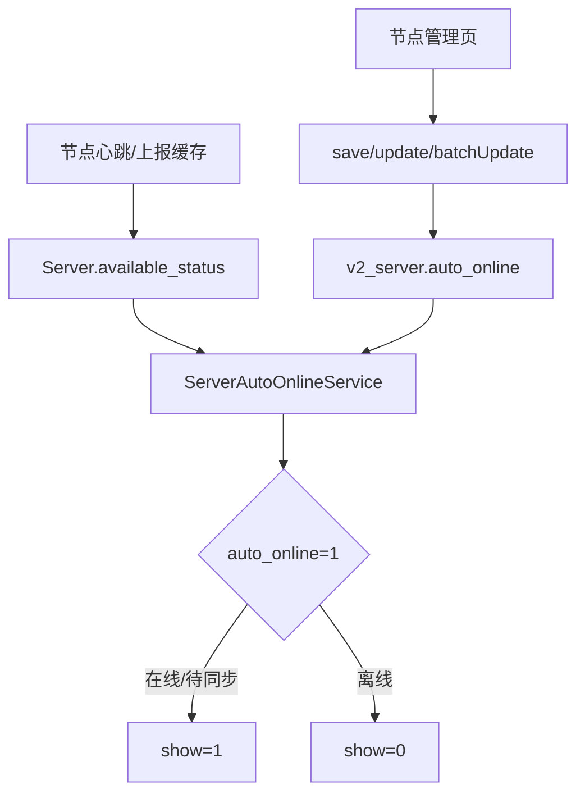

# 变更提案: admin-frontend-node-auto-online

## 元信息
```yaml
类型: 新功能
方案类型: implementation
优先级: P1
状态: 已选定方案
创建: 2026-04-27
```

---

## 1. 需求

### 背景
节点管理页当前已经展示在线、离线、待同步和显隐状态，但 `show` 仍完全依赖管理员手动切换。用户希望增加“自动上线”能力：后台定时检测节点状态，对启用该能力的节点自动同步前台展示状态，节点离线时自动隐藏，节点在线时自动显示。

### 目标
- 在节点管理页新增“自动上线”开关。
- 只有开启“自动上线”的节点由后台自动改写 `show`；未开启的节点继续保持手动显隐控制。
- 后台定时根据现有 `available_status` / `is_online` 判定自动同步 `show`。
- 节点编辑、新建、列表展示和 API 类型定义同步支持该字段。

### 约束条件
```yaml
时间约束: 本轮完成实现并执行可用验证
性能约束: 定时任务只处理开启 auto_online 的节点，避免全量无意义写库
兼容性约束: 默认 auto_online=false，避免升级后自动覆盖现有节点显隐状态
业务约束: 未开启自动上线的节点不得被后台任务改写 show
```

### 验收标准
- [ ] `v2_server` 新增 `auto_online` 字段，默认关闭，并在 `Server` 模型中正确 cast。
- [ ] 管理端 `save` / `update` / `batchUpdate` 接口能保存 `auto_online`。
- [ ] 后台调度命令只同步 `auto_online=1` 的节点：在线或待同步时 `show=1`，离线时 `show=0`。
- [ ] 节点管理表格和编辑弹窗展示/编辑“自动上线”开关，且不会破坏现有显隐开关、墙状态检测和筛选能力。
- [ ] 前端类型检查与构建通过；后端相关文件通过 PHP 语法检查。

---

## 2. 方案

### 技术方案
采用“独立字段 + 独立同步服务”方案：

- 数据层新增 `v2_server.auto_online` 布尔字段，默认 `false`。
- `Server` 模型增加 `auto_online` cast 和文档注释。
- 后端新增 `ServerAutoOnlineService`，集中处理 `auto_online` 节点的显示状态同步，避免把业务逻辑散落在 Controller 或 Console Command 中。
- 新增 Artisan 命令 `sync:server-auto-online`，由 `app/Console/Kernel.php` 每 5 分钟调度，并使用 `onOneServer()` / `withoutOverlapping()` 防止多实例重复写入。
- 管理端 API 扩展 `save` / `update` / `batchUpdate` 参数，允许保存或批量切换 `auto_online`。
- 管理端节点页在表格中展示自动托管状态，编辑弹窗基础信息区增加开关；批量修改弹窗增加可选批量设置。

### 影响范围
```yaml
涉及模块:
  - 数据库迁移: 增加 v2_server.auto_online 字段
  - 节点模型: 增加字段 cast 与文档注释
  - 节点管理 API: 保存、单点更新、批量更新支持 auto_online
  - 后台调度: 新增自动同步服务、命令和定时任务
  - 管理端前端: 类型、API payload、节点页、编辑弹窗、批量修改弹窗
  - 知识库: 更新项目上下文和节点管理模块说明
预计变更文件: 12-16
```

### 风险评估
| 风险 | 等级 | 应对 |
|------|------|------|
| 开启自动上线后后台任务覆盖管理员手动显隐 | 中 | 仅 `auto_online=1` 的节点自动同步；UI 文案明确“自动托管前台显示” |
| 在线状态依赖缓存，缓存过期导致节点被隐藏 | 中 | 使用现有 `available_status` 语义，保持与节点列表在线状态一致；不引入新的检测标准 |
| 批量更新误操作影响多个节点 | 中 | 批量修改弹窗保持“字段启用后才更新”的模式，默认不更新 `auto_online` |
| 已有墙状态检测改动被覆盖 | 低 | 增量修改当前脏文件，不移除 `gfw_check` 相关类型、接口和 UI |

### 方案取舍
```yaml
唯一方案理由: 独立字段语义清晰，定时同步服务可测试、可扩展，并且默认关闭能保护现有手动显隐行为。
放弃的替代路径:
  - 复用 check:server 命令: 会把离线通知和展示同步耦合，且 1800 秒通知阈值与 300 秒在线状态阈值不一致。
  - 写入 protocol_settings: 自动上线不是协议配置，会污染协议数据并增加查询和批量更新复杂度。
回滚边界: 可撤销前端开关、接口参数、同步命令和迁移；已开启 auto_online 后由任务改写过的 show 需要管理员按业务需要手动恢复。
```

---

## 3. 技术设计

### 架构设计


### API设计
#### POST server/manage/save
- **请求**: 原节点保存 payload 增加 `auto_online?: boolean`
- **响应**: 沿用 `ApiResponse<boolean>`

#### POST server/manage/update
- **请求**: `{ id: number, show?: 0|1, enabled?: boolean, machine_id?: number|null, auto_online?: boolean }`
- **响应**: 沿用 `ApiResponse<boolean>`

#### POST server/manage/batchUpdate
- **请求**: 原批量更新 payload 增加 `auto_online?: boolean`
- **响应**: 沿用 `ApiResponse<boolean>`

### 数据模型
| 字段 | 类型 | 说明 |
|------|------|------|
| `auto_online` | boolean | 是否允许后台根据节点在线状态自动同步 `show` |

---

## 4. 核心场景

### 场景: 自动上线节点在线
**模块**: 节点管理
**条件**: 节点 `auto_online=1`，`available_status` 为在线或待同步  
**行为**: 调度命令执行自动同步  
**结果**: 节点 `show=1`，用户侧可见

### 场景: 自动上线节点离线
**模块**: 节点管理
**条件**: 节点 `auto_online=1`，`available_status` 为离线  
**行为**: 调度命令执行自动同步  
**结果**: 节点 `show=0`，用户侧隐藏

### 场景: 手动节点不受影响
**模块**: 节点管理
**条件**: 节点 `auto_online=0`  
**行为**: 调度命令执行自动同步  
**结果**: 后台不改写该节点 `show`

---

## 5. 技术决策

### admin-frontend-node-auto-online#D001: 自动上线使用独立字段与独立同步服务
**日期**: 2026-04-27  
**状态**: 采纳  
**背景**: 需要让后台自动同步节点展示状态，同时保留未开启节点的手动显隐控制。  
**选项分析**:
| 选项 | 优点 | 缺点 |
|------|------|------|
| A: 独立字段 + 独立服务 | 语义清晰、可测试、默认关闭安全、后续可扩展 | 需要新增迁移和命令 |
| B: 复用 `check:server` | 改动较少 | 阈值语义不一致，离线通知和显示同步耦合 |
| C: 写入 `protocol_settings` | 避免迁移 | 污染协议配置，查询和批量更新复杂 |
**决策**: 选择方案 A  
**理由**: 自动上线是节点运营策略，不是协议配置或离线通知；独立字段和服务能把边界表达清楚。  
**影响**: 数据库、节点模型、节点管理 API、调度命令和管理端节点 UI。

---

## 6. 验证策略

```yaml
verifyMode: review-first
reviewerFocus:
  - app/Services/ServerAutoOnlineService.php 的 show 同步边界
  - app/Http/Controllers/V2/Admin/Server/ManageController.php 的 update/batchUpdate 参数兼容性
  - admin-frontend/src/views/nodes/* 的现有墙状态检测与批量选择逻辑不回退
testerFocus:
  - php -l 后端新增/修改 PHP 文件
  - npm run build 管理端类型检查与构建
  - 人工检查 auto_online 默认关闭，批量修改默认不覆盖
uiValidation: required
riskBoundary:
  - 不执行数据库迁移到真实环境
  - 不写生产数据
  - 不移除现有未提交的墙状态检测相关改动
```

---

## 7. 成果设计

### 设计方向
- **美学基调**: Apple 风格的运维控制台，黑白主节奏、低装饰、强信息密度；自动上线作为状态治理能力，不做营销化强调。
- **记忆点**: 每行节点同时能看见“当前显示状态”和“是否自动托管”，管理员可以一眼区分手动控制与自动控制。
- **参考**: `apple/DESIGN.md` 与现有 `NodesView.vue`。

### 视觉要素
- **配色**: 延续黑色 hero、白色表格面板和 Apple Blue `#0071e3` 作为自动托管强调色；在线/离线仍使用现有绿色/红色状态点。
- **字体**: 沿用项目现有系统字体栈，不引入新字体，保证管理端一致性。
- **布局**: 表格显隐列附近增加自动上线开关或标识，编辑弹窗基础信息的“节点状态”区域加入第三张开关卡片。
- **动效**: 复用 Element Plus Switch loading 与当前 `switch-shell` 动态反馈，避免新增噪音动效。
- **氛围**: 克制透明浅底提示块，突出“自动托管”状态但不抢占节点名称和在线状态。

### 技术约束
- **可访问性**: 开关必须有明确文本标签和辅助描述；不能只用颜色表达自动状态。
- **响应式**: 表格保持现有横向滚动和断点行为；编辑弹窗开关卡片在窄屏下自然堆叠。
