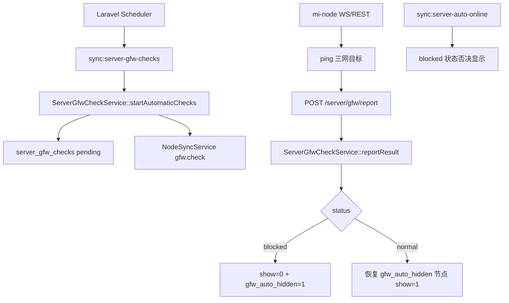

# 变更提案: node-gfw-auto-check-and-online

## 元信息
```yaml
类型: 新功能
方案类型: implementation
优先级: P1
状态: 已确认
创建: 2026-04-28
```

---

## 1. 需求

### 背景
节点墙状态检测已具备手动触发、节点端执行、结果上报和节点列表展示能力，但当前仍需要管理员手动检测。实际运营需要后台自动检测所有父节点，并在节点疑似被中国防火墙拦截时自动隐藏，避免继续发布到用户订阅配置。

### 目标
- 自动为开启托管的父节点创建墙状态检测任务，子节点不单独检测，继续继承父节点状态。
- 节点可单独关闭自动墙检测托管；关闭后不参与自动检测和自动墙状态显隐动作。
- 仅当检测结果为 `blocked` 时自动隐藏节点；恢复 `normal` 时只恢复由墙检测自动隐藏过的节点。
- 自动上线服务必须尊重墙状态：`blocked` 是显示否决条件，防止现有 `auto_online` 把疑似被墙节点重新发布。
- 节点管理页新增刷新数据按钮，并展示/切换墙检测托管状态。

### 约束条件
```yaml
时间约束: 本轮完成后端、前端、测试和知识库同步
性能约束: 自动检测调度不得重复创建 pending/checking 任务，避免对节点端和三网目标造成无意义压力
兼容性约束: 不改变 mi-node 现有 gfw.check 协议；不改变手动检测接口；现有节点默认开启自动墙检测托管
业务约束: show=0 是订阅发布边界；子节点不创建独立检测任务；partial/failed 不触发自动下线
```

### 验收标准
- [ ] 后端存在定时命令，可自动为开启墙检测托管的父节点创建检测任务，并跳过子节点、关闭托管节点和已有待执行任务的节点。
- [ ] `blocked` 上报后节点自动 `show=0`，并记录自动隐藏标记；`normal` 上报后只恢复曾由墙检测自动隐藏的节点。
- [ ] `sync:server-auto-online` 在节点疑似被墙时不会把节点重新显示。
- [ ] 管理端节点列表可刷新数据、可切换节点自动墙检测托管开关，并能通过搜索/筛选继续识别疑似被墙和正常节点。
- [ ] 前端构建通过；PHP 侧至少完成新增测试用例或说明本机 PHP 不可用导致未执行。

---

## 2. 方案

### 技术方案
采用方案 A：复用现有墙检测链路和自动上线链路，新增节点级墙检测托管字段与自动隐藏标记。

- 数据层在 `v2_server` 新增:
  - `gfw_check_enabled`: 是否参与自动墙检测和墙状态自动显隐，默认 `true`。
  - `gfw_auto_hidden`: 是否由墙检测自动隐藏，默认 `false`，用于避免恢复管理员手动隐藏的节点。
  - `gfw_auto_action_at`: 最近一次墙检测自动显隐动作时间。
- `ServerGfwCheckService` 新增自动检测入口:
  - 只查询 `parent_id is null` 且 `gfw_check_enabled=1` 的节点。
  - 若已有 `pending/checking` 检测任务则跳过。
  - 创建任务后沿用 `NodeSyncService::push(..., 'gfw.check', ...)` 和节点端 REST 兜底领取。
- `ServerGfwCheckService::reportResult()` 在写入最终状态后执行自动显隐:
  - `blocked`: 对父节点及其子节点中仍开启 `gfw_check_enabled` 的节点设置 `show=0`、`gfw_auto_hidden=1`。
  - `normal`: 仅对 `gfw_auto_hidden=1` 的节点恢复 `show=1` 并清理标记。
  - `partial/failed`: 只记录状态，不改变 `show`。
- `ServerAutoOnlineService` 同步时把最新继承墙状态为 `blocked` 作为显示否决条件，避免自动上线覆盖墙检测隐藏。
- 管理端节点页在现有 Apple 风格工作台上增量扩展：
  - 工具栏新增刷新数据按钮，调用 `loadNodeBoard()`。
  - 表格新增“墙检测”托管开关；父节点会自动检测，子节点不独立检测但可单独关闭随父节点自动隐藏/恢复。
  - 批量修改弹窗支持统一设置自动墙检测托管。
  - 搜索文本补充自动墙检/自动隐藏关键字。

### 影响范围
```yaml
涉及模块:
  - Laravel 数据模型: 新增 v2_server 墙检测托管与自动隐藏字段
  - node-gfw-check: 新增自动检测调度、自动显隐动作和状态查询辅助
  - admin-frontend: 节点列表刷新入口、墙检测托管开关、类型和筛选文案
  - 测试: 扩展自动上线与墙检测服务测试
预计变更文件: 12-16
```

### 风险评估
| 风险 | 等级 | 应对 |
|------|------|------|
| 自动恢复显示误覆盖管理员手动隐藏 | 高 | 使用 `gfw_auto_hidden` 标记，只恢复由墙检测自动隐藏的节点 |
| 自动上线重新显示 blocked 节点 | 高 | 在 `ServerAutoOnlineService` 中加入墙状态否决 |
| 自动检测任务堆积 | 中 | 自动调度前跳过已有 `pending/checking` 任务的节点 |
| 子节点行为误解 | 中 | 子节点不检测，但继承父节点状态；自动动作只作用于仍开启托管的子节点 |
| 前端列宽变密 | 低 | 延续现有表格密度，新增窄列和 Tooltip，不重做页面结构 |

### 方案取舍
```yaml
唯一方案理由: 复用现有检测协议和自动上线服务，新增最少字段解决自动检测、自动隐藏、自动恢复和手动隐藏冲突问题。
放弃的替代路径:
  - 只在上报时直接改 show: 会被 auto_online 覆盖，也无法区分管理员手动隐藏。
  - 新建完整策略中心: 审计与扩展更完整，但本轮范围过大，后续接入墙内检测 IP 时再升级更合适。
回滚边界: 可回滚新增迁移、命令、服务逻辑和前端字段；历史 server_gfw_checks 检测记录不需要删除。
```

---

## 3. 技术设计

### 架构设计


### API 设计
#### POST `server/manage/update`
- **新增请求字段**: `gfw_check_enabled?: boolean`
- **行为**: 父节点可切换自动墙检测托管；子节点保存字段但不创建独立检测任务。

#### POST `server/manage/batchUpdate`
- **新增请求字段**: `gfw_check_enabled?: boolean`
- **行为**: 支持批量开启/关闭自动墙检测托管。

#### GET `server/manage/getNodes`
- **新增响应字段**:
  - `gfw_check_enabled`
  - `gfw_auto_hidden`
  - `gfw_auto_action_at`
- **保留响应字段**: `gfw_check` 继续承载墙状态、继承来源和检测时间。

### 数据模型
| 字段 | 类型 | 说明 |
|------|------|------|
| `v2_server.gfw_check_enabled` | boolean | 是否参与自动墙检测和墙状态自动显隐 |
| `v2_server.gfw_auto_hidden` | boolean | 是否由墙检测自动隐藏 |
| `v2_server.gfw_auto_action_at` | unsignedInteger nullable | 最近一次墙检测自动显隐动作 Unix 时间 |

---

## 4. 核心场景

### 场景: 自动检测父节点
**模块**: node-gfw-check  
**条件**: 父节点 `gfw_check_enabled=1`，且没有 `pending/checking` 检测任务  
**行为**: 定时命令创建检测记录并推送 `gfw.check`  
**结果**: 节点端通过 WS 或 REST 兜底执行检测并上报结果

### 场景: 疑似被墙自动隐藏
**模块**: node-gfw-check  
**条件**: 检测结果判定为 `blocked`  
**行为**: 后端将开启墙检测托管的父节点及其子节点 `show=0`，并设置 `gfw_auto_hidden=1`  
**结果**: `ServerService::getAvailableServers()` 不再返回这些节点，订阅配置不再发布

### 场景: 恢复正常自动显示
**模块**: node-gfw-check  
**条件**: 后续检测结果判定为 `normal`，节点存在 `gfw_auto_hidden=1`  
**行为**: 后端恢复 `show=1` 并清理自动隐藏标记  
**结果**: 只恢复曾由墙检测自动隐藏的节点，不恢复管理员原本手动隐藏的节点

---

## 5. 技术决策

### node-gfw-auto-check-and-online#D001: 使用自动隐藏标记隔离管理员手动显隐
**日期**: 2026-04-28  
**状态**: ✅采纳  
**背景**: 自动恢复显示必须避免把管理员手动隐藏的节点误发布。  
**选项分析**:
| 选项 | 优点 | 缺点 |
|------|------|------|
| A: 新增 `gfw_auto_hidden` 标记 | 可精确恢复自动隐藏节点，和手动显隐互不覆盖 | 需要新增字段和测试 |
| B: 只根据最新状态直接设置 `show` | 实现少 | 会恢复管理员手动隐藏节点 |
**决策**: 选择方案 A  
**理由**: 发布控制属于高影响业务行为，必须可追踪自动动作来源。  
**影响**: `v2_server`、`ServerGfwCheckService`、管理端节点列表。

### node-gfw-auto-check-and-online#D002: 自动上线服务必须把 blocked 作为显示否决
**日期**: 2026-04-28  
**状态**: ✅采纳  
**背景**: 现有 `sync:server-auto-online` 会按在线状态同步 `show`，若不接入墙状态，疑似被墙节点可能被重新显示。  
**选项分析**:
| 选项 | 优点 | 缺点 |
|------|------|------|
| A: 在自动上线服务中加入墙状态否决 | 和现有定时链路一致，避免状态互相覆盖 | 需要查询最新墙状态 |
| B: 只依赖检测上报时改 `show` | 改动少 | 后续自动上线可能覆盖 |
**决策**: 选择方案 A  
**理由**: 自动上线是当前 `show` 的定时真相源之一，必须在同一服务中纳入墙状态。  
**影响**: `ServerAutoOnlineService`、相关单元测试。

---

## 6. 验证策略

```yaml
verifyMode: test-first
reviewerFocus:
  - ServerGfwCheckService 自动创建任务、自动显隐、子节点继承边界
  - ServerAutoOnlineService 与 blocked 状态的冲突处理
  - 管理端字段类型和子节点托管提示
testerFocus:
  - tests/Unit/ServerAutoOnlineServiceTest.php
  - 新增 tests/Unit/ServerGfwCheckServiceTest.php
  - admin-frontend npm run build
uiValidation: optional
riskBoundary:
  - 不执行真实生产调度
  - 不修改 mi-node 检测协议
  - 不删除历史检测记录
```

---

## 7. 成果设计

### 设计方向
- **美学基调**: Apple 风格后台工作台的克制密度；以白色工作台、黑色标题区、Apple Blue 交互强调和语义状态色承载新增控制。
- **记忆点**: 节点行内形成“显隐 / 自动上线 / 墙检测”三段式托管开关，运营人员能快速判断哪个自动机制正在接管发布状态。
- **参考**: `apple/DESIGN.md` 与现有 `NodesView.vue`。

### 视觉要素
- **配色**: 保持 `#000000` Hero、`#ffffff` 工作台、`#0071e3` 交互蓝；blocked 继续使用危险语义色。
- **字体**: 延续项目现有系统字体栈和 Element Plus 字体，不引入远程字体。
- **布局**: 新增窄列表格列和工具栏刷新按钮，不重构页面；移动端沿用现有表格横向滚动能力。
- **动效**: 使用 Element Plus `loading` 状态和 Switch 反馈，不增加额外动效。
- **氛围**: 维持低装饰成本，无渐变、无背景纹理。

### 技术约束
- **可访问性**: 子节点墙检测开关提供继承行为 Tooltip，刷新按钮带图标和文本。
- **响应式**: 工具栏继续换行，新增按钮不固定宽度，避免窄屏溢出。
