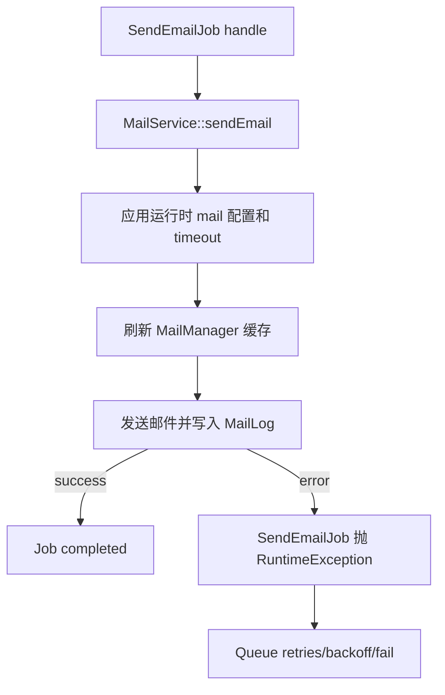

# 变更提案: fix-send-email-job-timeout

## 元信息
```yaml
类型: 修复
方案类型: implementation
优先级: P1
状态: 已确认
创建: 2026-04-28
```

---

## 1. 需求

### 背景
Horizon 失败作业中共有 59 条 `send_email` 队列失败，作业均为 `App\Jobs\SendEmailJob`，错误摘要均为 `Illuminate\Queue\TimeoutExceededException: App\Jobs\SendEmailJob has timed out.`。代码排查发现 `SendEmailJob` 当前 `$timeout = 10`，明显短于生产环境 SMTP 连接、TLS 握手和邮件服务商慢响应的常见耗时，也短于 `config/horizon.php` 中 notification supervisor 的 60 秒 timeout。

### 目标
- 降低正常邮件发送因 10 秒 job 超时导致失败的概率。
- 让邮件发送失败走 Laravel 队列异常/重试机制，避免手动 `release()` 隐藏真实失败原因。
- 给 SMTP 传输设置明确超时，避免单次发送无限阻塞直到 worker 超时。
- 保留邮件失败可观测性，同时避免将邮件密码等敏感配置写入日志或数据库。

### 约束条件
```yaml
时间约束: 当前回合内完成代码修复和可执行验证。
性能约束: 不引入同步批量发信，不扩大单个 worker 的无限等待时间。
兼容性约束: 保持现有 Laravel 12 + Horizon 队列结构，继续兼容当前 legacy mail config。
业务约束: 不直接清空、重试或修改生产 Horizon 失败作业；生产重试需要另行确认。
```

### 验收标准
- [ ] `SendEmailJob` 的 job timeout 不再是 10 秒，并且小于 Redis `retry_after`。
- [ ] 邮件发送返回错误时抛出异常，由队列统一处理 retries/backoff/fail，而不是直接 `release(60)`。
- [ ] SMTP 配置包含可调 `MAIL_TIMEOUT`，运行时邮件配置能在 Horizon 长驻 worker 中生效。
- [ ] `MailLog` 中保存的邮件配置不包含明文 `password`。
- [ ] 新增或更新测试覆盖 job 超时配置、失败抛出、邮件配置脱敏。

---

## 2. 方案

### 技术方案
采用唯一修复路径：保留现有 `SendEmailJob` 和 `MailService` 架构，不拆分新队列、不引入新依赖。将 `SendEmailJob` 调整为更适合 SMTP 的超时和 backoff 策略；邮件发送失败时抛出异常交给 Laravel Queue/Horizon；在 `MailService` 中统一应用运行时邮件配置、设置 SMTP timeout、刷新 Laravel MailManager 缓存，并对写入 `MailLog` 的配置做敏感字段脱敏。

### 影响范围
```yaml
涉及模块:
  - queue-mail: SendEmailJob 的超时、重试、失败处理行为。
  - mail-service: 运行时 SMTP 配置、发送日志、敏感信息脱敏。
  - config: MAIL_TIMEOUT 与队列 retry_after 可配置化。
预计变更文件: 5-7
```

### 风险评估
| 风险 | 等级 | 应对 |
|------|------|------|
| 超时时间过长导致 worker 被慢 SMTP 占用 | 中 | SMTP transport timeout 默认 30 秒，job timeout 60 秒，仍小于 retry_after。 |
| 失败后抛异常可能让失败摘要变化 | 低 | 这是期望行为，能暴露真实邮件错误；超时仍由 Horizon 记录。 |
| 生产已有失败作业重试后可能重复发信 | 中 | 本方案不自动重试历史失败作业，生产重试需按作业内容另行确认。 |
| 运行时刷新 MailManager 影响同 worker 后续邮件 | 低 | 仅在每次发信前应用当前配置，符合动态后台邮件配置的预期。 |

### 方案取舍
```yaml
唯一方案理由: 故障根因集中在当前 job 过短 timeout 和邮件发送失败处理方式，局部修复能直接降低失败率且不改变业务入口。
放弃的替代路径:
  - 单纯把 Horizon notification timeout 调大: 无法覆盖 job 自身 timeout=10，也不能解决 SMTP 无限阻塞和错误摘要不清晰。
  - 新增邮件服务商 API SDK: 需要新的凭据、配置和迁移成本，超出当前故障修复范围。
  - 自动重试全部失败作业: 可能造成重复邮件，属于生产副作用，不在本次代码修复中执行。
回滚边界: 可独立回退 SendEmailJob、MailService、config 与测试变更；不会修改数据库结构。
```

---

## 3. 技术设计

### 核心流程


### 配置边界
- `MAIL_TIMEOUT` 控制 SMTP transport timeout，默认 30 秒。
- `SendEmailJob::$timeout` 控制单个 job 最大执行时长，计划设置为 60 秒。
- `queue.redis.retry_after` 保持大于 job timeout；改为可通过 `QUEUE_RETRY_AFTER` 调整，默认 90 秒。

---

## 4. 核心场景

### 场景: 单封邮件发送成功
**模块**: queue-mail  
**条件**: SMTP 服务在 `MAIL_TIMEOUT` 内响应成功。  
**行为**: `SendEmailJob` 调用 `MailService::sendEmail()`。  
**结果**: job 正常完成，`MailLog.error = null`。

### 场景: SMTP 返回错误
**模块**: queue-mail  
**条件**: SMTP 认证失败、连接失败或服务商返回错误。  
**行为**: `MailService` 记录脱敏配置和错误摘要，`SendEmailJob` 抛出异常。  
**结果**: Horizon 按 job tries/backoff 重试，失败摘要展示真实错误。

### 场景: SMTP 长时间无响应
**模块**: queue-mail  
**条件**: SMTP 连接或读写超过 `MAIL_TIMEOUT`。  
**行为**: 邮件传输超时后返回错误，若仍阻塞则 job timeout 兜底。  
**结果**: 单个 job 不会被无限占用，且 `retry_after` 不早于 timeout 触发。

---

## 5. 技术决策

### fix-send-email-job-timeout#D001: 保留队列结构并修复 job 与 mail transport 超时
**日期**: 2026-04-28  
**状态**: ✅采纳  
**背景**: 失败作业都集中在 `SendEmailJob has timed out`，当前 job timeout 只有 10 秒。  
**选项分析**:
| 选项 | 优点 | 缺点 |
|------|------|------|
| A: 局部修复 job timeout、mail timeout 和错误处理 | 改动小，直接命中根因，易验证和回滚 | 仍依赖 SMTP 服务商自身稳定性 |
| B: 只增大 Horizon timeout | 改动更少 | job 自身 timeout=10 仍会失败，且缺少传输层超时 |
| C: 改造为第三方邮件 API | 长期可观测性更好 | 需要新配置和迁移，超出当前故障修复 |
**决策**: 选择方案 A。  
**理由**: 当前故障由代码事实直接定位到 job timeout 过短和失败处理不清晰，局部修复收益最高、风险最低。  
**影响**: `SendEmailJob`、`MailService`、`config/mail.php`、`config/queue.php`、`.env.example`、相关单元测试。

---

## 6. 验证策略

```yaml
verifyMode: test-first
reviewerFocus:
  - app/Jobs/SendEmailJob.php 的 timeout/tries/backoff/failOnTimeout 与 retry_after 关系。
  - app/Services/MailService.php 是否刷新 mailer 缓存并避免明文 password 写入 MailLog。
  - config/mail.php 与 config/queue.php 是否保持默认值可部署。
testerFocus:
  - vendor/bin/phpunit --filter SendEmailJobTest
  - vendor/bin/phpunit --filter MailServiceTest
  - php -l app/Jobs/SendEmailJob.php
  - php -l app/Services/MailService.php
uiValidation: none
riskBoundary:
  - 不执行 horizon:forget、queue:retry、horizon:terminate 等会影响生产队列的命令。
  - 不读取或修改 .env 中的真实 SMTP 密码。
```

---

## 7. 成果设计

N/A。此任务不涉及视觉产出。
