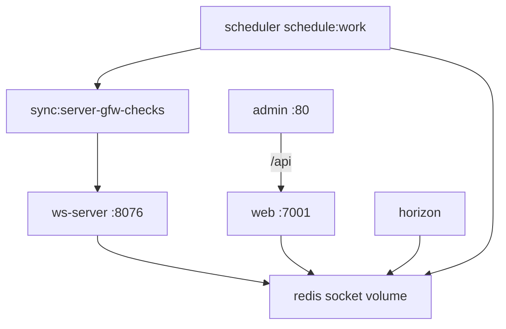

# 变更提案: xboard-reusable-server-deploy

## 元信息
```yaml
类型: 新功能
方案类型: implementation
优先级: P1
状态: 已确认
创建: 2026-04-28
```

---

## 1. 需求

### 背景
当前服务器部署使用自定义 compose，包含 `web / horizon / admin / ws-server / redis`，但缺少独立 `scheduler` 服务，导致 Laravel Scheduler 可能没有持续运行，进而影响 `sync:server-gfw-checks` 自动墙检测等定时任务。用户希望在本地仓库内新增一套可复制到其他服务器的一键部署目录，包含 compose、环境变量模板、目录初始化和常用部署命令。

### 目标
- 新增 `deploy/xboard-server/` 自包含部署模板。
- 模板保留用户当前部署拓扑，并补齐 `scheduler` 服务运行 `php artisan schedule:work`。
- 提供 `.env.example`，覆盖 Laravel、镜像、端口、数据库、Redis、邮件和管理前端上游等必要变量。
- 提供脚本创建挂载目录、初始化 `.env`、拉取镜像、启动服务、执行迁移和查看状态。
- 提供 README，说明首次部署、更新、迁移、日志、调度检查和墙检测排查命令。

### 约束条件
```yaml
时间约束: 本轮完成模板目录、脚本、说明和静态验证
性能约束: 不新增运行时服务以外的额外常驻依赖；scheduler 单进程即可
兼容性约束: 兼容当前 ghcr.io/micah123321/xboard:new 和 ghcr.io/micah123321/xboard-admin-frontend:new 镜像
业务约束: 不写入真实 APP_KEY、数据库密码、邮箱密码或域名；不自动执行生产数据库破坏性操作
```

### 验收标准
- [ ] `deploy/xboard-server/compose.yaml` 存在，并包含 `web / horizon / scheduler / admin / ws-server / redis` 六个服务。
- [ ] `.env.example` 与 compose 变量匹配，复制为 `.env` 后可作为部署起点。
- [ ] 初始化脚本可创建 `.docker/.data`、`storage/logs`、`storage/theme`、`plugins` 等挂载目录。
- [ ] README 覆盖首次部署、更新、迁移、日志、scheduler 检查和墙检测手动触发命令。
- [ ] shell 脚本通过 `sh -n` 语法检查，YAML 至少通过文本结构检查。

---

## 2. 方案

### 技术方案
在仓库新增 `deploy/xboard-server/`，将服务器部署所需内容收敛到独立目录:

- `compose.yaml`: 以用户当前 compose 为基础，新增 `scheduler` 服务；所有服务复用同一 `.env`、日志目录、插件目录和 Redis socket 卷。
- `.env.example`: 同时作为 Docker Compose 变量文件和 Laravel 环境变量模板，保留镜像 tag、端口、数据库、Redis、邮件等占位项。
- `scripts/init.sh`: 创建挂载目录，并在 `.env` 不存在时从 `.env.example` 复制。
- `scripts/deploy.sh`: 执行初始化、拉取镜像并启动服务；默认不自动迁移，避免生产 DB 风险。
- `scripts/update.sh`: 拉取镜像、重启服务，并提供可选 `--migrate` 执行迁移。
- `scripts/status.sh`: 输出 compose 服务状态、scheduler 日志尾部、Laravel schedule 状态和墙检测手动命令提示。
- `README.md`: 作为部署操作手册。

### 影响范围
```yaml
涉及模块:
  - deploy: 新增可复制部署模板目录
  - node-gfw-check: 明确 scheduler 对自动墙检测的部署依赖
预计变更文件: 7-9
```

### 风险评估
| 风险 | 等级 | 应对 |
|------|------|------|
| 用户误以为脚本会自动完成交互式安装 | 中 | README 明确 `xboard:install` 和 `migrate` 命令需按部署阶段执行 |
| `.env` 同时被 Compose 和 Laravel 使用导致变量混杂 | 低 | Laravel 会忽略未知变量；README 标注变量用途 |
| scheduler 多实例重复运行 | 中 | 模板只定义一个 scheduler 服务；split/supervisor 规则中仅 web 角色默认启用 scheduler |
| 生产数据库迁移风险 | 中 | `deploy.sh` 默认不迁移，`update.sh --migrate` 才执行 |

### 方案取舍
```yaml
唯一方案理由: 自包含目录最贴近用户“复制到其他服务器一键部署”的使用方式；不侵入现有根目录 compose，也不会要求用户记住多处文档。
放弃的替代路径:
  - 只修改根目录 compose.sample.yaml: 对新服务器仍缺少初始化目录、env 和排查命令，不够一键化。
  - 生成生产 .env: 会引入真实密钥和凭据风险，不适合提交仓库。
  - 把 MySQL 纳入 compose: 用户当前部署未包含 MySQL，强行加入会改变部署拓扑。
回滚边界: 删除 `deploy/xboard-server/` 目录即可回滚本模板；不会影响运行时代码。
```

---

## 3. 技术设计

### 架构设计


### 数据模型
无数据库结构变更。

---

## 4. 核心场景

### 场景: 首次复制部署
**模块**: deploy  
**条件**: 新服务器已安装 Docker Compose  
**行为**: 复制 `deploy/xboard-server/`，执行 `scripts/init.sh`，填写 `.env`，启动 compose  
**结果**: 必需目录存在，服务按 compose 启动

### 场景: 自动墙检测持续运行
**模块**: node-gfw-check  
**条件**: scheduler 服务在线，节点开启墙检测托管  
**行为**: `php artisan schedule:work` 触发 `sync:server-gfw-checks`  
**结果**: 自动为开启托管的父节点创建检测任务

---

## 5. 技术决策

### xboard-reusable-server-deploy#D001: 使用独立 scheduler 服务驱动 Laravel Scheduler
**日期**: 2026-04-28
**状态**: ✅采纳
**背景**: 用户当前 compose 中 `web` 只运行 Octane，`horizon` 只运行队列，缺少持续执行 `schedule:work` 的进程。
**选项分析**:
| 选项 | 优点 | 缺点 |
|------|------|------|
| A: 独立 `scheduler` 服务 | 与 Laravel 推荐模式一致，状态可独立查看，适合 compose 部署 | 多一个容器 |
| B: 依赖 Octane tick 调 `schedule:run` | 服务数量少 | 当前 Provider 在 console 入口 return，实际可靠性不足 |
| C: 让 horizon 顺带跑 scheduler | 容器少 | 职责混杂，日志和重启策略不清晰 |
**决策**: 选择方案 A
**理由**: 定时任务是自动墙检测和自动上线的运行前提，必须有显式、可排查、可重启的进程。
**影响**: `deploy/xboard-server/compose.yaml`、部署文档。

### xboard-reusable-server-deploy#D002: 默认不把 MySQL 纳入一键模板
**日期**: 2026-04-28
**状态**: ✅采纳
**背景**: 用户当前生产 compose 不包含 MySQL，数据库可能由宿主机、面板或云数据库提供。
**选项分析**:
| 选项 | 优点 | 缺点 |
|------|------|------|
| A: 保持外部 MySQL | 与当前生产部署一致，迁移成本低 | 需要用户填写 DB_HOST |
| B: 模板内新增 MySQL | 更完整 | 会改变现有架构，数据持久化与迁移风险更高 |
**决策**: 选择方案 A
**理由**: 部署模板应优先复刻已验证拓扑，避免把数据库迁移纳入本轮。
**影响**: `.env.example`、README。

---

## 6. 验证策略

```yaml
verifyMode: review-first
reviewerFocus:
  - compose 服务拓扑是否包含 scheduler
  - env 变量是否与 compose 使用一致
  - 脚本是否避免自动执行生产数据库风险操作
testerFocus:
  - sh -n scripts/*.sh
  - docker compose config
  - docker compose ps scheduler
  - docker compose exec web php artisan schedule:list
uiValidation: none
riskBoundary:
  - 不写入真实密钥
  - 不自动连接或修改生产数据库
  - 不覆盖用户现有服务器 compose
```

---

## 7. 成果设计

N/A，本任务不产生视觉 UI。
