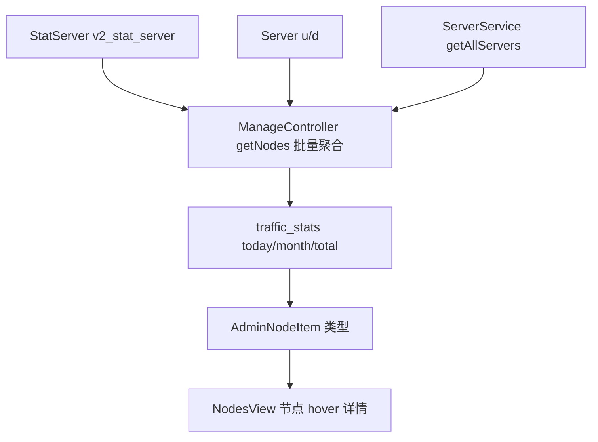

# 变更提案: admin-frontend-node-traffic-hover

## 元信息
```yaml
类型: 新功能
方案类型: implementation
优先级: P1
状态: 已规划
创建: 2026-04-28
```

---

## 1. 需求

### 背景
节点管理页 `#/nodes` 已能展示节点在线状态、墙检测状态、地址、在线人数、倍率和权限组，但鼠标悬停节点时的详情还没有展示节点自身的流量统计。管理员排查节点负载或流量异常时，需要直接看到今日、本月和累计流量，并区分上行、下行。

### 目标
在 `admin-frontend` 节点列表的节点详情 hover 区域新增流量统计信息：
- 今日流量：上行、下行、合计
- 本月流量：上行、下行、合计
- 累计流量：上行、下行、合计

### 约束条件
```yaml
时间约束: 无
性能约束: server/manage/getNodes 不能引入按节点循环查询；流量聚合需批量完成
兼容性约束: 旧接口字段缺失时前端以 0 B 或 -- 兜底，不破坏现有节点列表
业务约束: 后端接口契约以 Controller/Model/StatServer 为真相源，不在前端伪造统计
```

### 验收标准
- [ ] `server/manage/getNodes` 返回每个节点的 `traffic_stats.today/month/total`，每组包含 `upload/download/total`
- [ ] `AdminNodeItem` 类型覆盖新增流量统计字段
- [ ] 节点列表中鼠标移动到节点名称区域时显示流量详情卡，包含日、月、总的上行、下行和合计
- [ ] 流量值按 B/KB/MB/GB/TB 自适应格式化，空值不产生 `NaN`
- [ ] `npm run build` 在 `admin-frontend` 下通过

---

## 2. 方案

### 技术方案
在后端 `ManageController::getNodes()` 中基于当前节点 ID 集合批量聚合 `v2_stat_server`，按今日起点和本月起点计算 `SUM(u)`、`SUM(d)`、`SUM(u + d)`；累计流量以 `v2_server.u/d` 为节点当前累计真相源。三组结果统一挂载到每个节点的 `traffic_stats` 字段。前端扩展节点类型定义和 `nodes.ts` 工具函数，提供统一的流量格式化与详情数据结构；`NodesView.vue` 将节点名称区域包裹为 Element Plus popover，并以 Apple 风格的克制统计网格展示日、月、总三组上下行数据。

### 影响范围
```yaml
涉及模块:
  - backend-server-manage: server/manage/getNodes 新增节点级流量统计字段
  - admin-frontend: 节点类型、格式化工具和节点 hover 详情 UI
预计变更文件: 5
```

### 风险评估
| 风险 | 等级 | 应对 |
|------|------|------|
| 节点数量较多时聚合查询变慢 | 中 | 使用 `whereIn(server_id, ids)` + `groupBy(server_id)` 批量聚合，避免 N+1 |
| 历史节点没有统计记录 | 低 | 后端返回 0 结构，前端格式化兜底 |
| Element Plus popover 导致表格行布局抖动 | 低 | 只包裹节点名称展示区，详情层使用固定宽度和轻量样式 |

### 方案取舍
```yaml
唯一方案理由: 当前需求需要“日、月、总”三种统计，后端已有 StatServer 日志表和 Server.u/d 累计字段，最合理路径是在 getNodes 返回时一次性挂载聚合结果，前端只负责展示。
放弃的替代路径:
  - 前端逐节点请求统计接口: 会产生 N+1 网络请求，表格分页和 hover 体验不稳定
  - 只展示 v2_server.u/d: 只能表示节点当前累计字段，不能满足日/月维度
  - 新增独立详情接口按 hover 拉取: 可减少列表 payload，但 hover 时延迟明显，且本次统计字段较小
回滚边界: 可独立回退 ManageController 的 traffic_stats 挂载、前端类型/工具函数和 NodesView hover UI，不影响节点 CRUD、排序、墙检测和自动上线逻辑。
```

---

## 3. 技术设计

### 数据流


### API 设计
#### GET server/manage/getNodes
- **请求**: 沿用现有请求，无新增参数
- **响应新增字段**:
```ts
traffic_stats?: {
  today: { upload: number; download: number; total: number }
  month: { upload: number; download: number; total: number }
  total: { upload: number; download: number; total: number }
}
```

### 数据模型
| 字段 | 类型 | 说明 |
|------|------|------|
| `traffic_stats.today.upload` | number | 今日节点上行字节数 |
| `traffic_stats.today.download` | number | 今日节点下行字节数 |
| `traffic_stats.today.total` | number | 今日节点总流量 |
| `traffic_stats.month.*` | number | 本月节点流量统计 |
| `traffic_stats.total.*` | number | 节点当前累计流量统计，来源为 `v2_server.u/d` |

---

## 4. 核心场景

### 场景: 节点 hover 查看流量明细
**模块**: admin-frontend  
**条件**: 管理员进入 `#/nodes`，节点列表加载成功  
**行为**: 鼠标移动到节点名称区域  
**结果**: 弹出详情卡展示今日、本月、累计的上行、下行和合计流量，数值单位自动格式化。

---

## 5. 技术决策

### admin-frontend-node-traffic-hover#D001: 在 getNodes 聚合节点流量而不是 hover 拉取
**日期**: 2026-04-28  
**状态**: ✅采纳  
**背景**: 节点列表已通过 `server/manage/getNodes` 获取全部节点，需求要求 hover 即可看到日、月、总流量。  
**选项分析**:
| 选项 | 优点 | 缺点 |
|------|------|------|
| A: `getNodes` 批量挂载统计 | hover 无延迟；接口契约集中；可避免前端 N+1 | 列表 payload 略增加；后端查询增加三组聚合 |
| B: hover 时请求单节点详情 | 初始列表轻 | hover 有网络延迟；高频移动会造成请求风暴 |
| C: 前端只展示 `v2_server.u/d` | 改动最小 | 无法提供今日/本月维度 |
**决策**: 选择方案 A  
**理由**: 当前统计来自同一张 `v2_stat_server` 表，可按当前节点集合批量聚合；相比 hover 拉取，运营查看详情的反馈更稳定。  
**影响**: `server/manage/getNodes` 响应增加 `traffic_stats`；前端节点类型与 hover UI 同步适配。

---

## 6. 验证策略

```yaml
verifyMode: review-first
reviewerFocus:
  - app/Http/Controllers/V2/Admin/Server/ManageController.php 聚合查询是否避免 N+1
  - admin-frontend/src/utils/nodes.ts 流量格式化是否处理 null/undefined/NaN
  - admin-frontend/src/views/nodes/NodesView.vue popover 是否不影响表格操作
testerFocus:
  - npm run build
  - PHP 语法检查: php -l app/Http/Controllers/V2/Admin/Server/ManageController.php
  - 人工核对 #/nodes 节点名称 hover 详情包含今日、本月、累计三组上下行数据
uiValidation: optional
riskBoundary:
  - 不执行真实数据库写入
  - 不重置节点流量
  - 不修改节点 CRUD、批量删除、墙检测或自动上线行为
```

---

## 7. 成果设计

### 设计方向
- **美学基调**: Apple 式极简运营详情层。以白色轻表面、近黑文字和单一蓝色强调呈现统计信息，不引入额外色彩系统。
- **记忆点**: hover 卡片用三组紧凑统计带呈现“今日 / 本月 / 累计”，每组内部清晰区分上行、下行和合计。
- **参考**: `apple/DESIGN.md`

### 视觉要素
- **配色**: 背景 `#ffffff` / `#f5f5f7`，正文 `#1d1d1f`，次要文字 `rgba(0,0,0,0.48)`，强调色 `#0071e3`
- **字体**: 沿用当前项目 Apple 风格系统字体栈，不额外引入远程字体，避免管理端性能成本
- **布局**: 详情卡固定宽度，三行统计分组纵向排列；每行左侧为维度标签，右侧为合计，下方用两列展示上行/下行
- **动效**: 使用 Element Plus popover 的轻量浮层出现/消失，不新增高成本动画
- **氛围**: 低阴影、浅灰分区、无纹理无渐变，保持管理端可读性

### 技术约束
- **可访问性**: popover 内容为可读文本；触发区域保留节点名称文本，不用图标替代语义
- **响应式**: 表格本身横向滚动时 popover 保持固定宽度，不挤压列宽
