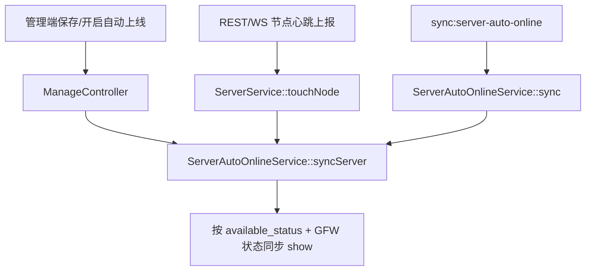

# 变更提案: admin-frontend-node-auto-online-immediate-sync

## 元信息
```yaml
类型: 修复
方案类型: implementation
优先级: P1
状态: 已规划
创建: 2026-04-28
```

---

## 1. 需求

### 背景
节点管理页复制节点后，新节点会保留原节点的 `auto_online` 状态但被复制接口强制设为隐藏。管理员修改新节点信息并安装节点后，即使自动上线处于开启状态，节点也不会立即显示，需要手动关闭自动上线、打开显隐、再重新开启自动上线。

代码事实:
- `ManageController::copy()` 复制节点后设置 `show = 0`。
- `NodeEditorDialog` 保存会提交 `show` 与 `auto_online`，但后端 `save()` 只落库，不主动执行自动上线同步。
- `ServerAutoOnlineService::sync()` 目前只由 `sync:server-auto-online` 定时命令每 5 分钟调用。
- REST 节点心跳 `ServerService::touchNode()` 只更新在线缓存，不会触发自动上线同步；WebSocket 状态上报还绕过了 `touchNode()` 直接写缓存。

### 目标
- 自动上线开启的节点在管理端保存、开启自动上线或节点心跳上报后，立即按当前在线状态和墙检测状态同步 `show`。
- 保持现有定时任务兜底能力，避免依赖管理员手动切换显隐。
- 保持墙检测自动隐藏规则不被绕过。

### 约束条件
```yaml
时间约束: 无
性能约束: 单节点心跳只能同步当前节点，不能触发全量扫描
兼容性约束: 保持 sync:server-auto-online 命令输出结构不变
业务约束: 自动上线仍以 available_status 和墙状态为准；未开启 auto_online 的节点不改变手动显隐
```

### 验收标准
- [ ] `ServerAutoOnlineService` 支持单节点同步，并复用定时全量同步的同一套判定逻辑。
- [ ] 管理端保存节点、开启自动上线、批量开启自动上线后，若节点当前为在线或待同步且未被墙检测否决，应立即 `show=1`。
- [ ] 节点心跳上报后，若该节点开启自动上线，应立即同步 `show`，不必等待 Scheduler。
- [ ] 被墙状态或 `gfw_auto_hidden` 未恢复正常时，自动上线不会把节点重新显示。
- [ ] 单元测试覆盖单节点同步和心跳触发场景。

---

## 2. 方案

### 技术方案
将 `ServerAutoOnlineService` 中的自动上线判定抽出为可复用的 `syncServer(Server $server)` 单节点入口。全量定时命令继续调用 `sync()`，内部复用同一判定函数。

在两个关键触发点调用单节点同步:
- 管理端 `ManageController` 的 `save()`、`update()`、`batchUpdate()` 在节点开启 `auto_online` 后立即调用。
- `ServerService::touchNode()` 在节点心跳刷新后，如果节点开启 `auto_online`，立即调用；WebSocket 状态上报改为复用 `touchNode()`。

### 影响范围
```yaml
涉及模块:
  - server-auto-online: 抽取单节点同步入口，复用全量同步逻辑
  - admin-server-manage: 保存/开关/批量更新自动上线时立即同步
  - server-heartbeat: REST 与 WebSocket 节点心跳后触发当前节点同步
  - tests: 补充自动上线单节点与心跳行为验证
预计变更文件: 5
```

### 风险评估
| 风险 | 等级 | 应对 |
|------|------|------|
| 节点心跳频繁导致额外数据库写入 | 中 | 只在 `auto_online=true` 时执行；状态无变化时不保存 |
| 保存接口中 `show` 与 `auto_online` 同时提交时语义冲突 | 低 | 自动上线开启时以自动同步判定为准，符合 UI 中显隐开关被托管的文案 |
| 墙检测自动隐藏被误清除 | 中 | 单节点同步复用原有 `isGfwBlocked/isGfwHeld` 判定，只在正常状态时清除 hold |

### 方案取舍
```yaml
唯一方案理由: 问题根因在后端自动上线语义只由定时任务触发；把同步能力收敛到服务层并在业务事件中调用，可以同时覆盖管理端保存、开关和节点真实上线心跳。
放弃的替代路径:
  - 仅前端保存后强制提交 show=1: 会绕过离线/被墙判断，且无法覆盖节点稍后才心跳上线的场景。
  - 缩短 Scheduler 间隔: 仍不是立即上线，并增加全量扫描频率。
  - 复制节点时默认关闭 auto_online: 会改变复制语义，仍要求管理员额外操作。
回滚边界: 可独立回退 ServerAutoOnlineService 单节点入口、ManageController 调用点和 ServerService::touchNode 调用点；数据库结构不变。
```

---

## 3. 技术设计

### 架构设计


### API 设计
不新增外部 API。现有接口保持不变:
- `POST /server/manage/save`
- `POST /server/manage/update`
- `POST /server/manage/batchUpdate`
- 节点心跳/报告接口

### 数据模型
不新增字段。

---

## 4. 核心场景

### 场景: 复制节点后自动上线立即生效
**模块**: admin-frontend / server-auto-online
**条件**: 新节点由复制产生，`show=0`，`auto_online=1`，节点已经心跳在线且未被墙检测否决。
**行为**: 管理员在节点管理页编辑并保存该节点。
**结果**: 后端保存后立即执行单节点自动上线同步，节点 `show=1`，前端刷新列表后显示为上线。

### 场景: 节点稍后才上线
**模块**: server-heartbeat / server-auto-online
**条件**: 节点保存时尚未心跳，`auto_online=1`，`show=0`。
**行为**: 节点安装完成并上报心跳。
**结果**: REST 与 WebSocket 心跳都会通过 `touchNode()` 更新在线缓存并立即同步当前节点，节点不需要等待下一轮 Scheduler。

---

## 5. 验证策略

```yaml
verifyMode: test-first
reviewerFocus:
  - app/Services/ServerAutoOnlineService.php 单节点与全量同步是否共用判定逻辑
  - app/Services/ServerService.php 与 app/WebSocket/NodeEventHandlers.php 心跳触发是否只影响 auto_online 节点
  - app/Http/Controllers/V2/Admin/Server/ManageController.php 管理端更新后的同步时机
testerFocus:
  - vendor/bin/phpunit tests/Unit/ServerAutoOnlineServiceTest.php
  - npm --prefix admin-frontend run build
uiValidation: none
riskBoundary:
  - 不修改数据库结构
  - 不修改节点列表视觉结构
  - 不改变未开启 auto_online 节点的手动显隐行为
```

---

## 6. 成果设计

N/A。此任务不包含视觉产出。
