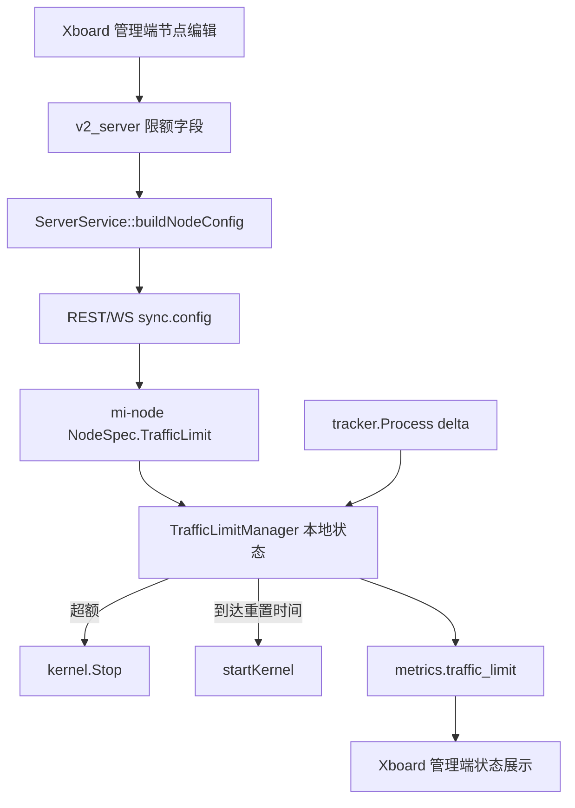

# 变更提案: node-traffic-limit-enforcement

## 元信息
```yaml
类型: 新功能
方案类型: implementation
优先级: P1
状态: 已确认
创建: 2026-04-28
```

---

## 1. 需求

### 背景
部分节点供应商有固定月流量额度，且每个节点的额度重置时间不同。当前 Xboard 只在面板侧通过 `show`、订阅过滤或节点累计 `u/d` 判断可见性，不能让 `mi-node` 实际停止节点内核，因此无法满足超额后真实下线的要求。

### 目标
- 管理员可以为单个节点设置每月流量额度，上行和下行合并计算。
- 管理员可以设置每月重置日期和重置时间。
- `mi-node` 在当前周期内统计节点总流量，达到额度后调用内核 `Stop()`，使节点真实下线。
- 重置时间到达后，`mi-node` 清理本周期状态并重新启动内核，使节点恢复上线。
- Xboard 负责保存、下发、展示和手动重置节点流量限额状态，不把该状态混入 `show` 或 `auto_online`。

### 约束条件
```yaml
时间约束: 本轮在现有 Xboard 与 mi-node 项目内增量实现，不重写节点同步架构。
性能约束: mi-node 额度检查复用现有 tracker tick，不能增加按连接扫描的重负载路径。
兼容性约束: 未启用节点流量限额的节点行为保持不变；旧 mi-node 忽略新增配置字段。
业务约束: 节点下线必须是 mi-node 内核停止，不只是订阅隐藏或 show=false。
```

### 验收标准
- [ ] Xboard 节点编辑接口和管理端可保存节点月流量额度、重置日、重置时间。
- [ ] Xboard 下发的节点配置包含流量限额、重置规则和时区信息。
- [ ] mi-node 可解析新增配置，并在达到额度后停止内核，同时阻止 `ensureRunning()` 自动拉起。
- [ ] mi-node 在重置时间到达后清理限额状态并恢复内核运行。
- [ ] mi-node 重启后能从本地持久化状态恢复周期用量和限额下线状态。
- [ ] Xboard 管理端能展示限额额度、当前已用、下次重置、限额状态。
- [ ] 手动/自动重置节点流量后会通知 mi-node，使本地限额状态及时恢复。
- [ ] `go test ./...`、`admin-frontend npm run build` 完成；PHP 侧在本机工具可用时执行语法/测试验证。

---

## 2. 方案

### 技术方案
采用“节点本地强执行 + 面板配置编排”。

Xboard 在 `v2_server` 增加限额配置字段，复用已有 `transfer_enable` 作为节点月流量额度，新增启用状态、重置日、重置时间、时区和限额状态字段。`ServerService::buildNodeConfig()` 将限额配置下发给 `mi-node`，`ServerObserver` 在配置字段变化时推送 `sync.config`。管理端节点编辑弹窗增加限额配置区，节点列表流量浮层展示限额状态。

`mi-node` 在 `NodeConfig` / `NodeSpec` 中新增 `traffic_limit` 结构，新增节点流量限额管理组件，复用 tracker 每个 tick 计算出的增量合计周期用量。达到额度后设置 suspended 状态并调用 `kernel.Stop()`；在重置时间到达后清空周期状态，并在已有 `lastConfig` / `lastUsers` 可用时重启内核。状态写入本地 JSON，避免进程重启后丢失周期用量。

### 影响范围
```yaml
涉及模块:
  - Xboard 数据模型: v2_server 限额字段、casts、保存校验。
  - Xboard 节点同步: buildNodeConfig、ServerObserver、NodeSyncService 推送触发。
  - Xboard 节点状态: report metrics 缓存、手动重置流量后通知节点恢复。
  - Xboard 管理端: 节点编辑弹窗、类型定义、保存映射、节点列表限额展示。
  - mi-node 面板协议: panel.NodeConfig、model.NodeSpec、WS/REST 转换。
  - mi-node 服务层: tracker 增量接入、内核 stop/start gate、metrics 上报。
  - mi-node 本地状态: 新增持久化文件保存周期用量和 suspended 状态。
预计变更文件: 20-30 个，跨 PHP、Vue/TypeScript、Go 三层。
```

### 风险评估
| 风险 | 等级 | 应对 |
|------|------|------|
| mi-node 本地周期用量与 Xboard `u/d` 展示短暂不一致 | 中 | 以 mi-node 为强执行源，Xboard 展示同时保留面板统计和 node metrics；手动重置触发 config/full sync。 |
| `ensureRunning()` 或配置 reload 在 suspended 状态下误重启内核 | 高 | 在 `startKernel()` / `ensureRunning()` / `applyChanges()` 入口统一检查限额 gate，并补单元测试。 |
| 重置日遇到短月，如 31 号 | 中 | 下次重置时间计算时钳制到当月最后一天。 |
| 旧 mi-node 不支持新增字段 | 低 | 新字段为可选结构，旧节点忽略；Xboard 仍能保存和展示配置。 |
| 同一节点多实例运行导致额度各自计算 | 中 | 本轮按一节点一运行实例处理；方案文档注明该边界，多实例集中裁决不在本轮范围。 |

### 方案取舍
```yaml
唯一方案理由: 本方案把真实下线放在 mi-node 本地执行，能避免面板报告延迟导致超额后仍继续服务，同时保留 Xboard 的配置、审计和人工操作入口。
放弃的替代路径:
  - 面板集中裁决 + WS 停启事件: 状态源集中但依赖 report/WS 延迟，不能保证及时停止节点。
  - 只扩展 show/enabled 或用户移除逻辑: 成本低但不满足“节点实际下线”。
回滚边界: 可关闭单节点限额开关恢复旧行为；数据库新增字段可独立回滚；mi-node 新增限额组件不影响未启用限额节点。
```

---

## 3. 技术设计

### 架构设计


### API 设计
#### Admin 节点保存 payload
- **请求新增字段**:
  - `traffic_limit_enabled`: boolean
  - `traffic_limit_reset_day`: integer|null，1-31
  - `traffic_limit_reset_time`: string|null，`HH:mm`
  - `traffic_limit_timezone`: string|null，默认面板时区
  - `transfer_enable`: integer|null，字节，0 表示不限额
- **响应**: 复用现有节点保存响应。

#### 节点配置下发
- **新增结构**:
```json
{
  "traffic_limit": {
    "enabled": true,
    "limit": 1099511627776,
    "reset_day": 1,
    "reset_time": "04:00",
    "timezone": "Asia/Shanghai",
    "current_used": 123456,
    "next_reset_at": 1774977600
  }
}
```

#### mi-node metrics
- **新增结构**:
```json
{
  "traffic_limit": {
    "enabled": true,
    "limit": 1099511627776,
    "used": 123456,
    "suspended": false,
    "next_reset_at": 1774977600,
    "last_reset_at": 1772299200
  }
}
```

### 数据模型
| 字段 | 类型 | 说明 |
|------|------|------|
| `traffic_limit_enabled` | boolean | 是否启用节点月流量强制下线。 |
| `traffic_limit_reset_day` | tinyint nullable | 每月重置日，1-31，短月钳制到最后一天。 |
| `traffic_limit_reset_time` | string nullable | 每月重置时间，`HH:mm`。 |
| `traffic_limit_timezone` | string nullable | 重置时间使用的时区，默认面板时区。 |
| `traffic_limit_status` | string nullable | 面板缓存的限额状态，如 `normal` / `suspended`。 |
| `traffic_limit_last_reset_at` | integer nullable | 最近一次重置时间戳。 |
| `traffic_limit_next_reset_at` | integer nullable | 下一次重置时间戳。 |
| `traffic_limit_suspended_at` | integer nullable | 最近一次超额下线时间戳。 |

---

## 4. 核心场景

### 场景: 节点超额后真实下线
**模块**: mi-node 服务层  
**条件**: 节点启用流量限额，周期用量累计达到 `limit`。  
**行为**: `TrafficLimitManager` 标记 suspended，持久化状态，调用 `kernel.Stop()`。  
**结果**: `kernel_status=false`，节点不再提供代理服务，`ensureRunning()` 不会自动重启。

### 场景: 重置时间到达后恢复上线
**模块**: mi-node 服务层  
**条件**: 节点处于限额 suspended，当前时间达到 `next_reset_at`。  
**行为**: 管理组件清空周期用量，更新 reset 时间，持久化状态，调用 `startKernel(lastConfig,lastUsers)`。  
**结果**: 节点内核重新运行，metrics 显示 `suspended=false`。

### 场景: 管理员调整限额配置
**模块**: Xboard 节点同步  
**条件**: 管理员保存节点限额字段。  
**行为**: Xboard 保存字段，`ServerObserver` 触发 `sync.config`。  
**结果**: mi-node 收到新配置并重新计算限额状态；未启用限额时不影响旧行为。

---

## 5. 技术决策

### node-traffic-limit-enforcement#D001: 由 mi-node 本地强制节点下线
**日期**: 2026-04-28  
**状态**: ✅采纳  
**背景**: 用户明确要求“不是只是不显示，要实际上的下线”。  
**选项分析**:
| 选项 | 优点 | 缺点 |
|------|------|------|
| A: mi-node 本地强执行 | 停机及时，网络异常时仍能执行，符合真实下线 | 需要本地状态持久化和更多测试 |
| B: Xboard 集中裁决后下发停启 | 状态集中，管理端一致性强 | 依赖 report/WS 延迟，节点可能继续服务 |
| C: 修改 show/enabled/用户列表 | 实现简单 | 不是真实节点下线 |
**决策**: 选择方案 A。  
**理由**: 真实下线必须发生在运行代理内核的进程内，本地强执行可以最小化超额后的继续服务窗口。  
**影响**: `mi-node` 服务层成为限额执行源，Xboard 负责配置和展示。

### node-traffic-limit-enforcement#D002: 复用 `transfer_enable` 作为节点月额度
**日期**: 2026-04-28  
**状态**: ✅采纳  
**背景**: Xboard 已有 `v2_server.transfer_enable/u/d` 字段和管理端流量统计展示。  
**选项分析**:
| 选项 | 优点 | 缺点 |
|------|------|------|
| A: 复用 `transfer_enable` | 避免重复额度字段，兼容已有过滤与展示 | 字段语义需要在 UI 中明确为节点月额度 |
| B: 新增 `traffic_limit_bytes` | 语义独立 | 与现有 `transfer_enable` 容易重复和不同步 |
**决策**: 选择方案 A。  
**理由**: 现有字段已经是节点流量上限，新增启用和重置规则即可表达“每月额度”。  
**影响**: 保存 payload、模型 casts、下发配置和 UI 显示都以 `transfer_enable` 为额度来源。

---

## 6. 验证策略

```yaml
verifyMode: test-first
reviewerFocus:
  - mi-node suspended 状态下所有内核启动路径是否被 gate 住。
  - Xboard 限额字段变化是否一定触发 config sync。
  - 手动重置是否同时清面板统计并通知节点恢复。
testerFocus:
  - go test ./...
  - cd admin-frontend && npm run build
  - PHP 可用时执行 php artisan test 或针对新增测试执行 vendor/bin/phpunit
  - 节点配置接口返回 traffic_limit 结构
  - mi-node 超额 stop、重置 start、重启恢复状态
uiValidation: optional
riskBoundary:
  - 不执行生产数据库迁移。
  - 不推送远端、不部署生产环境。
  - 不修改与节点限额无关的 show/auto_online/gfw 检测策略。
```

---

## 7. 成果设计

### 设计方向
- **美学基调**: 工具型运维界面，保持节点工作台既有密度和控件体系，新增内容以紧凑表单行、状态标签和进度信息呈现。
- **记忆点**: 节点流量浮层中出现一条清晰的“额度进度 + 下次重置 + 限额状态”信息带。
- **参考**: 延续当前 `NodesView.vue` 和 `NodeEditorDialog.vue` 的 Element Plus 管理端风格。

### 视觉要素
- **配色**: 使用现有状态色，正常为绿色，接近限额为橙色，限额下线为红色，避免引入新的主视觉体系。
- **字体**: 沿用项目当前字体栈，避免在管理端局部引入不一致字体。
- **布局**: 节点编辑弹窗在基础配置区增加“流量限额”配置组；节点列表流量 popover 在今日/本月/累计后增加额度状态。
- **动效**: 仅使用 Element Plus 表单显隐和 loading 状态，不新增装饰动效。
- **氛围**: 保持运维工具克制、可扫描，避免营销式说明文字。

### 技术约束
- **可访问性**: 开关、输入框、时间选择器保留明确 label；状态不只靠颜色表达。
- **响应式**: 编辑弹窗使用现有 grid/form 布局，在窄屏下自动换行。
