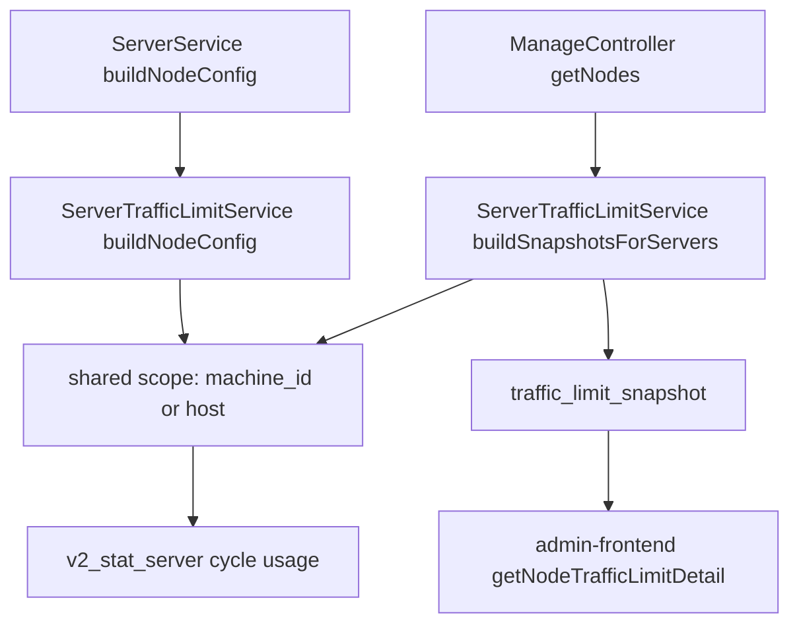

# 变更提案: shared-node-traffic-limit

## 元信息
```yaml
类型: 修复
方案类型: implementation
优先级: P1
状态: 草稿
创建: 2026-04-29
```

---

## 1. 需求

### 背景
节点管理页的“流量统计”弹层中，“月额度”当前优先使用单个节点的 mi-node metrics 或 `v2_server.u + v2_server.d`。当同一台机器上配置多个节点时，机器月流量额度是共享的，单节点口径会低估或拆散真实使用量。现有“本月”统计也按自然月聚合，不等同于机器供应商从指定重置日开始的账期。

### 目标
- 同一台机器 / 同一 IP 下的多个节点共享月额度使用量。
- 月额度使用量按当前限额配置的上一个重置边界到现在统计，而不是按自然月或单节点累计。
- 节点管理页的“月额度 used / limit”、进度条和限额状态使用后端统一快照。
- 保留“今日 / 昨日 / 本月 / 累计”节点流量统计的现有展示口径，不把自然月统计改成账期统计。

### 约束条件
```yaml
时间约束: 无
性能约束: 节点列表接口需要避免全表扫描式重复统计，按当前节点集合和共享范围聚合
兼容性约束: 不新增必填数据库字段；未配置 machine_id 的节点仍可按 host/IP 共享
业务约束: 不执行生产数据修复；不改变节点显隐和用户订阅筛选规则
```

### 验收标准
- [ ] 同一 `machine_id` 的两个限额节点，节点管理页显示相同的月额度已用量。
- [ ] 未配置 `machine_id` 但 `host` 相同的两个限额节点，节点管理页显示相同的月额度已用量。
- [ ] 月额度已用量从当前时间之前最近一次重置边界开始统计，例如重置日 18 日则按最近一个 18 日 00:00 起算。
- [ ] 不同 `machine_id` 或不同 `host` 的节点不互相累加。
- [ ] 前端在后端缺少共享快照时仍能回退到原有 metrics / `u + d` 展示。

---

## 2. 方案

### 技术方案
在 `ServerTrafficLimitService` 中集中新增共享限额快照能力：
- 共享范围优先使用 `machine_id`；未绑定机器时使用规范化后的 `host`。空 host 回退为单节点范围。
- 新增当前账期起点计算：根据节点的 `traffic_limit_reset_day / traffic_limit_reset_time / traffic_limit_timezone` 计算“当前时间之前最近一次重置时间”。
- 新增共享账期用量统计：从 `v2_stat_server` 中按共享范围内的 `server_id` 聚合 `record_type='d'` 的 `u/d`，统计窗口为账期起点到当前日。若节点未持久化或没有统计来源，再回退到共享范围内的 `u + d`。
- `buildNodeConfig()` 继续返回 mi-node 既有 `traffic_limit` 结构，但 `current_used` 改用共享账期用量。
- 管理端 `server/manage/getNodes` 为每个节点追加 `traffic_limit_snapshot`，前端月额度优先使用该快照展示。
- 管理端 TypeScript 类型和 `getNodeTrafficLimitDetail()` 同步增加快照优先级，保持缺省兼容。

### 影响范围
```yaml
涉及模块:
  - node-traffic-limit: 限额账期、共享范围和当前用量计算
  - admin-frontend: 节点管理页月额度展示数据源
预计变更文件: 5-7 个
```

### 风险评估
| 风险 | 等级 | 应对 |
|------|------|------|
| `v2_stat_server.record_at` 是日粒度，非 00:00 重置时间无法做到小时级切分 | 中 | 按重置日所在自然日作为统计起点，保留 `traffic_limit_last_reset_at` 和 mi-node metrics 作为运行态辅助；在测试中覆盖 00:00 主路径 |
| 同 host 但实际不是同一机器的节点会被共享统计 | 中 | 优先使用 `machine_id`；未绑定机器时按用户明确要求的同 IP/host 兜底，并在知识库记录规则 |
| 前端旧数据结构缺少新快照 | 低 | 前端保留原有 metrics / `u + d` 回退 |
| 改动影响 mi-node 下发的 `current_used` | 中 | 仅改变限额模块中的用量口径，不改变配置字段名；用单元测试覆盖共享和非共享场景 |

### 方案取舍
```yaml
唯一方案理由: 共享用量属于限额领域逻辑，集中在 ServerTrafficLimitService 能同时服务节点配置下发和管理端展示，避免前端自行猜测同机节点。
放弃的替代路径:
  - 仅前端按 host 汇总: 只能修展示，无法修正 mi-node 下发的 current_used，且会复制业务规则
  - 新增 machine_quota 表: 能表达机器级额度，但超出本次问题范围，需要新增配置入口和迁移
  - 每次 DNS 解析 host 后按真实 IP 汇总: 接口性能和网络副作用不可控，且域名解析会受环境影响
回滚边界: 可独立回退 ServerTrafficLimitService 的共享快照、ManageController 的 traffic_limit_snapshot 返回和前端快照优先展示；不涉及数据库结构回滚
```

---

## 3. 技术设计

### 架构设计


### API 设计
#### GET `server/manage/getNodes`
- **请求**: 保持不变。
- **响应**: 每个节点新增可选字段：
```json
{
  "traffic_limit_snapshot": {
    "enabled": true,
    "limit": 1073741824000,
    "used": 616327110656,
    "percent": 57,
    "suspended": false,
    "status": "normal",
    "cycle_start_at": 1776441600,
    "last_reset_at": 1776441600,
    "next_reset_at": 1779033600,
    "scope_key": "host:82.40.33.225",
    "scope_node_ids": [327, 272]
  }
}
```

### 数据模型
不新增数据库字段。共享范围由现有 `v2_server.machine_id` 和 `v2_server.host` 推导。

---

## 4. 核心场景

### 场景: 同 IP 节点共享月额度
**模块**: node-traffic-limit  
**条件**: 两个节点 `host` 相同，均启用月流量限额，重置日一致。  
**行为**: 管理端打开节点列表并悬停任一节点名称。  
**结果**: 两个节点的“月额度”已用量均为该 host 下节点账期流量合计。

### 场景: 绑定机器优先共享
**模块**: node-traffic-limit  
**条件**: 两个节点绑定相同 `machine_id`，host 可以不同。  
**行为**: 后端生成节点列表或 mi-node 配置。  
**结果**: 共享范围按 `machine_id` 聚合，不再按 host 分裂。

---

## 5. 技术决策

### shared-node-traffic-limit#D001: 共享范围优先 machine_id，兜底 host
**日期**: 2026-04-29  
**状态**: ✅采纳  
**背景**: 项目已有 `v2_server_machine` 和 `machine_id`，但用户当前问题来自同 IP 多节点共享机器额度，不能要求所有旧节点先补机器绑定。  
**选项分析**:
| 选项 | 优点 | 缺点 |
|------|------|------|
| A: 只按 machine_id | 语义最准确 | 旧节点或未绑定机器的同 IP 节点无法修复 |
| B: 只按 host/IP | 满足截图场景 | 已绑定机器但 host 不同的同机节点会被拆散 |
| C: machine_id 优先，host 兜底 | 覆盖新旧两类场景，改动较小 | host 相同但非同机的节点会共享统计 |
**决策**: 选择方案 C。  
**理由**: 在不新增配置入口的前提下，C 能覆盖已有机器模型和用户明确的同 IP 场景。  
**影响**: `ServerTrafficLimitService` 成为共享范围规则的唯一实现位置，管理端和节点配置下发共用该规则。

---

## 6. 验证策略

```yaml
verifyMode: test-first
reviewerFocus:
  - app/Services/ServerTrafficLimitService.php 的账期起点、共享范围和回退逻辑
  - app/Http/Controllers/V2/Admin/Server/ManageController.php 的响应兼容性
  - admin-frontend/src/utils/nodes.ts 的快照优先级和旧数据回退
testerFocus:
  - vendor/bin/phpunit tests/Unit/ServerTrafficLimitServiceTest.php
  - vendor/bin/phpunit tests/Unit/Admin/NodeTrafficStatsWindowTest.php
  - php -l app/Services/ServerTrafficLimitService.php
  - php -l app/Http/Controllers/V2/Admin/Server/ManageController.php
uiValidation: optional
riskBoundary:
  - 不执行数据库迁移或生产数据更新
  - 不修改删除节点、重置节点流量等破坏性接口语义
```

---

## 7. 成果设计

N/A。本次不调整节点管理页视觉结构，只修正“月额度”展示数据源。
