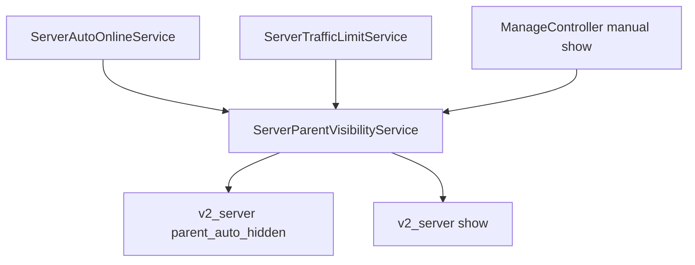

# 变更提案: parent-node-auto-visibility

## 元信息
```yaml
类型: 修复
方案类型: implementation
优先级: P1
状态: 已设计
创建: 2026-04-29
```

---

## 1. 需求

### 背景
当前父节点自动状态链路存在不一致：
- `ServerAutoOnlineService` 只同步开启 `auto_online` 的节点自身；父节点因离线被自动隐藏时，不会保证其子节点同步隐藏。
- `ServerTrafficLimitService` 将流量限额超额状态写入 `traffic_limit_status`，既有知识库明确记录“不修改 `show`”，因此父节点超额后子节点仍可能保持展示。
- 墙检测已有 `gfw_auto_hidden` 标记，只恢复上次由墙检测自动隐藏的节点；本次需求需要为“父节点自动下线”建立同等可追溯标记，避免误恢复原本手动隐藏的子节点。

### 目标
- 父节点因系统自动逻辑变为不可展示时，自动隐藏当时仍展示的子节点。
- 父节点由系统自动逻辑恢复可展示时，只恢复上一次由该父节点联动逻辑自动隐藏的子节点。
- 原本 `show=0`、管理员手动隐藏、后续被手动调整的子节点不能被误上线。
- 覆盖自动上线同步、流量限额超额/恢复等当前可定位的自动状态入口，并保留墙检测自身的独立标记逻辑。

### 约束条件
```yaml
时间约束: 本轮完成后端实现、迁移、测试和知识库同步
性能约束: 子节点联动只按单个父节点查询/更新，不引入全表循环外的额外扫描
兼容性约束: 不改变现有管理端 API 请求结构，不改变 mi-node 下发协议
业务约束: 只修改系统自动联动产生的 show 状态；不修改 enabled、auto_online、gfw_check_enabled
```

### 验收标准
- [ ] 父节点自动下线时，当前 `show=1` 的子节点被隐藏并打上父级自动隐藏标记。
- [ ] 父节点自动恢复时，仅 `parent_auto_hidden=1` 的子节点恢复展示，原本隐藏的子节点保持隐藏。
- [ ] 管理员手动修改子节点 `show` 时会清除父级自动隐藏标记，后续父节点恢复不会覆盖人工决定。
- [ ] 流量限额从 normal 变为 suspended 时触发子节点隐藏，从 suspended/超额状态恢复为 normal 时触发标记子节点恢复。
- [ ] 相关单元测试通过，至少覆盖自动上线和流量限额两条入口。

---

## 2. 方案

### 技术方案
新增一组父节点联动标记字段到 `v2_server`：
- `parent_auto_hidden`: 子节点是否由父节点自动状态联动隐藏。
- `parent_auto_action_at`: 最近一次父节点联动操作时间。

新增 `ServerParentVisibilityService` 作为集中服务：
- `hideChildrenForParent(Server $parent)`: 只隐藏当前 `show=1` 的直接子节点，并设置 `parent_auto_hidden=1`。
- `restoreChildrenForParent(Server $parent)`: 只恢复 `parent_auto_hidden=1` 且未被其他自动隐藏原因阻断的直接子节点，并清除标记。
- `clearParentAutoHidden(Server $server)`: 管理员手动调整节点展示状态时清除标记，防止后续自动恢复覆盖人工操作。

接入点：
- `ServerAutoOnlineService`: 父节点自动同步后，根据父节点最终 `show` 决定隐藏或恢复子节点；即使父节点自身状态未变化，也根据当前最终状态补齐子节点联动。
- `ServerTrafficLimitService`: `refreshSchedule()`、`resetServer()`、`applyRuntimeMetrics()` 写入限额运行状态后，对父节点执行子节点隐藏/恢复。超额或节点端上报 suspended 时隐藏；恢复 normal 或重置后恢复标记子节点。
- `ManageController`: 在单节点保存、快速更新、批量更新中，手动传入 `show` 时同步清除 `parent_auto_hidden`。

### 影响范围
```yaml
涉及模块:
  - node-traffic-limit: 限额 suspended/normal 状态影响子节点展示联动
  - node-auto-online: 自动上线同步影响父节点子节点展示联动
  - admin-server-manage: 手动 show 修改时清理自动联动标记
预计变更文件: 8
```

### 风险评估
| 风险 | 等级 | 应对 |
|------|------|------|
| 恢复子节点时覆盖其他自动隐藏原因 | 中 | 恢复时跳过 `gfw_auto_hidden=1` 的节点，并只处理 `parent_auto_hidden=1` 的子节点 |
| 流量限额状态频繁上报导致重复更新 | 低 | 服务方法先按当前状态筛选，只更新需要变化的子节点 |
| 新字段未迁移导致运行时异常 | 中 | 添加幂等迁移、模型 casts 和测试覆盖 |

### 方案取舍
```yaml
唯一方案理由: 独立 `parent_auto_hidden` 标记能精确表达“上次由父节点联动自动下线”的来源，满足只恢复自动下线子节点的要求，且不会污染墙检测专用字段。
放弃的替代路径:
  - 复用 `gfw_auto_hidden`: 会把墙检测和父节点自动联动混在一起，恢复时无法区分原因。
  - 不加字段、只按当前 show 推断: 无法判断子节点原本是否手动隐藏，会误上线。
回滚边界: 可回退新增服务接入、模型字段和迁移；数据库字段保留时不会影响旧逻辑，删除字段需单独迁移。
```

---

## 3. 技术设计

### 架构设计


### 数据模型
| 字段 | 类型 | 说明 |
|------|------|------|
| parent_auto_hidden | boolean default false | 子节点是否由父节点自动状态联动隐藏 |
| parent_auto_action_at | unsignedBigInteger nullable | 最近一次父节点联动隐藏或恢复时间戳 |

---

## 4. 核心场景

### 场景: 父节点自动下线联动子节点
**模块**: node-auto-online / node-traffic-limit  
**条件**: 父节点因自动上线检测离线、流量限额超额或其他系统自动状态变为不可展示；子节点 A 当前 `show=1`，子节点 B 当前 `show=0`。  
**行为**: 服务隐藏子节点 A 并设置 `parent_auto_hidden=1`，子节点 B 保持隐藏且不设置标记。  
**结果**: 父节点恢复时只恢复子节点 A。

### 场景: 父节点自动恢复只恢复上次自动下线子节点
**模块**: node-auto-online / node-traffic-limit  
**条件**: 父节点恢复可展示；子节点 A `parent_auto_hidden=1`，子节点 B 是手动隐藏。  
**行为**: 服务恢复子节点 A 并清除标记，子节点 B 不变。  
**结果**: 不误上线原本未展示的子节点。

### 场景: 管理员手动修改子节点展示状态
**模块**: admin-server-manage  
**条件**: 子节点此前由父节点联动隐藏，管理员手动设置 `show`。  
**行为**: 控制器清除 `parent_auto_hidden` 和 `parent_auto_action_at`。  
**结果**: 后续父节点自动恢复不会覆盖管理员最新选择。

---

## 5. 技术决策

### parent-node-auto-visibility#D001: 使用独立父级自动隐藏标记
**日期**: 2026-04-29  
**状态**: ✅采纳  
**背景**: 需求要求恢复“上次自动下线”的子节点，不能恢复原本未启用或手动隐藏的子节点。  
**选项分析**:
| 选项 | 优点 | 缺点 |
|------|------|------|
| A: 独立 `parent_auto_hidden` 标记 | 语义清晰，可与墙检测、手动隐藏并存 | 需要新增迁移和模型字段 |
| B: 复用 `gfw_auto_hidden` | 改动少 | 原因混淆，容易误恢复墙检测隐藏节点 |
| C: 不持久化标记 | 无数据库变更 | 不能跨进程、跨重启准确恢复 |
**决策**: 选择方案 A  
**理由**: 只有持久化来源标记能准确表达“上次被父节点自动联动下线”的子节点集合。  
**影响**: `v2_server` 表、节点自动上线服务、流量限额服务、管理端节点状态接口、相关测试。

---

## 6. 验证策略

```yaml
verifyMode: test-first
reviewerFocus:
  - app/Services/ServerParentVisibilityService.php 的恢复条件是否避免误上线
  - ServerAutoOnlineService 与 ServerTrafficLimitService 的触发时机是否覆盖状态变化
  - ManageController 手动 show 修改是否清除自动标记
testerFocus:
  - vendor/bin/phpunit tests/Unit/ServerAutoOnlineServiceTest.php tests/Unit/ServerTrafficLimitServiceTest.php
  - php -l 新增/修改的 PHP 文件
uiValidation: none
riskBoundary:
  - 不执行生产数据库迁移
  - 不调用生产 API
  - 不修改 mi-node 协议
```

---

## 7. 成果设计

N/A。此次为后端状态联动与数据标记修复，不涉及视觉产出。
