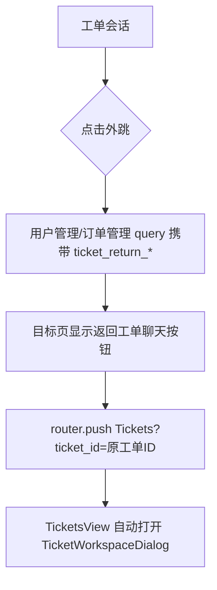

# 变更提案: admin-frontend-ticket-return-manual-subscribe-copy

## 元信息
```yaml
类型: 修复/优化
方案类型: implementation
优先级: P1
状态: 已确认
创建: 2026-05-07
```

---

## 1. 需求

### 背景
管理端用户列表的“复制订阅URL”在不支持 `navigator.clipboard.writeText` 的环境中只显示提示，没有把订阅地址展示给管理员，导致“请手动复制”但无法直接复制地址。工单工作台跳转到用户页或订单页后，也缺少明显入口返回原工单会话，排查链路会被打断。

### 目标
- 复制订阅地址时，在剪贴板 API 不可用或写入失败时弹出可选中文本框，展示对应订阅地址供手动复制。
- 从工单会话跳转到其他页面时携带原工单上下文，目标页展示“返回工单聊天”按钮。
- 返回按钮点击后回到工单管理页，并自动打开原工单会话。
- 先覆盖当前已存在的工单外跳目标：用户管理页与订单管理页，同时抽出可复用逻辑，便于后续页面接入。

### 约束条件
```yaml
时间约束: 本次在现有 admin-frontend 内完成，不扩展后端接口。
性能约束: 不新增全局状态库或第三方依赖，仅使用 Vue Router query 和本地 computed。
兼容性约束: 保持现有 Hash 路由、用户页 user_id/user_email 筛选、订单页 user_id/user_email 筛选和 dashboard 来源提示行为。
业务约束: 不修改工单接口与订单/用户业务筛选语义。
```

### 验收标准
- [ ] 剪贴板不可用时点击“复制订阅URL”，弹窗展示该用户订阅地址，可选中复制。
- [ ] 剪贴板写入失败时同样弹窗展示该用户订阅地址，而不是只显示失败提示。
- [ ] 从工单会话点击“查看用户”进入用户页后，页面顶部展示“返回工单聊天”按钮。
- [ ] 从工单会话点击“用户订单”进入订单页后，页面顶部展示“返回工单聊天”按钮。
- [ ] 点击返回按钮后进入 `Tickets` 路由并通过 query 指定工单 ID，工单页自动打开对应会话。
- [ ] `npm run build` 在 `admin-frontend` 下通过。

---

## 2. 方案

### 技术方案
- 新增 `src/views/tickets/useTicketReturnLink.ts`，集中解析 `ticket_return_id/ticket_return_subject` query，并提供 `returnToTicket()`。
- 在 `TicketWorkspaceDialog.vue` 的 `openTicketUser()` 与 `openTicketUserOrders()` 中追加 `ticket_return_id` 和 `ticket_return_subject` query。
- 在 `TicketsView.vue` 中读取 `route.query.ticket_id`，进入页面时自动打开对应工单会话，并在 query 变化时同步。
- 在 `UsersView.vue` 与 `OrdersView.vue` 顶部引入 `useTicketReturnLink()`，当存在工单返回上下文时展示带图标的返回按钮。
- 在 `useUsersManagement.ts` 中把复制失败路径改为 `ElMessageBox.alert()`，使用 readonly textarea 展示订阅地址。

### 影响范围
```yaml
涉及模块:
  - admin-frontend: 工单工作台外跳、用户管理订阅地址复制、用户页/订单页返回工单入口
预计变更文件: 6-7 个
```

### 风险评估
| 风险 | 等级 | 应对 |
|------|------|------|
| query 参数与现有筛选参数冲突 | 低 | 使用 `ticket_return_*` 独立命名，不复用 `user_id/user_email/source/workbench` |
| 工单返回时未自动打开弹窗 | 中 | 在 `TicketsView.vue` 中统一解析 `ticket_id` 并 watch query 变化 |
| 手动复制弹窗样式或文本不可选 | 低 | 使用原生 textarea + readonly，保证文本可选中 |
| 目标页按钮布局破坏移动端 | 低 | 复用现有 toolbar/hero flex 样式，并补充响应式规则 |

### 方案取舍
```yaml
唯一方案理由: 当前需求是跨页面导航状态，不需要引入 Pinia 或 sessionStorage。query 可复制、可刷新、可从地址栏恢复，符合 Hash 路由管理端现状。
放弃的替代路径:
  - 使用全局 store 保存返回状态: 刷新页面会丢失上下文，且引入状态生命周期清理问题。
  - 使用浏览器 history.back(): 无法保证返回后打开原工单，也无法覆盖新标签/刷新场景。
  - 在每个页面各自硬编码 query 解析: 重复逻辑多，后续页面接入成本高。
回滚边界: 可独立撤销新增 composable、工单外跳 query、目标页返回按钮与订阅地址弹窗改动，不影响后端接口。
```

---

## 3. 技术设计

### 路由 query
```yaml
ticket_return_id: 原工单 ID，数字字符串
ticket_return_subject: 原工单标题，可选，仅用于按钮标题/提示
ticket_id: Tickets 路由打开指定工单会话的入口参数
```

### 交互流程


---

## 4. 核心场景

### 场景: 订阅地址手动复制
**模块**: admin-frontend  
**条件**: 当前浏览器环境不支持 Clipboard API，或 `writeText()` 被拒绝。  
**行为**: 管理员点击用户行级“复制订阅URL”。  
**结果**: 页面弹出“手动复制订阅地址”对话框，显示该用户订阅地址，管理员可直接选中复制。

### 场景: 工单外跳后返回会话
**模块**: admin-frontend  
**条件**: 管理员在工单工作台打开某个工单。  
**行为**: 点击“查看用户”或“用户订单”跳转，并在目标页点击“返回工单聊天”。  
**结果**: 回到工单管理页并自动打开原工单聊天弹窗。

---

## 5. 技术决策

### admin-frontend-ticket-return-manual-subscribe-copy#D001: 使用 query 传递工单返回上下文
**日期**: 2026-05-07  
**状态**: 采纳  
**背景**: 返回入口需要跨页面、可刷新，并能指定重新打开的工单会话。  
**选项分析**:
| 选项 | 优点 | 缺点 |
|------|------|------|
| A: Vue Router query | 可刷新恢复、实现轻量、符合现有筛选参数模式 | URL 会多出少量参数 |
| B: Pinia/sessionStorage | URL 更干净 | 刷新/多标签一致性更弱，需要额外清理 |
| C: history.back | 实现最少 | 无法保证返回指定工单聊天 |
**决策**: 选择方案 A  
**理由**: 工单 ID 本身不是敏感内容，query 能表达“从某工单来”的导航上下文，并能直接触发工单页打开指定会话。  
**影响**: 用户页和订单页会新增返回按钮；后续页面可复用同一个 composable。

---

## 6. 验证策略

```yaml
verifyMode: review-first
reviewerFocus:
  - src/views/tickets/useTicketReturnLink.ts
  - src/views/tickets/TicketsView.vue
  - src/views/tickets/TicketWorkspaceDialog.vue
  - src/views/users/useUsersManagement.ts
  - src/views/users/UsersView.vue
  - src/views/subscriptions/OrdersView.vue
testerFocus:
  - npm run build
  - 人工核对复制失败弹窗内容可选中
  - 人工核对从工单跳用户页/订单页后可返回原工单
uiValidation: optional
riskBoundary:
  - 不修改后端 API
  - 不引入新依赖
  - 不触碰 public/assets/admin 既有未提交构建产物
```

---

## 7. 成果设计

### 设计方向
- **美学基调**: 延续当前管理端 Apple 风格，使用低装饰、清晰留白、轻量蓝色强调的工具型入口。
- **记忆点**: 目标页顶部出现一枚明确的“返回工单聊天”操作按钮，保持排查链路不中断。
- **参考**: 项目现有用户页、订单页、工单弹窗样式。

### 视觉要素
- **配色**: 使用现有 `#0071e3` / `var(--xboard-link)` 作为返回按钮强调色，背景保持白色或页面现有色块。
- **字体**: 沿用项目既有系统字体栈，不引入远程字体，符合知识库中的当前视觉基线。
- **布局**: 用户页按钮放在 hero 右侧操作区，订单页按钮放在标题区右侧；移动端堆叠显示。
- **动效**: 使用 Element Plus 按钮默认 hover/focus 反馈，不增加装饰性动画。
- **氛围**: 维持纯色分区与轻量阴影，不新增大面积装饰背景。

### 技术约束
- **可访问性**: 按钮保留文本与图标，textarea 可通过键盘选中内容。
- **响应式**: 在现有断点下返回按钮不挤压标题和筛选工具栏。
