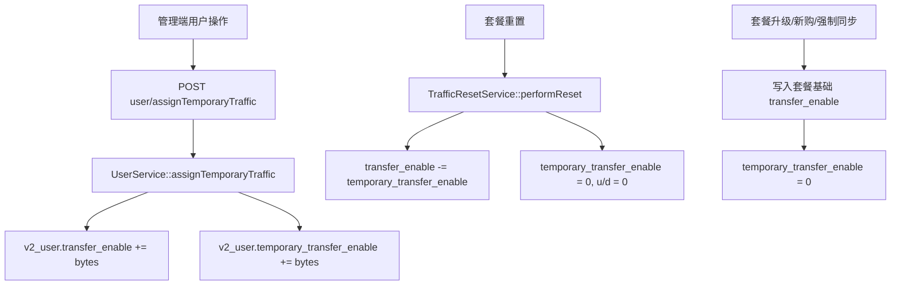

# 变更提案: admin-temporary-user-traffic

## 元信息
```yaml
类型: 新功能
方案类型: implementation
优先级: P1
状态: 已确认
创建: 2026-05-08
```

---

## 1. 需求

### 背景
用户管理需要支持管理员给用户临时增加一次性流量。例如用户当前套餐基础流量为 500G，管理员额外分配 50G 后，当期总额度显示为 550G；但这 50G 只是本期可用的临时流量，后续套餐升级、新购、套餐强制同步或套餐周期流量重置时，不能把这 50G 继续计入新套餐或新周期。

### 目标
- 管理端用户列表提供“分配一次性流量”操作。
- 分配后用户当前 `transfer_enable` 增加指定额度，订阅客户端和节点可用性判断继续读取当前总额度。
- 新增独立字段记录管理员分配的临时额度，避免与套餐基础额度混淆。
- 套餐升级、新购、一次性套餐购买、套餐强制同步时清空临时额度。
- 用户套餐流量重置时移除临时额度，只保留非临时总额度，并清零 `u/d`。
- 覆盖关键单元测试，避免临时额度在升级和重置中被滚入后续周期。

### 约束条件
```yaml
时间约束: 无
性能约束: 用户列表和订阅导出仍直接使用 transfer_enable，不引入运行时复杂聚合
兼容性约束: 保持现有节点、订阅协议、活跃状态筛选、流量提醒对 transfer_enable 的读取语义
业务约束: 本次只处理“管理员在用户管理处分配的一次性流量”，不重构礼品卡或订单流量来源账本
```

### 验收标准
- [ ] 管理员给 500G 用户分配 50G 后，用户当前总流量为 550G，临时额度字段为 50G。
- [ ] 套餐流量重置后 `u/d` 归零，当前总流量回到 500G，临时额度归零。
- [ ] 用户升级或新购套餐后，当前总流量等于新套餐流量，临时额度归零。
- [ ] 套餐管理 `force_update` 同步套餐参数时，当前总流量等于套餐流量，临时额度归零。
- [ ] 管理端用户操作入口可输入 GB 数量并成功调用后端接口刷新列表。

---

## 2. 方案

### 技术方案
采用“独立临时额度字段 + 当前总额物化”的方案：
- 在 `v2_user` 新增 `temporary_transfer_enable`，以字节记录管理员额外分配的一次性流量。
- 新增后端用户管理接口，验证用户 ID 与 GB 数量，在事务中同时增加 `transfer_enable` 与 `temporary_transfer_enable`。
- 在 `TrafficResetService::performReset()` 中，重置流量时扣除并清空 `temporary_transfer_enable`。
- 在订单开通和套餐强制同步路径中，凡是重新写入套餐基础流量的地方，同时清空 `temporary_transfer_enable`。
- 管理端用户列表新增“分配一次性流量”操作弹窗，用户输入 GB 数量后调用新接口。

### 影响范围
```yaml
涉及模块:
  - database/migrations: 增加用户临时流量字段
  - app/Models/User.php: 增加字段文档
  - app/Services/UserService.php: 封装管理员临时流量分配
  - app/Services/TrafficResetService.php: 重置时移除临时额度
  - app/Services/OrderService.php: 套餐重写时清空临时额度
  - app/Http/Controllers/V2/Admin/UserController.php: 增加管理端接口
  - app/Http/Requests/Admin: 增加请求校验
  - app/Http/Routes/V2/AdminRoute.php: 增加管理端路由
  - admin-frontend/src: 增加类型、API、用户操作弹窗和列表刷新
  - tests/Unit: 覆盖临时流量服务、重置和订单清空规则
预计变更文件: 14
```

### 风险评估
| 风险 | 等级 | 应对 |
|------|------|------|
| 现有 `transfer_enable` 直接作为当前总额使用，拆成计算字段会影响大量查询 | 中 | 保持 `transfer_enable` 作为当前总额，只新增临时额度来源字段 |
| 重置路径只清零 `u/d`，若未扣除临时额度会继续带入新周期 | 高 | 在 `TrafficResetService::performReset()` 中统一扣减并清空临时额度 |
| 套餐开通和强制同步覆盖 `transfer_enable` 时忘记清空临时额度 | 高 | 同步修改 `OrderService`、`UserService::assignPlan()`、`PlanController::save(force_update)` |
| 管理端编辑抽屉已有“总流量”字段，混用会造成来源不清 | 中 | 新增独立操作，不复用手动编辑总流量字段 |

### 方案取舍
```yaml
唯一方案理由: 该方案兼容现有 transfer_enable 读取语义，改动面可控，同时能明确隔离管理员临时流量。
放弃的替代路径:
  - 完整流量来源流水表: 长期最清晰，但需要重构大量查询和协议导出，本次风险与成本过高。
  - 只增加加流量接口: 无法追踪管理员临时额度，重置或升级时无法精确扣回。
回滚边界: 可撤销新增路由、接口、前端入口和迁移字段；若已上线并产生数据，回滚前需先确认 temporary_transfer_enable 数据处理策略。
```

---

## 3. 技术设计

### 架构设计


### API设计
#### POST `{secure_path}/user/assignTemporaryTraffic`
- **请求**:
```json
{
  "id": 123,
  "traffic_gb": 50
}
```
- **响应**:
```json
{
  "data": {
    "user_id": 123,
    "transfer_enable": 590558003200,
    "temporary_transfer_enable": 53687091200
  }
}
```

### 数据模型
| 字段 | 类型 | 说明 |
|------|------|------|
| `v2_user.temporary_transfer_enable` | `bigInteger default 0` | 管理员分配、仅本期有效的一次性流量，单位字节 |

---

## 4. 核心场景

### 场景: 管理员分配一次性流量
**模块**: admin-frontend / admin-user  
**条件**: 用户当前套餐基础流量 500G，`temporary_transfer_enable = 0`  
**行为**: 管理员在用户管理中给用户分配 50G  
**结果**: `transfer_enable = 550G`，`temporary_transfer_enable = 50G`

### 场景: 套餐周期重置
**模块**: traffic-reset  
**条件**: 用户 `transfer_enable = 550G`，`temporary_transfer_enable = 50G`，`u/d` 有用量  
**行为**: 执行自动或手动流量重置  
**结果**: `transfer_enable = 500G`，`temporary_transfer_enable = 0`，`u = 0`，`d = 0`

### 场景: 套餐升级或新购
**模块**: order-payment  
**条件**: 用户当前存在临时流量  
**行为**: 订单开通新套餐或升级套餐  
**结果**: 用户 `transfer_enable` 等于新套餐基础流量，`temporary_transfer_enable = 0`

---

## 5. 技术决策

### admin-temporary-user-traffic#D001: 临时流量独立字段并物化到当前总额度
**日期**: 2026-05-08
**状态**: ✅采纳
**背景**: 现有系统大量逻辑直接读取 `v2_user.transfer_enable` 判断可用性、展示订阅总额度和筛选活跃用户，直接改成动态聚合会扩大回归面。
**选项分析**:
| 选项 | 优点 | 缺点 |
|------|------|------|
| A: 独立临时字段 + 物化当前总额 | 兼容现有逻辑，能在重置/升级时精确扣除临时额度 | 不是完整流量来源账本 |
| B: 流量来源流水表 | 长期可审计、可扩展 | 改动面大，需要替换大量现有查询 |
| C: 只加总流量接口 | 实现最快 | 无法区分临时来源，后续重置仍易误算 |
**决策**: 选择方案 A
**理由**: 满足当前业务目标，控制风险，并为未来流量账本保留演进空间。
**影响**: 用户管理、订单开通、套餐管理、流量重置、管理端用户页面。

---

## 6. 验证策略

```yaml
verifyMode: test-first
reviewerFocus:
  - app/Services/TrafficResetService.php 中临时额度扣减是否只执行一次
  - app/Services/OrderService.php 和 PlanController force_update 是否清空临时额度
  - 管理端新增入口是否避免和编辑总流量字段语义混淆
testerFocus:
  - vendor/bin/phpunit tests/Unit/UserTemporaryTrafficServiceTest.php tests/Unit/TrafficResetTemporaryTrafficTest.php tests/Unit/Orders/OrderServiceTemporaryTrafficTest.php
  - npm run build --prefix admin-frontend
uiValidation: optional
riskBoundary:
  - 不执行生产数据库迁移
  - 不改动礼品卡流量奖励语义
  - 不重构 transfer_enable 的全局读取方式
```

---

## 7. 成果设计

### 设计方向
- **美学基调**: 工业实用型管理界面，延续当前 Apple 风格管理端的低装饰、强扫描体验。
- **记忆点**: 在用户行操作中增加独立的“分配流量”弹窗，明确展示“本期有效，不随重置/升级继承”的风险提示。
- **参考**: 现有 `UsersView.vue`、`UserFormDrawer.vue` 和 Element Plus 弹窗表单。

### 视觉要素
- **配色**: 沿用现有 `var(--xboard-*)` 变量，避免新增独立色系。
- **字体**: 沿用项目当前管理端字体策略，保持后台一致性。
- **布局**: 小型对话框，单列输入，底部动作区固定为取消/确认。
- **动效**: 使用 Element Plus 默认弹窗过渡。
- **氛围**: 不增加装饰背景，保持运营工具的清晰密度。

### 技术约束
- **可访问性**: 输入框保留 label、placeholder 和禁用/加载状态，确认按钮在无效数值时禁用。
- **响应式**: 弹窗宽度限制在移动端可用范围内。
