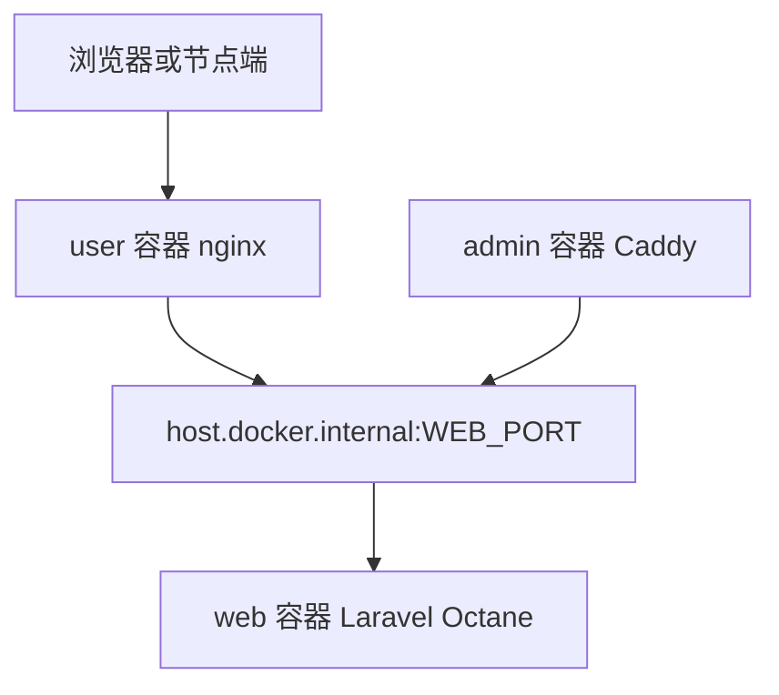

# 变更提案: fix-user-frontend-api-upstream

## 元信息
```yaml
类型: 修复
方案类型: implementation
优先级: P0
状态: 已规划
创建: 2026-05-09
```

---

## 1. 需求

### 背景
生产访问 `https://www2.spkun.com/api/v1/user/getSubscribe` 返回 502。用户补充验证显示，直接访问宿主机后端 `http://152.53.48.209:7001/api/v1/user/getSubscribe` 正常；对应前端容器 nginx 日志显示所有 `/api/v1/*` 请求都在连接 `http://172.19.0.6:7001/...` 时被拒绝。

因此故障不在 Laravel 订阅接口本身，而在用户前端容器到后端的反向代理上游。当前模板让用户前端默认使用 Docker 内部服务名 `web:7001`，nginx 会把该名称解析为容器 IP；当 `web` 容器更新或重建后，未重建的用户前端容器可能继续使用旧 IP，导致所有用户 API 返回 502。

### 目标
- 让用户前端的 `/api/v1/*` 代理默认走稳定的宿主机后端入口，避免依赖可能陈旧的 Docker 内部服务 IP。
- 拆分用户前端端口与管理前端端口，避免两个前端服务共用 `ADMIN_PORT` 变量造成歧义。
- 保留管理端和用户端可按环境变量覆盖上游地址的能力。
- 补充部署文档，给出当前生产故障的快速恢复与持久修复方式。

### 约束条件
```yaml
时间约束: 需要尽快恢复生产用户 API 和节点拉取接口
性能约束: 不改变 Laravel 后端运行路径，不引入额外应用层转发
兼容性约束: 继续支持现有 WEB_PORT、ADMIN_PORT、XBOARD_BACKEND_UPSTREAM 配置
业务约束: 不改订阅接口语义，不触碰数据库和用户数据
```

### 验收标准
- [ ] `deploy/xboard-server/compose.test.yaml` 中 `user` 服务默认使用稳定宿主机上游，并包含 Linux Docker 可解析的 `host.docker.internal` 映射。
- [ ] `user` 与 `admin` 服务端口变量已拆分，用户端默认 `7003`，管理端默认 `7002`。
- [ ] `.env.example` 和 README 明确说明用户前端、管理前端、后端 API 上游的配置方式。
- [ ] YAML 基础语法检查通过，变更差异和故障根因一致。

---

## 2. 方案

### 技术方案
- 在 `deploy/xboard-server/compose.test.yaml` 中为 `user`、`admin` 增加 `extra_hosts: host.docker.internal:host-gateway`。
- 将 `user` 服务的 `XBOARD_BACKEND_UPSTREAM` 默认值改为 `http://host.docker.internal:${WEB_PORT:-7001}`，让用户前端 API 代理走宿主机发布的稳定后端端口。
- 为管理端增加独立 `XBOARD_ADMIN_BACKEND_UPSTREAM`，默认同样可走宿主机后端入口；保留用户显式覆盖能力。
- 新增 `USER_PORT`，用户前端默认发布宿主机 `7003`，管理端继续使用 `ADMIN_PORT` 默认 `7002`。
- README 增加 502 排障段落：当前日志中的 `connect() failed (111: Connection refused)` 代表前端容器上游不可达，短期可重启前端容器刷新解析，持久方案是使用 host-gateway 上游。

### 影响范围
```yaml
涉及模块:
  - deploy: Compose 部署模板、环境变量样例、部署说明
预计变更文件: 3
```

### 风险评估
| 风险 | 等级 | 应对 |
|------|------|------|
| Linux Docker 版本不支持 `host-gateway` | 中 | 文档说明可回退到 `docker compose restart user admin` 或显式设置可达的宿主机网关 IP |
| 用户自定义 `WEB_PORT` 后忘记同步上游 | 低 | 默认值引用 `WEB_PORT`，`.env.example` 标注两者关系 |
| 管理端从内部 `web:7001` 改为宿主机端口后路径变化 | 低 | 后端端口已发布且用户已验证宿主机 `7001` 正常；仍保留 `XBOARD_ADMIN_BACKEND_UPSTREAM` 覆盖 |

### 方案取舍
```yaml
唯一方案理由: 日志显示前端容器连接 Docker 内部 IP 的 7001 被拒绝，而宿主机 7001 正常；把前端默认上游切到 host-gateway 可以规避 nginx 静态解析 Docker 服务名后 IP 失效的问题。
放弃的替代路径:
  - 只改 Laravel 订阅接口: 直连后端已正常，接口不是根因。
  - 只增加 depends_on: 只能约束启动顺序，不能解决 web 容器重建后 nginx 持有旧 IP 的问题。
  - 要求生产手动重启 user 容器: 可作为临时恢复，但不能防止下次后端容器 IP 变化再次 502。
回滚边界: 回退 deploy/xboard-server/compose.test.yaml、.env.example、README.md 中的端口和上游说明即可；不涉及数据库和业务代码。
```

---

## 3. 技术设计

### 代理拓扑


### 环境变量
| 变量 | 默认值 | 说明 |
|------|--------|------|
| `WEB_PORT` | `7001` | 后端 Laravel Octane 发布到宿主机的端口 |
| `USER_PORT` | `7003` | 用户前端发布到宿主机的端口 |
| `ADMIN_PORT` | `7002` | 管理前端发布到宿主机的端口 |
| `XBOARD_USER_BACKEND_UPSTREAM` | `http://host.docker.internal:${WEB_PORT}` | 用户前端 `/api` 代理上游 |
| `XBOARD_ADMIN_BACKEND_UPSTREAM` | `http://host.docker.internal:${WEB_PORT}` | 管理端 `/api` 代理上游 |

---

## 4. 核心场景

> 执行完成后同步到对应模块文档

### 场景: 用户前端 API 代理
**模块**: deploy
**条件**: 用户访问 `www2.spkun.com/dashboard` 后请求 `/api/v1/*`
**行为**: 用户前端 nginx 将 `/api` 转发到 `host.docker.internal:${WEB_PORT}`
**结果**: 即使 `web` 容器内部 IP 变化，用户前端仍通过宿主机发布端口访问正常后端。

---

## 5. 技术决策

> 本方案涉及的技术决策，归档后成为决策的唯一完整记录

### fix-user-frontend-api-upstream#D001: 用户前端默认后端上游改为 host-gateway
**日期**: 2026-05-09
**状态**: ✅采纳
**背景**: 生产日志显示 `/api/v1/*` 连接 Docker 内部上游 IP 的 7001 被拒绝，直连宿主机 7001 正常。用户前端 nginx 解析 Docker 服务名后可能持有陈旧容器 IP。
**选项分析**:
| 选项 | 优点 | 缺点 |
|------|------|------|
| A: 继续使用 `web:7001` | 容器内链路短 | nginx 静态解析后容易因 web 容器重建持有旧 IP |
| B: 使用 `host.docker.internal:${WEB_PORT}` | 上游稳定，和外部验证路径一致 | 依赖 Docker host-gateway 支持 |
| C: 仅重启 user 容器 | 立刻缓解 | 不是持久修复 |
**决策**: 选择方案 B
**理由**: 当前生产已证明宿主机 `7001` 可用，故把前端代理默认指向宿主机后端端口是最小且持久的修复。
**影响**: 影响 `deploy/xboard-server` Compose 模板和部署文档。

---

## 6. 验证策略

```yaml
verifyMode: review-first
reviewerFocus:
  - deploy/xboard-server/compose.test.yaml 的端口变量和环境变量插值
  - README 对 502 根因和恢复步骤的描述是否准确
testerFocus:
  - YAML 基础语法检查
  - 检查 compose 模板中 user/admin 均包含 host-gateway 映射
  - 检查文档中给出的即时恢复命令与持久配置一致
uiValidation: none
riskBoundary:
  - 不执行生产服务器破坏性操作
  - 不修改 Laravel 业务代码或数据库迁移
```

---

## 7. 成果设计

N/A。此任务不涉及视觉产出。
