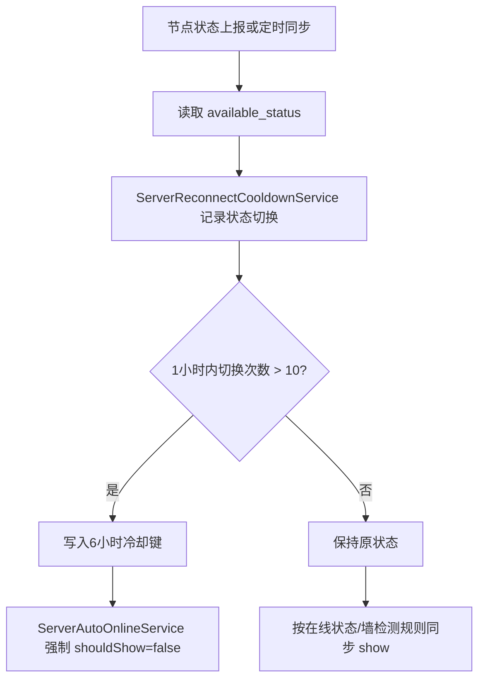

# 变更提案: node-reconnect-cooldown

## 元信息
```yaml
类型: 新功能
方案类型: implementation
优先级: P1
状态: 已规划
创建: 2026-05-21
```

---

## 1. 需求

### 背景
现有节点自动上线由 `ServerAutoOnlineService` 统一根据节点在线状态同步 `show`。当节点反复掉线和连线时，自动上线会频繁恢复展示，导致不稳定节点反复进入用户可用列表。

### 目标
- 给节点增加“重连冷却”节点级开关，作为自动上线功能的延伸选项。
- 开启后，同一节点 1 小时内在线/离线状态切换超过 10 次时，自动隐藏该节点 6 小时。
- 冷却期间自动上线逻辑不得重新显示节点；冷却到期后按原有自动上线、墙检测和父子联动规则恢复判断。
- 未开启自动上线或未开启重连冷却的节点保持原行为。

### 约束条件
```yaml
业务约束: 该选项是节点级开关，仅在 auto_online=true 时生效
兼容性约束: 旧节点默认关闭重连冷却，不改变既有自动上线行为
性能约束: 状态抖动计数使用 Redis/Cache 短期记录，避免新增高频写库
UI约束: 管理端延续现有 Apple 化后台表单样式，只新增必要开关和简短标签
```

### 验收标准
- [ ] 数据库存在节点级开关字段，模型、校验、管理端类型和提交映射均支持该字段。
- [ ] 节点在线状态从在线到离线、离线到在线的切换会计入 1 小时滑动窗口。
- [ ] 1 小时内切换次数超过 10 次时，开启冷却的自动上线节点被隐藏 6 小时。
- [ ] 冷却期内 `ServerAutoOnlineService` 不会因节点在线而重新显示该节点。
- [ ] 关闭重连冷却或关闭自动上线时不触发冷却规则。

---

## 2. 方案

### 技术方案
在 `v2_server` 增加 `auto_online_cooldown_enabled` 布尔字段，默认 `false`。新增 `ServerReconnectCooldownService` 负责读取节点 `available_status`，在 Redis/Cache 中保存最近状态和 1 小时内切换时间戳列表；当切换次数大于 10 次时写入 6 小时冷却键。`ServerAutoOnlineService` 在计算 `shouldShow` 时增加冷却否决条件，冷却期间强制 `show=false`。管理端节点编辑表单在“自动上线”区域新增重连冷却开关，仅作为节点配置项提交。

### 影响范围
```yaml
涉及模块:
  - node-auto-online: 自动上线同步逻辑增加冷却否决
  - admin-frontend: 节点编辑表单、类型声明和 payload 映射新增字段
  - database: v2_server 新增节点级配置字段
预计变更文件: 8-10
```

### 风险评估
| 风险 | 等级 | 应对 |
|------|------|------|
| 冷却计数误把首次状态记录算作切换 | 中 | 首次仅记录状态，不增加切换计数 |
| 冷却状态仅存 Redis，重启后冷却消失 | 低 | 这是短期保护策略，符合低写库约束；持久化替代方案见取舍 |
| 触发冷却后父节点隐藏可能影响子节点展示 | 中 | 复用现有 `syncChildrenForFinalState()`，保持与自动上线隐藏一致 |
| 管理端字段未同步导致保存丢失 | 中 | 同步更新 TypeScript 类型、默认值、填充和提交映射 |

### 方案取舍
```yaml
唯一方案理由: 使用节点级开关 + Redis 短期状态最贴合需求，改动集中且不会让高频连断事件写入数据库。
放弃的替代路径:
  - 新建数据库表记录每次连断: 可审计性更强，但写入频率高，超过当前需求。
  - 全局开关: 用户已选择节点级开关，不符合确认范围。
  - 前端仅展示无后端强制: 不能保证自动上线兜底任务和 WS/REST 上报路径一致。
回滚边界: 可回滚迁移字段、移除新增 service 与自动上线否决调用、移除管理端字段映射；不会改变既有 auto_online 字段语义。
```

---

## 3. 技术设计

### 状态流


### 缓存键
| 键 | TTL | 说明 |
|------|------|------|
| `server:{id}:reconnect_cooldown:last_status` | 7200 秒 | 最近一次可用状态，用于判断是否发生切换 |
| `server:{id}:reconnect_cooldown:transitions` | 7200 秒 | 1 小时内切换时间戳列表 |
| `server:{id}:reconnect_cooldown:suspended_until` | 21600 秒 | 冷却结束时间戳 |

### 数据模型
| 字段 | 类型 | 说明 |
|------|------|------|
| `auto_online_cooldown_enabled` | boolean | 是否启用自动上线重连冷却 |

---

## 4. 核心场景

### 场景: 节点抖动触发冷却
**模块**: node-auto-online  
**条件**: 节点开启 `auto_online` 与 `auto_online_cooldown_enabled`  
**行为**: 节点 1 小时内在线/离线切换超过 10 次  
**结果**: 节点被自动隐藏 6 小时，冷却期内自动上线不会恢复展示。

### 场景: 冷却结束后恢复自动判断
**模块**: node-auto-online  
**条件**: 冷却键过期或当前时间超过 `suspended_until`  
**行为**: 定时命令或状态上报再次触发自动上线同步  
**结果**: 节点按在线状态、墙检测状态和父子联动规则重新判断是否展示。

---

## 5. 技术决策

### node-reconnect-cooldown#D001: 冷却状态使用 Redis 短期缓存
**日期**: 2026-05-21  
**状态**: ✅采纳  
**背景**: 连断计数是高频运行时状态，目标是抑制短期抖动，不是做审计报表。  
**选项分析**:
| 选项 | 优点 | 缺点 |
|------|------|------|
| A: Redis/Cache 短期状态 | 写入轻、实现集中、符合调度和 WS 上报路径 | Redis 重启会丢失冷却状态 |
| B: 数据库事件表 | 可审计、可跨重启保留 | 高频写库，迁移和清理成本更高 |
**决策**: 选择方案 A。  
**理由**: 当前需求是自动上线的保护策略，短期缓存足够表达 1 小时窗口和 6 小时冷却，风险低且不扩大数据模型。  
**影响**: 自动上线服务依赖新增冷却服务；冷却状态不会出现在持久化报表中。

---

## 6. 验证策略

```yaml
verifyMode: review-first
reviewerFocus:
  - app/Services/ServerReconnectCooldownService.php
  - app/Services/ServerAutoOnlineService.php
  - database/migrations/*auto_online_cooldown*
  - admin-frontend/src/utils/nodeEditorMapper.ts
testerFocus:
  - php -l 相关 PHP 文件
  - npm --prefix admin-frontend run build
  - 构造服务级脚本验证超过10次切换后 shouldShow 被冷却否决
uiValidation: optional
riskBoundary:
  - 不执行生产迁移
  - 不连接远程服务器
  - 不删除现有数据
```

---

## 7. 成果设计

### 设计方向
- **美学基调**: 延续现有 Apple 化运营后台，低噪音、紧凑、清晰。
- **记忆点**: 在自动上线配置旁以同组开关表达“重连冷却”，让它被理解为自动上线的延伸能力。
- **参考**: `.helloagents/DESIGN.md` 与现有 `NodeEditorDialog.vue`。

### 视觉要素
- **配色**: 沿用 `#0071e3` 激活态与现有文本 token。
- **字体**: 沿用项目管理端既有系统字体栈，不引入新字体。
- **布局**: 复用 `switch-card` 双列开关结构，不增加新卡片层级。
- **动效**: 仅保留 Element Plus 开关默认反馈。
- **氛围**: 不新增装饰。

### 技术约束
- **可访问性**: 新开关使用明确中文标签，保留键盘可达。
- **响应式**: 复用现有移动端单列布局。
