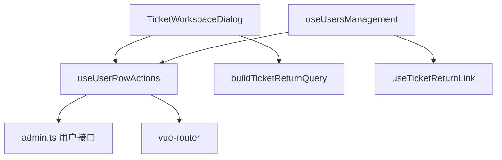

# 变更提案: admin-ticket-user-actions

## 元信息
```yaml
类型: 新功能
方案类型: implementation
优先级: P1
状态: 已规划
创建: 2026-05-22
```

---

## 1. 需求

### 背景
管理员处理工单时，经常需要切到用户管理修改用户订阅相关信息，尤其是复制订阅 URL、重置 UUID 及订阅 URL、封禁/恢复用户、查看流量记录或重置流量。当前工单工作台已经支持编辑当前用户、查看订单、查看流量日志和分配一次性流量，但缺少用户管理页“更多操作”菜单里的关键操作，也缺少从工单跳到用户管理再返回工单聊天页的完整入口。

### 目标
- 在工单工作台中补齐当前工单用户的常用操作入口，覆盖截图中的核心运维动作。
- 支持从工单工作台跳转到用户管理页，并携带返回工单所需的 `ticket_return_id/ticket_return_subject`。
- 用户管理页保留现有“返回工单”按钮，管理员完成用户订阅 URL 调整后可回到原工单聊天页。
- 用户管理页和工单工作台共用同一套用户行级操作逻辑，避免复制订阅 URL、重置密钥、封禁、重置流量等行为在两个页面漂移。

### 约束条件
```yaml
时间约束: 无
性能约束: 不新增全量数据请求；仅复用当前工单详情中的 user 数据和现有管理端接口
兼容性约束: 保持 Vue3 + TypeScript + Vite + Element Plus 技术栈，不引入新依赖
业务约束: 不改后端接口；重置 UUID 及订阅 URL、封禁、重置流量继续保留确认弹窗
设计约束: 延续 admin-frontend Apple 风格，使用紧凑按钮、下拉菜单和现有蓝色强调，不创建新视觉体系
```

### 验收标准
- [ ] 工单工作台当前用户区域可打开“用户操作”菜单，包含编辑、分配订单、分配流量、复制订阅 URL、重置 UUID 及订阅 URL、TA 的订单、TA 的邀请、TA 的流量记录、重置流量、封禁/恢复用户、进入用户管理。
- [ ] “进入用户管理”会按当前工单用户精确筛选用户管理页，并保留返回当前工单的按钮。
- [ ] 用户管理页原有更多操作功能不退化。
- [ ] 敏感用户动作继续显示确认弹窗，成功后刷新当前数据。
- [ ] `npm run build` 在 `admin-frontend` 下通过。

---

## 2. 方案

### 技术方案
将用户行级操作从 `useUsersManagement.ts` 中拆出为共享 composable，供用户管理页和工单工作台共同调用：

- 新增 `admin-frontend/src/views/users/useUserRowActions.ts`，集中处理复制订阅 URL、重置 UUID 及订阅 URL、封禁/恢复、重置流量等与具体用户绑定的动作，并暴露跳转订单、跳转邀请、打开流量日志、打开分配订单等轻量动作。
- 调整 `useUsersManagement.ts`，继续维护用户列表状态、筛选、批量操作和弹窗状态，但调用共享 composable 执行行级动作。
- 调整 `TicketWorkspaceDialog.vue`，在工单工作台头部增加“用户操作”下拉菜单，并复用共享 composable；保留现有编辑用户、用户订单、流量日志、分配流量弹层，新增订阅 URL、重置密钥、封禁/恢复、重置流量、分配订单、查看邀请和进入用户管理。
- 用户管理跳转使用现有 `Users` 路由 query：`user_id/user_email` 做精准筛选，叠加 `ticket_return_id/ticket_return_subject` 作为返回工单上下文。
- 补充 `TicketWorkspaceDialog.scss` 的紧凑操作区样式和移动端换行规则。

### 影响范围
```yaml
涉及模块:
  - admin-frontend 用户管理: 抽出共享用户行级动作，保持原列表行为
  - admin-frontend 工单管理: 增加用户操作菜单与跨页返回链路
  - HelloAGENTS 知识库: 更新 admin-frontend 模块说明与 CHANGELOG
预计变更文件: 6
```

### 风险评估
| 风险 | 等级 | 应对 |
|------|------|------|
| 用户管理页行级动作抽出后行为回归 | 中 | 保持原 `UserAction` 命令名和调用路径，构建验证类型约束 |
| 工单页操作后当前工单详情未刷新 | 中 | 对会改变用户状态或订阅 URL 的动作统一绑定 `onUserChanged` 回调刷新工单工作台 |
| 下拉菜单入口过多影响工单头部布局 | 低 | 主头部保留少量高频按钮，完整动作收进一个 `ElDropdown` |
| 跨页返回 query 丢失 | 低 | 复用现有 `buildTicketReturnQuery()` 和 `useTicketReturnLink()` |

### 方案取舍
```yaml
唯一方案理由: 共享 composable 能让用户管理页和工单页共用相同行为、确认文案和错误处理，同时避免在工单页复制一套订阅 URL/重置密钥/封禁逻辑。
放弃的替代路径:
  - 只从工单页跳转到用户管理: 可以满足返回需求，但处理高频订阅 URL 操作时仍需离开聊天上下文，效率较低。
  - 在工单页复制用户管理页全部逻辑: 初期快，但后续两个页面的确认弹窗、异常处理和接口调用容易不一致。
  - 新增后端“工单用户快捷操作”接口: 不必要，现有管理端接口已经覆盖本次需求。
回滚边界: 可独立回退工单工作台菜单与共享 composable 调整；不涉及数据库、后端接口或路由结构变更。
```

---

## 3. 技术设计

### 架构设计


### API设计
不新增 API。继续使用现有管理端接口：
- `user/resetSecret`
- `user/update`
- `traffic-reset/reset-user`
- `user/fetch`
- `plan/fetch`

### 数据模型
不新增数据模型。跨页返回只使用现有路由 query：
| 字段 | 类型 | 说明 |
|------|------|------|
| `user_id` | string | 用户管理页精准筛选目标用户 |
| `user_email` | string | 用户管理页筛选摘要展示 |
| `ticket_return_id` | string | 返回工单聊天页时打开的工单 ID |
| `ticket_return_subject` | string | 返回按钮展示文案 |

---

## 4. 核心场景

### 场景: 工单内直接复制或重置订阅 URL
**模块**: admin-frontend  
**条件**: 管理员打开某个工单聊天页，工单详情包含用户信息  
**行为**: 管理员打开“用户操作”菜单，选择复制订阅 URL 或重置 UUID 及订阅 URL  
**结果**: 复制成功显示 toast；重置前弹确认框，成功后刷新工单详情并更新用户信息  

### 场景: 从工单跳到用户管理再返回
**模块**: admin-frontend  
**条件**: 管理员正在处理某个工单  
**行为**: 管理员选择“进入用户管理”  
**结果**: 用户管理页按该用户筛选，并显示“返回工单”按钮；点击后回到工单工作台并打开原工单  

### 场景: 用户管理页原行级操作保持一致
**模块**: admin-frontend  
**条件**: 管理员在用户管理页打开某个用户更多操作菜单  
**行为**: 执行复制订阅 URL、重置密钥、封禁、重置流量、查看订单等操作  
**结果**: 行为与改造前一致，并由共享 composable 统一维护  

---

## 5. 技术决策

### admin-ticket-user-actions#D001: 用户行级动作抽为共享 composable
**日期**: 2026-05-22  
**状态**: ✅采纳  
**背景**: 工单页需要复用用户管理页已有的订阅 URL、重置密钥、封禁和流量操作。  
**选项分析**:
| 选项 | 优点 | 缺点 |
|------|------|------|
| A: 抽出共享 composable | 行为一致，维护成本低，工单页和用户页都能复用 | 需要调整用户管理页现有组合函数边界 |
| B: 工单页复制用户管理逻辑 | 实现局部直观 | 两套逻辑容易漂移，后续维护风险高 |
| C: 只跳转用户管理 | 改动小 | 高频操作仍离开工单上下文，效率不够 |
**决策**: 选择方案 A  
**理由**: 本次需求同时要求“可跳转返回”和“也可以直接在工单页加入这些操作”，共享动作能兼顾效率与一致性。  
**影响**: 用户管理页的行级动作调用路径会轻微重构；工单工作台新增完整用户操作入口。  

---

## 6. 验证策略

```yaml
verifyMode: review-first
reviewerFocus:
  - admin-frontend/src/views/users/useUserRowActions.ts
  - admin-frontend/src/views/users/useUsersManagement.ts
  - admin-frontend/src/views/tickets/TicketWorkspaceDialog.vue
testerFocus:
  - npm run build
  - 工单页用户操作菜单可见且命令调用类型正确
  - 用户管理页原更多操作菜单仍能编译通过
uiValidation: optional
riskBoundary:
  - 不新增或修改后端接口
  - 不绕过重置密钥、封禁、重置流量等确认弹窗
  - 不提交或展示任何敏感凭据
```

---

## 7. 成果设计

### 设计方向
- **美学基调**: Apple 化运营工具。保持黑白主场、蓝色交互、轻薄边界和低噪音层级，把新增能力收进紧凑下拉菜单。
- **记忆点**: 工单聊天页顶部出现一个稳定的“用户操作”入口，处理订阅 URL 时不再离开会话上下文。
- **参考**: 项目现有 `UsersView` 更多操作菜单和 `TicketWorkspaceDialog` 头部 ghost action。

### 视觉要素
- **配色**: 继续使用 `#0071e3` 作为普通操作强调，危险动作使用现有 `--xboard-danger`。
- **字体**: 延续项目系统字体栈，符合现有 `DESIGN.md` 对 admin-frontend 的约束。
- **布局**: 工单工作台头部保留高频按钮，完整用户动作进入一个右侧下拉菜单；窄屏时操作区自动换行。
- **动效**: 使用 Element Plus 下拉菜单默认交互，不新增装饰性动画。
- **氛围**: 继续使用现有纯色容器、细边界和轻阴影，不新增背景装饰。

### 技术约束
- **可访问性**: 下拉菜单使用 `ElDropdown` 和按钮触发，保持键盘可聚焦；危险动作有明确文字和确认框。
- **响应式**: 头部操作区允许换行，避免小屏文字挤压。
