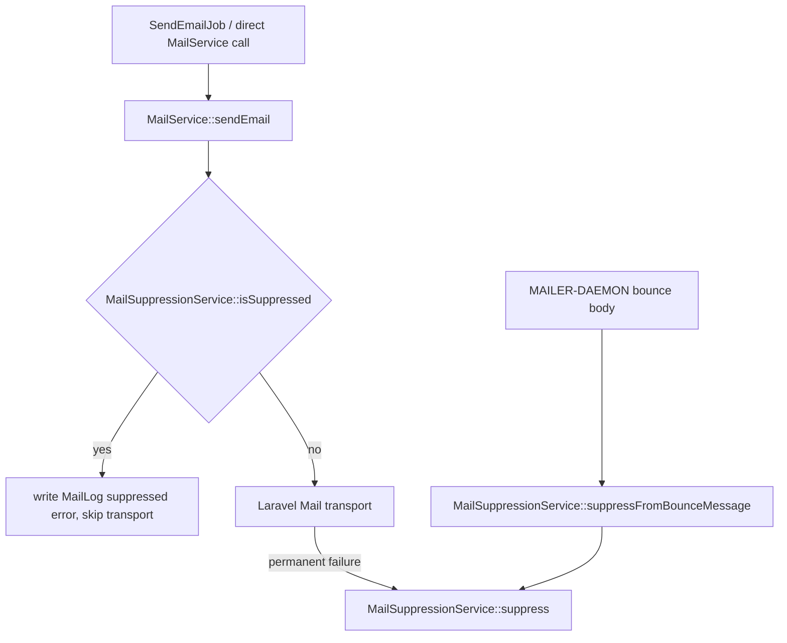

# 变更提案: mail-bounce-suppression

## 元信息
```yaml
类型: 新功能
方案类型: implementation
优先级: P1
状态: 已确认
创建: 2026-06-02
```

---

## 1. 需求

### 背景
当前邮件发送链路由 `App\Jobs\SendEmailJob` 和 `App\Services\MailService` 统一发送并写入 `v2_mail_log`。当收件邮箱不存在或被收件方拒收时，系统没有全局禁发记录，后续注册验证、登录链接、工单提醒、到期/流量提醒和后台群发仍可能继续向同一邮箱发送。

用户给出的退信样例包含：
- `550 Mailbox not found`
- `550 Mail is rejected by recipients`
- 退信正文中以 `<user@example.com>:` 标识失败收件人

### 目标
- 对永久性退信或拒收的邮箱地址建立全局禁发记录。
- 后续任何邮件通知只要目标邮箱相同，都不再真实发送。
- 发送前拦截必须覆盖 `send_email` 和 `send_email_mass` 队列，以及所有调用 `MailService::sendEmail()` 的入口。
- 提供可复用退信正文解析能力，能从用户提供的 `MAILER-DAEMON` 退信正文中提取失败邮箱并判断是否应禁发。
- 完成后执行本次改动审查，并提交 commit。

### 约束条件
```yaml
时间约束: 本轮完成实现、验证、review 和 commit
性能约束: 发送前禁发判断必须是单次索引查询，避免群发场景明显放大成本
兼容性约束: 不改变现有用户账号状态、提醒开关和队列名称；不要求当前项目立即具备入站邮箱拉取能力
业务约束: 仅对明确永久失败或拒收原因禁发；临时 SMTP 网络失败不禁发
```

### 验收标准
- [ ] 邮箱地址命中全局禁发表后，`MailService::sendEmail()` 不调用 Laravel Mail 发送，并写入一条带跳过原因的 `MailLog`。
- [ ] 同一邮箱大小写、首尾空格归一后使用同一禁发记录。
- [ ] 退信正文中包含 `550 Mailbox not found` 或 `550 Mail is rejected by recipients` 时，能提取 `<...>` 中的收件邮箱并创建禁发记录。
- [ ] 非永久性失败或无法提取邮箱的正文不会创建禁发记录。
- [ ] PHPUnit 覆盖发送前拦截、退信解析、永久失败自动禁发和非永久失败不禁发。
- [ ] `vendor/bin/phpunit` 针对新增/相关测试通过；可行时运行 `vendor/bin/phpstan analyse --memory-limit=1G`。
- [ ] 审查本次改动并修复发现的问题后提交 commit。

---

## 2. 方案

### 技术方案
新增 `v2_mail_suppressions` 表记录被禁发邮箱，字段包含归一化 `email`、`reason`、`source`、`diagnostic_code`、`raw_excerpt`、时间戳。新增 `MailSuppression` 模型和 `MailSuppressionService`：

- `normalizeEmail()` 统一 `trim + strtolower`。
- `isSuppressed()` 供发送前拦截使用。
- `suppress()` 以邮箱唯一键幂等写入或更新禁发记录。
- `suppressFromBounceMessage()` 解析退信正文，识别永久失败并禁发对应邮箱。
- `isPermanentFailure()` 识别同步 SMTP 异常文本中的永久失败，避免重试期间继续排队。

在 `MailService::sendEmail()` 中，在渲染与真实发送前归一化目标邮箱并查询禁发表；命中时不调用 `Mail::send()` / `MailHtmlContent::sendHtmlMail()`，仍写入 `MailLog`，`error` 使用稳定前缀 `Email suppressed: ...`。发送过程中捕获到永久失败时，调用服务写入禁发记录。

### 影响范围
```yaml
涉及模块:
  - queue-mail: 新增全局禁发存储、发送前拦截、永久失败识别和退信解析
  - database: 新增 v2_mail_suppressions 迁移
  - tests: 新增邮件禁发服务与发送链路测试
预计变更文件: 8-10
```

### 风险评估
| 风险 | 等级 | 应对 |
|------|------|------|
| 误判临时故障导致禁发 | 中 | 仅匹配明确永久失败词和 5xx 邮箱不存在/拒收文本，测试覆盖非永久失败 |
| 群发时每封邮件增加查询 | 中 | `email` 唯一索引，查询只取存在性；后续如有需要可加缓存，本次不提前复杂化 |
| 当前项目无入站退信触发源 | 中 | 先提供可复用解析服务，后续可由命令、Webhook 或邮箱拉取任务调用 |
| 禁发后用户无法自行恢复 | 低 | 本次保留数据库记录和幂等更新，不新增后台 UI；管理员可通过数据库或后续功能恢复 |

### 方案取舍
```yaml
唯一方案理由: 新建全局禁发表是最小且准确的事实源，满足“后续邮件通知给这个人关了”的全局邮箱维度要求，同时不修改用户账号状态或提醒偏好，避免把投递问题混入业务偏好。
放弃的替代路径:
  - 修改 v2_user.remind_expire/remind_traffic: 只能影响提醒邮件，无法覆盖登录链接、验证码、工单通知和后台群发。
  - 直接封禁用户或清空邮箱: 会改变认证和业务身份，副作用过大。
  - 仅依赖 v2_mail_log 查询最近失败: 群发前查询日志不稳定，也缺少恢复、来源和原因审计。
  - 立即实现 IMAP 拉取 admin 邮箱退信: 需要新增外部凭据和运行环境配置，当前项目没有现成入口，超出本次可靠交付边界。
回滚边界: 回滚代码、迁移和模型/服务即可恢复原邮件发送行为；已创建的 v2_mail_suppressions 表可通过 down 迁移删除。
```

---

## 3. 技术设计

### 架构设计


### API 设计
本次不新增 HTTP API。新增内部服务接口：

- `MailSuppressionService::normalizeEmail(string $email): string`
- `MailSuppressionService::isSuppressed(string $email): bool`
- `MailSuppressionService::suppress(string $email, string $reason, string $source = 'manual', ?string $diagnosticCode = null, ?string $rawExcerpt = null): MailSuppression`
- `MailSuppressionService::suppressFromBounceMessage(string $message, string $source = 'bounce'): ?MailSuppression`
- `MailSuppressionService::isPermanentFailure(string $message): bool`

### 数据模型
| 字段 | 类型 | 说明 |
|------|------|------|
| id | integer | 主键 |
| email | string(191) unique | 归一化后的邮箱地址 |
| reason | string(64) | 禁发原因，如 `mailbox_not_found`、`rejected_by_recipient` |
| source | string(32) | 来源，如 `smtp_error`、`bounce`、`manual` |
| diagnostic_code | string(32) nullable | 退信/SMTP 诊断码，如 `550` |
| raw_excerpt | text nullable | 脱敏前的短错误片段，长度受服务限制 |
| created_at / updated_at | timestamps | Laravel 时间戳 |

---

## 4. 核心场景

### 场景: 发送前拦截已禁发邮箱
**模块**: queue-mail
**条件**: `v2_mail_suppressions.email = user@example.com` 已存在
**行为**: 调用 `MailService::sendEmail(['email' => ' User@Example.com ', ...])`
**结果**: 不调用真实邮件传输；写入 `v2_mail_log.email = user@example.com` 且 `error` 标记已禁发。

### 场景: 退信正文禁发失败邮箱
**模块**: queue-mail
**条件**: 管理员或后续入站任务提供包含 `<zuoruchun@qq.com>:` 与 `550 Mailbox not found` 的退信正文
**行为**: 调用 `MailSuppressionService::suppressFromBounceMessage()`
**结果**: 创建或更新 `v2_mail_suppressions.email = zuoruchun@qq.com`。

### 场景: 临时发送失败不禁发
**模块**: queue-mail
**条件**: SMTP 异常为连接超时、网络错误或 4xx 临时失败
**行为**: `MailService::sendEmail()` 捕获异常
**结果**: 只记录 `MailLog.error`，不写入禁发表，保留队列重试语义。

---

## 5. 技术决策

### mail-bounce-suppression#D001: 使用全局邮箱禁发表作为投递禁发事实源
**日期**: 2026-06-02
**状态**: ✅采纳
**背景**: 用户要求“后续邮件通知给这个人关了”，示例是收件地址不存在或被收件方拒收。该要求跨越验证码、登录链接、工单通知、提醒邮件和后台群发，不应只修改某个用户提醒偏好。
**选项分析**:
| 选项 | 优点 | 缺点 |
|------|------|------|
| A: 新增全局邮箱禁发表 | 覆盖所有发送入口，可审计、可恢复，发送前拦截清晰 | 需要新增迁移和一次索引查询 |
| B: 修改用户提醒开关 | 改动少 | 只影响部分通知，无法覆盖验证码/登录/工单/群发 |
| C: 读取最近失败日志决定是否发送 | 无新增表 | 规则不稳定，无法表达恢复状态和来源 |
**决策**: 选择方案 A
**理由**: 全局禁发表和发送前拦截最贴合需求边界，避免误伤账号业务状态。
**影响**: `queue-mail` 模块新增持久化禁发事实源；所有邮件发送入口通过 `MailService` 自动生效。

---

## 6. 验证策略

```yaml
verifyMode: test-first
reviewerFocus:
  - app/Services/MailService.php 的发送前拦截是否覆盖 notify 和模板邮件两条路径
  - app/Services/MailSuppressionService.php 的永久失败匹配是否足够保守
  - database/migrations/*_create_mail_suppressions_table.php 的唯一索引和 down 迁移
testerFocus:
  - vendor/bin/phpunit tests/Unit/MailSuppressionServiceTest.php tests/Unit/MailServiceSuppressionTest.php tests/Unit/Jobs/SendEmailJobTest.php
  - vendor/bin/phpstan analyse --memory-limit=1G
uiValidation: none
riskBoundary:
  - 不连接远程服务器、不读取真实邮箱凭据、不实际发送邮件
  - 不修改 v2_user 账号状态或提醒偏好字段
  - 不提交 public/assets/admin 的既有未提交变更
```

---

## 7. 成果设计

N/A。后端邮件发送链路改动，无视觉产出。
