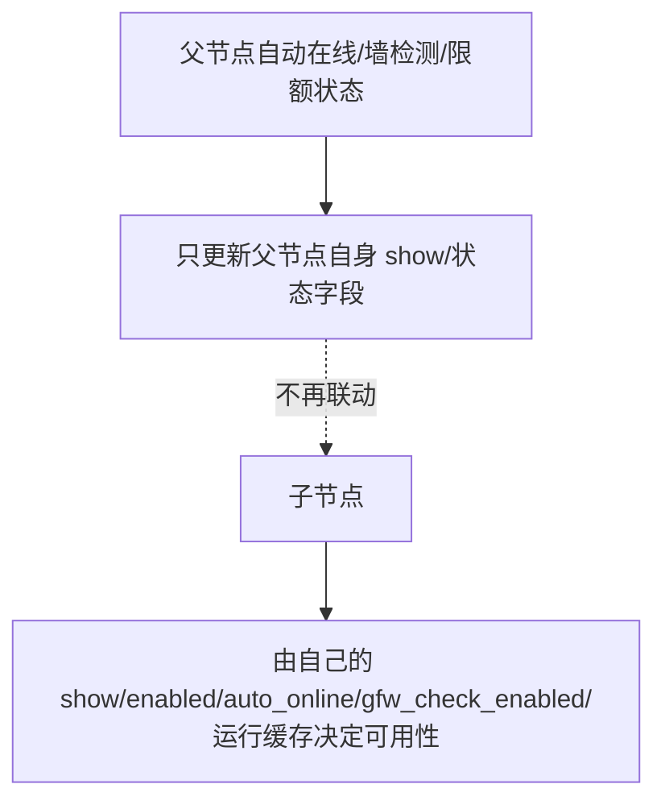

# 变更提案: forward-child-node-independent-visibility

## 元信息
```yaml
类型: 修复
方案类型: implementation
优先级: P1
状态: 已规划
创建: 2026-06-12
```

---

## 1. 需求

### 背景
部分转发节点的业务形态是：父节点使用一个用户无法直连的协议或入口，第三方流量转发为该节点提供可访问入口，子节点才是用户实际使用的入口节点。因此父节点自身直连检测失败、自动离线或流量限额状态不应反向改写子节点的展示状态。当前 Xboard 的自动在线、墙检测和流量限额逻辑会把父节点最终状态同步到直接子节点，导致转发入口子节点不可用。

### 目标
- 父节点自动在线检测结果只影响父节点自身，不再自动隐藏或恢复子节点。
- 父节点墙检测 blocked/normal 结果只改写父节点自身的 `show/gfw_auto_hidden`，不再改写子节点。
- 父节点流量限额 suspended/normal 只维护父节点自身限额状态，不再通过父节点状态改写子节点 `show`。
- 子节点在线状态、在线用户、metrics 和负载缓存读取子节点自身运行状态，不再回退读取父节点缓存。
- mi-node 机器模式继续按 `enabled=true` 发现和运行节点；子节点是否运行由自己的 `enabled` 决定，是否展示给用户由自己的 `show` 决定。

### 约束条件
```yaml
时间约束: 无
性能约束: 不增加额外全表查询；删除父子联动后应减少写库
兼容性约束: 不改数据库结构，不改 mi-node API 契约
业务约束: 父节点不影响子节点；子节点自己的 show/enabled/auto_online/gfw_check_enabled 继续生效
```

### 验收标准
- [ ] 父节点 `auto_online=true` 且离线时，父节点可被自动隐藏，但已有展示中的子节点保持 `show=true` 且 `parent_auto_hidden=false`。
- [ ] 父节点墙检测 blocked 时，父节点被隐藏并标记 `gfw_auto_hidden=true`，子节点保持自己的 `show/gfw_auto_hidden` 不变。
- [ ] 父节点流量限额 suspended 时，不再隐藏直接子节点。
- [ ] 子节点 `auto_online=true` 时，父节点在线不会让离线子节点误显示，父节点 blocked 也不会阻止在线子节点显示。
- [ ] 相关单元测试覆盖上述回归场景。
- [ ] PHP 语法检查和可运行测试通过；如本地环境缺失依赖，需明确记录未执行项。

---

## 2. 方案

### 技术方案
移除父节点状态对直接子节点的自动显隐联动。`Server` 模型的运行时缓存访问器改为始终按节点自身 ID 读取 `last_check_at`、`last_push_at`、在线用户、metrics 和负载状态，避免自动上线在判断子节点可用性时继续继承父节点运行状态。保留 `ServerParentVisibilityService::clearParentAutoHidden()`，用于兼容旧数据和手动保存时清理历史 `parent_auto_hidden` 标记；不再从自动在线、墙检测、流量限额流程调用隐藏/恢复子节点逻辑。

### 影响范围
```yaml
涉及模块:
  - node-auto-online: 父节点自动上线/离线只同步自身 show
  - server-model: 节点运行状态缓存访问器按节点自身读取
  - node-gfw-check: blocked/normal 自动显隐只作用于检测源节点自身
  - node-traffic-limit: 限额运行状态不再驱动子节点显隐
  - knowledge-base: 更新节点自动在线、墙检测和限额文档
预计变更文件: 8
```

### 风险评估
| 风险 | 等级 | 应对 |
|------|------|------|
| 之前依赖父节点下线自动隐藏子节点的运营场景改变 | 中 | 用户已明确要求父节点不影响子节点；测试和文档同步写明新语义 |
| 旧的 `parent_auto_hidden=1` 数据可能残留 | 低 | 保留手动保存时清理逻辑；父节点恢复逻辑不再自动改写子节点，避免继续扩大影响 |
| 子节点运行状态以前继承父节点缓存 | 中 | `Server` 运行状态访问器改为按自身 ID 读取，并新增父在线/父 blocked 的自动上线回归测试 |
| 墙检测继承展示仍显示为 inherited | 低 | 本次只取消显隐联动，不移除管理端状态继承展示，避免扩大 UI/API 变更 |

### 方案取舍
```yaml
唯一方案理由: 根因在 Xboard 把父节点自动状态写回子节点 show。删除联动写库是最小且符合转发语义的修复；mi-node 机器模式已经按 enabled 发现节点，不需要改节点端。
放弃的替代路径:
  - 只改 mi-node: 节点端不控制用户订阅中的 show，可运行节点也不能解决订阅入口被隐藏的问题。
  - 新增“跟随父节点”开关: 需要 UI、迁移和配置语义扩展，超出本次“父节点不影响子节点”的明确边界。
  - 只改自动在线: 墙检测和流量限额仍会让父节点影响子节点，无法完整修复转发场景。
回滚边界: 可独立回退 ServerAutoOnlineService、ServerGfwCheckService、ServerTrafficLimitService 与对应测试/知识库改动，不涉及数据库结构回滚。
```

---

## 3. 技术设计

### 架构设计


### API设计
无 API 契约变更。

### 数据模型
无数据库结构变更。保留既有 `parent_auto_hidden` 字段以兼容历史数据和手动清理。

---

## 4. 核心场景

### 场景: 转发子节点不跟随父节点自动下线
**模块**: node-auto-online
**条件**: 父节点 `auto_online=true` 且离线；子节点 `parent_id=父节点ID`、`show=true`。
**行为**: 执行自动在线同步。
**结果**: 父节点可隐藏；子节点保持 `show=true`。

### 场景: 转发子节点不继承父节点运行缓存
**模块**: server-model
**条件**: 父节点在线或墙检测 blocked；子节点自身离线或在线。
**行为**: 执行子节点自动在线同步。
**结果**: 子节点只按自己的 `last_check_at` / `last_push_at` 与墙检测标记判断显隐，父节点运行缓存不参与子节点判定。

### 场景: 父节点墙检测 blocked 不隐藏转发入口
**模块**: node-gfw-check
**条件**: 父节点墙检测结果为 blocked；子节点是用户实际入口。
**行为**: 节点端上报墙检测结果。
**结果**: 仅父节点写入 `gfw_auto_hidden=true` 并隐藏；子节点不被改写。

### 场景: 父节点限额状态不改写子节点展示
**模块**: node-traffic-limit
**条件**: 父节点限额上报 suspended；子节点仍作为第三方转发入口使用。
**行为**: Xboard 应用 runtime metrics。
**结果**: 父节点限额状态更新；子节点 `show` 保持不变。

---

## 5. 技术决策

### forward-child-node-independent-visibility#D001: 取消父节点对子节点的自动显隐联动
**日期**: 2026-06-12
**状态**: ✅采纳
**背景**: 转发场景下父节点可能天然不可直连，子节点才是用户可用入口；父节点状态联动子节点会误伤入口节点。
**选项分析**:
| 选项 | 优点 | 缺点 |
|------|------|------|
| A: 删除父子显隐联动 | 最小修复，直接符合“父节点不影响子节点”语义 | 依赖旧联动的场景需改为显式管理子节点 |
| B: 新增跟随父节点开关 | 可兼容两类运营模式 | 需要数据库、前端、API 和迁移，范围明显扩大 |
| C: 只在 mi-node 兼容 | 不动 Xboard 业务字段 | 无法修复订阅侧 show 被隐藏的问题 |
**决策**: 选择方案 A
**理由**: 用户明确要求父节点不影响子节点，且代码证据显示问题来自 Xboard 服务层联动写库。
**影响**: `Server` 模型运行状态访问器、`ServerAutoOnlineService`、`ServerGfwCheckService`、`ServerTrafficLimitService` 及其单元测试。

---

## 6. 验证策略

```yaml
verifyMode: test-first
reviewerFocus:
  - 父节点状态是否仍会写入子节点 show/gfw_auto_hidden/parent_auto_hidden
  - 子节点运行状态是否仍会读取父节点 last_check_at/last_push_at/metrics/load_status 缓存
  - mi-node 机器模式 enabled 发现语义是否未被误改
testerFocus:
  - vendor/bin/phpunit tests/Unit/ServerAutoOnlineServiceTest.php tests/Unit/ServerGfwCheckServiceTest.php tests/Unit/ServerTrafficLimitServiceTest.php
  - php -l app/Models/Server.php app/Services/ServerAutoOnlineService.php app/Services/ServerGfwCheckService.php app/Services/ServerTrafficLimitService.php
uiValidation: none
riskBoundary:
  - 不改数据库结构
  - 不改 mi-node API 与运行逻辑
  - 不执行生产数据批量修复
```

---

## 7. 成果设计

N/A。非视觉任务。
