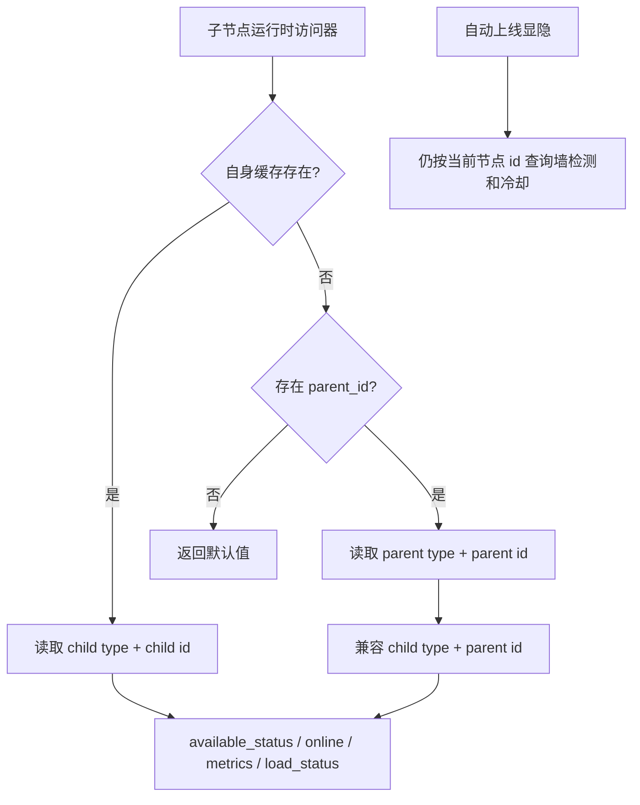

# 变更提案: child-runtime-cache-fallback

## 元信息
```yaml
类型: 修复
方案类型: implementation
优先级: P1
状态: 已规划
创建: 2026-06-13
```

---

## 1. 需求

### 背景
上次修复把子节点的 `last_check_at`、`last_push_at`、在线用户、metrics 和负载状态访问器改为只读取自身 ID 的缓存，避免父节点自动状态直接影响转发入口子节点。但部分转发节点实际只由父入口或兼容模式上报运行时缓存，子节点没有独立心跳缓存，导致管理端和自动上线逻辑看到所有子节点离线。

### 目标
- 子节点优先读取自身运行时缓存。
- 子节点自身心跳缓存缺失或过期时，回退读取父节点运行时缓存，兼容父入口上报的转发场景。
- 父节点的 `show`、墙检测自动隐藏、流量限额状态仍不批量改写子节点。
- 父节点墙检测 blocked 不应阻止子节点按自身或父入口运行时缓存上线。

### 约束条件
```yaml
时间约束: 本轮完成修复、测试和知识库同步
性能约束: 不新增全量扫描；访问器只在子节点缺少自身缓存时解析父节点缓存键
兼容性约束: 不改 API 字段和数据库结构；保持既有 CacheKey 命名
业务约束: 运行时缓存可共享兜底，显隐控制仍按当前节点独立执行
```

### 验收标准
- [ ] 子节点没有自身心跳缓存但父节点有心跳缓存时，`available_status` 不再是离线。
- [ ] 子节点自身心跳缓存新鲜时，优先使用子节点自身运行缓存。
- [ ] 父节点 blocked 的墙检测记录不会作为子节点自动上线的否决条件。
- [ ] 自动化测试覆盖父缓存兜底和父 blocked 不影响转发子节点显示。

---

## 2. 方案

### 技术方案
在 `App\Models\Server` 中抽出运行时缓存读取辅助方法：

- 先按当前节点 `type + id` 读取缓存。
- 当前节点心跳缓存不存在或过期且 `parent_id` 有效时，再按父节点运行时缓存读取。
- 父节点缓存键优先使用父节点真实 `type`，再兼容旧逻辑使用子节点 `type + parent_id`。
- `ServerAutoOnlineService` 不改写取数来源以外的显隐规则，继续用当前节点 ID 查询墙检测、重连冷却和 `show`。

### 影响范围
```yaml
涉及模块:
  - node-auto-online: 子节点运行时状态展示和自动上线判定
  - Server 模型: 运行时缓存访问器
  - PHPUnit 单测: 子节点运行时缓存和父 blocked 边界
预计变更文件: 4-6 个
```

### 风险评估
| 风险 | 等级 | 应对 |
|------|------|------|
| 子节点重新使用父缓存后，自动上线会显示父入口在线的转发子节点 | 中 | 这是本次回归修复目标；父 blocked、父 show、父限额仍不会批量改写子节点 |
| 父子节点协议类型不一致时缓存键读不到 | 中 | 父缓存兜底同时尝试父节点真实 type 和旧的子节点 type + parent_id |
| 模型访问器查询父节点 type 带来额外查询 | 低 | 仅子节点且读取缓存时触发；列表数量有限，后续可按需通过 eager load 优化 |

### 方案取舍
```yaml
唯一方案理由: 回归根因在读取侧把父入口运行时缓存完全切断；恢复“子节点优先、父节点兜底”的读取能兼容 mi-node/旧转发入口，同时不重新引入父节点显隐联动写库。
放弃的替代路径:
  - 直接回滚上次提交: 会恢复父节点自动状态批量影响子节点的原问题。
  - 修改 mi-node 强制给所有子节点上报: 不能覆盖旧版节点端和父入口转发场景，且需要跨仓发布。
  - 新增数据库开关: 范围扩大到 API、前端和迁移，不适合当前回归修复。
回滚边界: 可独立回退 Server 模型辅助方法和单测改动；不涉及迁移、配置或外部服务。
```

---

## 3. 技术设计

### 架构设计


### API设计
N/A。本次不改变外部 API。

### 数据模型
N/A。本次不新增数据库字段。

---

## 4. 核心场景

### 场景: 转发子节点使用父入口运行时缓存
**模块**: node-auto-online
**条件**: 子节点 `parent_id=父节点ID`，子节点无自身 `LAST_CHECK_AT` 缓存或自身心跳已过期，父节点有新鲜 `LAST_CHECK_AT` 缓存。
**行为**: 读取子节点 `available_status` 或执行子节点自动上线同步。
**结果**: 子节点不再被判定为离线，可按当前节点自己的 `auto_online/show/gfw_check_enabled` 规则同步。

### 场景: 父 blocked 不否决转发子节点
**模块**: node-auto-online
**条件**: 父节点墙检测结果为 blocked，子节点使用父入口心跳缓存，子节点自身没有 blocked 记录。
**行为**: 执行子节点自动上线同步。
**结果**: 子节点可显示，且不会写入 `gfw_auto_hidden=true`。

---

## 5. 技术决策

### child-runtime-cache-fallback#D001: 运行时缓存子节点优先、父节点兜底
**日期**: 2026-06-13
**状态**: ✅采纳
**背景**: 转发入口子节点可能不直接产生运行时缓存，但仍需要显示父入口上报的心跳；同时父节点显隐状态不能继续批量改写子节点。
**选项分析**:
| 选项 | 优点 | 缺点 |
|------|------|------|
| A: 子节点优先、父节点兜底 | 兼容独立子节点上报和父入口上报；不恢复父节点显隐联动 | 访问器需要处理父节点 type |
| B: 只读子节点自身缓存 | 显隐完全隔离 | 已导致转发子节点全部离线 |
| C: 完全恢复 parent_id 优先读取 | 兼容旧行为 | 子节点自身独立上报会被父缓存覆盖 |
**决策**: 选择方案 A
**理由**: 运行时缓存描述的是节点端或入口运行状态，可以在转发场景中共享兜底；显隐、墙检测和限额是业务控制，应保持当前节点独立。
**影响**: `Server` 运行时访问器、`ServerAutoOnlineService` 的 `available_status` 判定、节点列表在线状态展示。

---

## 6. 验证策略

```yaml
verifyMode: test-first
reviewerFocus:
  - app/Models/Server.php 的缓存键顺序和父节点 type 解析
  - tests/Unit/ServerAutoOnlineServiceTest.php 的父 blocked / 子节点兜底语义
testerFocus:
  - E:/php/php.exe -l app/Models/Server.php
  - E:/php/php.exe vendor/bin/phpunit --filter ServerAutoOnlineServiceTest
uiValidation: none
riskBoundary:
  - 不修改 public/assets/admin 子模块
  - 不执行生产、远程或数据库破坏性操作
```

---

## 7. 成果设计

N/A。非视觉任务。
