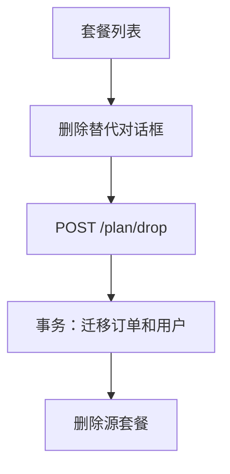

# 变更提案: plan-force-delete-copy

## 元信息
```yaml
类型: 新功能
方案类型: implementation
优先级: P1
状态: 已完成
创建: 2026-07-29
```

---

## 1. 需求

### 背景
当前管理端删除套餐时，只要存在关联订单或用户便被后端拒绝。管理员无法安全地下线旧套餐，也无法快速创建配置完全相同的新套餐。

### 目标
- 删除套餐前由管理员从其余套餐中选择替代套餐。
- 在同一数据库事务内将源套餐关联的订单和用户迁移到替代套餐，再删除源套餐。
- 在套餐列表提供复制操作，创建保留全部业务配置的新套餐，并将名称追加 `--复制`。

### 约束条件
```yaml
时间约束: 无
性能约束: 使用集合更新，禁止逐条加载订单或用户
兼容性约束: 保持现有 `plan/drop` 与 `plan/save` 行为；新增字段和 `plan/copy` 仅供新版管理端使用；新增索引可安全回滚
业务约束: 替代套餐必须存在且不得等于待删除套餐；订单和用户记录必须保留
```

### 验收标准
- [x] 删除有关联订单或用户的套餐时，管理员可选择其他套餐，关联记录的 `plan_id` 均改为所选套餐且源套餐被删除。
- [x] 源套餐存在订单或用户关联时，不传替代套餐、替代套餐不存在或与源套餐相同均会被后端拒绝且不修改数据；无关联套餐可直接删除。
- [x] 复制操作生成独立套餐记录，所有套餐配置与源套餐一致，名称为 `{源名称}--复制`。
- [x] 管理端构建与后端针对性测试通过。

---

## 2. 方案

### 技术方案
- 扩展 `PlanController::drop()`：先锁定源套餐、关联订单/用户和替代套餐，验证替代关系，在数据库事务中批量更新 `v2_order.plan_id`、`v2_user.plan_id`，最后删除源套餐；为两个关联字段增加索引，降低锁定扫描范围并避免并发插入留下旧套餐引用。
- 新增 `PlanController::copy()` 和 `/plan/copy` 路由：使用 Eloquent `replicate()` 复制套餐字段，在事务中锁定当前最大排序记录，将名称追加 `--复制`，并将排序放至现有列表末尾。
- 新增 `PlanDeleteDialog.vue`：展示待删除套餐、替代套餐下拉框和不可恢复提示；列表仅调用带有 `replacement_plan_id` 的删除接口。
- 在套餐表格的操作区新增复制图标按钮，并在成功后刷新列表。

### 影响范围
```yaml
涉及模块:
  - `app/Http/Controllers/V2/Admin/PlanController.php`: 套餐迁移删除与复制 API
  - `app/Http/Routes/V2/AdminRoute.php`: 复制路由
  - `admin-frontend/src/api/admin.ts`: 新 API 契约
  - `admin-frontend/src/views/subscriptions/PlansView.vue`: 删除、复制入口
  - `admin-frontend/src/views/subscriptions/PlanDeleteDialog.vue`: 替代套餐选择
  - `tests/Unit/Admin/PlanControllerTest.php`: 删除迁移与复制行为
预计变更文件: 8
```

### 风险评估
| 风险 | 等级 | 应对 |
|------|------|------|
| 错误选择替代套餐 | 中 | 删除对话框明确显示源套餐和替代套餐，后端校验 ID 不相同。 |
| 半完成迁移 | 高 | 用户更新、订单更新和删除包裹在单一事务内，失败时回滚。 |
| 复制记录与源配置不一致 | 中 | 使用 `replicate()`，仅覆盖名称和排序字段，并以测试断言。 |

### 方案取舍
```yaml
唯一方案理由: 复用现有套餐 API、Eloquent 模型和列表数据，变更范围最小，同时把数据一致性保证留在后端。
放弃的替代路径:
  - 前端直接调用用户和订单接口迁移: 不能保证原子性，且会扩散权限与数据一致性责任。
  - 只允许删除无关联套餐: 不满足管理员替换旧套餐的业务需求。
回滚边界: 撤回新增路由、控制器方法和管理端操作，并执行迁移回滚即可恢复原删除限制；索引回滚不影响既有数据。
```

---

## 3. 技术设计（可选）

> 涉及架构变更、API设计、数据模型变更时填写

### 架构设计


### API设计
#### POST /plan/drop
- **请求**: `{ id: number, replacement_plan_id?: number }`
- **行为**: 源套餐存在订单或用户时必须提供其他套餐作为替代；无关联套餐无需提供替代套餐。
- **响应**: `{ data: true }`

#### POST /plan/copy
- **请求**: `{ id: number }`
- **响应**: `{ data: true }`

### 数据模型
| 字段 | 类型 | 说明 |
|------|------|------|
| `v2_order.plan_id` | integer | 删除时更新为替代套餐 ID；新增 `v2_order_plan_id_index` |
| `v2_user.plan_id` | integer | 删除时更新为替代套餐 ID；新增 `v2_user_plan_id_index` |

---

## 4. 核心场景

> 执行完成后同步到对应模块文档

### 场景: 替换并删除旧套餐
**模块**: 管理端订阅套餐
**条件**: 至少存在两个套餐。
**行为**: 管理员选择替代套餐并确认删除。
**结果**: 所有关联订单和用户指向替代套餐，旧套餐被删除。

### 场景: 复制套餐
**模块**: 管理端订阅套餐
**条件**: 管理员选择一个现有套餐。
**行为**: 点击复制。
**结果**: 出现名称带 `--复制` 的独立套餐，配置与源套餐一致。

---

## 5. 技术决策

> 本方案涉及的技术决策，归档后成为决策的唯一完整记录

### plan-force-delete-copy#D001: 关联套餐删除采用后端事务迁移
**日期**: 2026-07-29
**状态**: ✅采纳
**背景**: 删除套餐需要同时维护订单和用户的外键归属。
**选项分析**:
| 选项 | 优点 | 缺点 |
|------|------|------|
| A: 后端事务迁移后删除 | 原子、可校验、权限边界清晰 | 需要新增 API 参数 |
| B: 管理端分步迁移 | 实现表面直接 | 可能出现半完成状态且 API 边界扩散 |
**决策**: 选择方案 A
**理由**: 数据一致性必须由拥有数据访问权的后端统一保证。
**影响**: 套餐删除 API、管理端删除对话框、关联字段索引与后端测试。

---

## 6. 验证策略

```yaml
verifyMode: test-first
reviewerFocus:
  - 替代套餐校验、事务边界与复制字段覆盖范围
testerFocus:
  - 有关联记录的删除迁移、无效替代套餐回滚、复制后的名称与配置
uiValidation: required
riskBoundary:
  - 不删除或重写订单、用户的其他字段。
```

---

## 7. 成果设计

> 含视觉产出的任务由 DESIGN Phase2 填充。非视觉任务整节标注"N/A"。

### 设计方向
- **美学基调**: 延续现有 Apple 风格管理台，以克制的白色表面和蓝色主操作突出替代选择。
- **记忆点**: 删除对话框把源套餐和替代套餐并列呈现，避免误操作。
- **参考**: 现有 `PlansView.vue` 与项目 `.helloagents/DESIGN.md`。

### 视觉要素
- **配色**: 沿用 `#0071e3` 主操作、项目既有危险色和白色表面。
- **字体**: 沿用项目系统字体栈。
- **布局**: 使用 Element Plus 对话框，先显示风险说明，再提供替代套餐选择。
- **动效**: 使用组件库默认加载与关闭反馈。
- **氛围**: 不新增装饰性背景或卡片层级。

### 技术约束
- **可访问性**: 替代套餐选择有明确标签，确认按钮在未选择时禁用。
- **响应式**: 对话框宽度使用现有移动端安全宽度约束。
